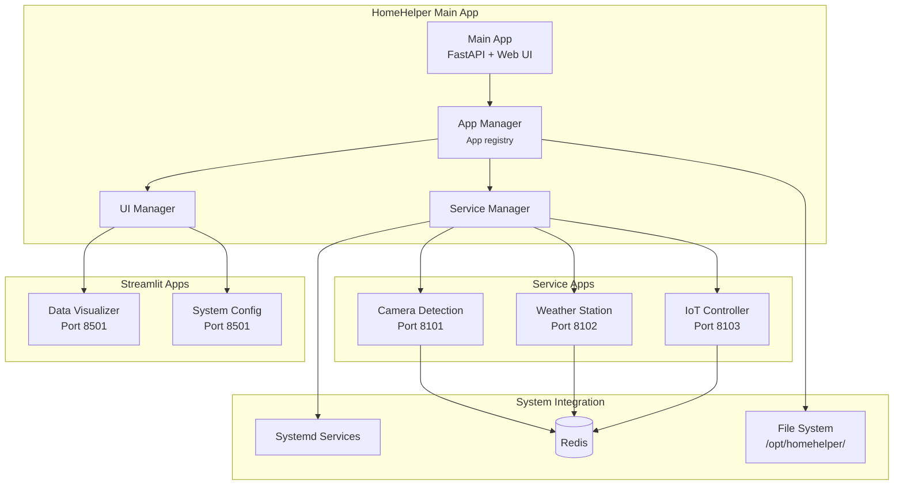
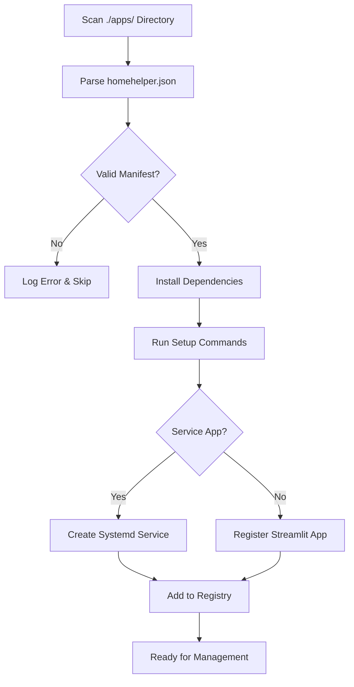
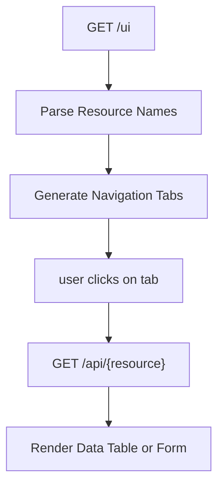
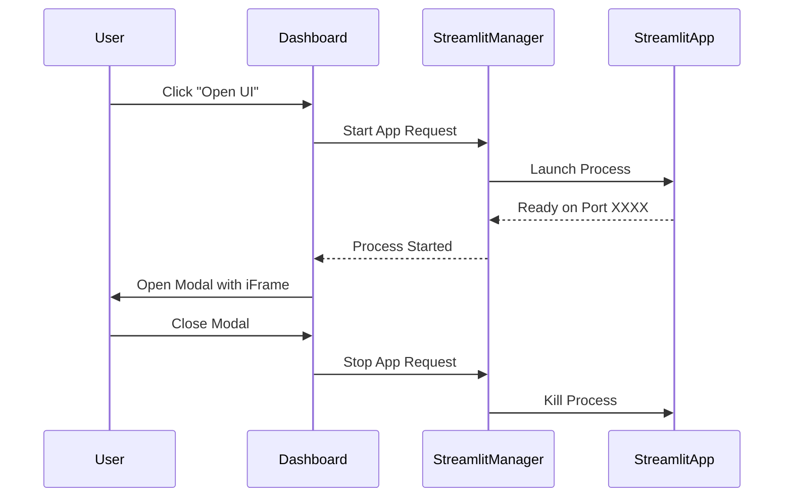
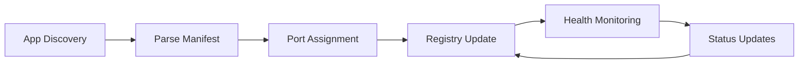

# HomeHelper System Shape Document

## Problem Statement

**Raw Idea**: Create a unified home automation platform that can integrate multiple independent applications (services and UIs) under one cohesive interface, running on a Raspberry Pi.

**Appetite**: 6-8 weeks for MVP (Main App + 2 sample apps)

**Who's it for**: Home automation enthusiasts who want a single dashboard to manage multiple services without complex integrations.

## Boundaries

### What we're solving
- Unified dashboard for multiple home automation services
- Automatic service discovery and management
- Simple app development framework
- Service lifecycle management (start/stop/monitor)
- On-demand UI access for interactive apps

### What we're NOT solving
- Authentication, this will be added in a future iteration
- Complex enterprise integrations
- Multi-user authentication systems
- Cloud connectivity (local-only for now)
- Mobile app companion
- Advanced scheduling/automation rules

### No-Goes
- Apps sharing code dependencies (each app is 100% independent)
- Complex configuration files (apps receive parameters via launch arguments)
- Direct database access between apps
- Real-time synchronization between services

## Solution Architecture



## Key Concepts

### App Types
1. **Service Apps**: Long-running background services managed by systemd
2. **Streamlit Apps**: On-demand interactive UIs with TTL management

### App Independence
- Each app has its own `homehelper.json` manifest
- No shared code libraries between apps
- All configuration passed via launch parameters
- Apps can run independently of main system

### Service Discovery
- Apps placed in `./apps/{app_name}/` directories
- Auto-discovery via manifest scanning
- Dynamic port assignment for service apps
- Fixed port for Streamlit apps (single instance)

## Core Components

### Main Application
- **Technology**: FastAPI backend + Web frontend
- **Responsibilities**:
  - App discovery and registration
  - Service lifecycle management
  - Health monitoring dashboard
  - UI proxy for app interfaces
  - Port management

### App Manager


- In case of errors or conflicts wieh loading apps, the app manager will log the error and skip the app.
    - If possible, the app manager keep the app registry with failed apps and show with a "failed to load" status.

### Service Manager (Service Apps)
- Health check polling (configurable interval)
- Automatic restart on failure
- Service start/stop/status operations
- Log aggregation via journalctl

### UI Manager (Streamlit Apps)
- Single instance enforcement
- TTL-based cleanup
- Modal integration in main UI
- Process lifecycle management

## Redis Integration

### Redis message structure

```json
{
  "timestamp": 1704067200,
  "source_app": "camera_detection",
  "event_type": "person_detected",
  "severity": "info|warning|error",
  "message": "Person detected at front door",
  "data": {
    "location": "front_door",
    "confidence": 0.85,
    "image_path": "/opt/homehelper/data/camera_detection/captures/20240101_142000.jpg"
  }
}
```

### Redis channel naming convention
```
homehelper:events:{event_type} - For specific event subscriptions
homehelper:events:all - For main app to log all events
```

## Technical Specifications

### Tech Stack summary
- **Backend**: FastAPI + Uvicorn
- **Frontend**: Jinja2 templates + Bootstrap 5
- **Messaging**: Redis
- **Process Management**: systemd
- **Python**: 3.9+ (RPi5 default)
- **Target**: Raspberry Pi OS (Debian-based)

### App Integration
- **Spec Reference**: [HomeHelper App Specification](./HomeHelper-App.md)
- **Key Requirements**:
  - `/health` endpoint for service apps
  - Optional `/ui` and REST endpoints
  - Manifest-driven configuration
  - Parameter-based setup (no shared config files)

### File System Structure
```
/opt/homehelper/
├── main/                 # Main application
├── apps/                 # App directories
│   ├── camera_detection/ # Individual apps
│   └── weather_station/
├── data/                 # App data storage, shared with installed apps
├── logs/                 # Application logs, shared with installed apps
└── config/               # System configuration
```

#### Shared Resources
The main app provides centralized data and logging directories that are shared with all installed apps:

- **Data Directory**: `/opt/homehelper/data/` - Persistent storage for app data
- **Logs Directory**: `/opt/homehelper/logs/` - Centralized logging location

#### Access Control
- Apps receive directory paths via launch parameters (`--data-dir`, `--logs-dir`)
- Each app can create subdirectories for organization (e.g., `/opt/homehelper/data/camera_detection/`)
- Main app has read access to all app logs for dashboard display
- Apps should use structured logging (JSON format preferred) for better integration

#### Benefits
- Unified backup strategy for all app data
- Centralized log analysis and monitoring
- Simplified storage management on resource-constrained Raspberry Pi
- Easy troubleshooting across all system components

## Dashboard

The dashboard is a web interface that provides a unified view of all installed apps and their status. 

The dashboard is built using FastAPI + Jinja2 templates + Bootstrap 5 and provides a modern, responsive interface with the following components:

### System Status Components
- **Health Overview**: Overall system status indicator
- **Resource Metrics**: CPU, memory, disk, temperature
- **Active Services Count**: Running vs total apps
- **Last Update Timestamp**: Manual refresh indicator

### App Status Grid
- **Visual Cards**: One card per installed app
- **Status Indicators**: Running/stopped/warning/error states
- **Quick Metrics**: Health status, uptime, key performance indicators
- **Action Buttons**: Start/stop, view logs, open UI (if available)

### Interactive Elements
- **Manual Refresh**: User-initiated updates for all dashboard data
- **App Management**: Direct start/stop controls from dashboard
- **Navigation**: Click-through to detailed app views

## Service App UI Rendering

### REST API Integration
When a service app exposes `/ui` endpoint, the main app renders dynamic interfaces:

### Resource List View


### UI Components
- **Navigation Tabs**: One tab per resource from `/ui` response
- **Data Tables**: Automatic rendering based on field types
- **Detail Views**: Click-through to individual resource pages
- **Form Rendering**: Automatic forms for nested objects

### Field Type Handling
- **Images** (`img_*`): Thumbnail gallery with modal view
- **Dates** (`date_*`): Human-readable timestamps in local timezone
- **Arrays**: Data Table
- **Objects**: Nested form sections (collapsible)
- **mermaid**: (`mermaid_*`) Mermaid diagram rendering

### Error Handling
- Graceful fallback when REST endpoints are unavailable
- Clear error messages for API failures

## Streamlit App Integration

### Modal Overlay Pattern


### iFrame Implementation
- **Full Modal**: Streamlit app rendered in full-screen modal overlay
- **Responsive Design**: Modal adapts to screen size
- **Navigation**: Close/minimize controls in modal header
- **Process Management**: Automatic cleanup on modal close

### TTL Management
- **Automatic Cleanup**: Kill process after configured timeout
- **Resource Protection**: Prevent multiple Streamlit instances
- **State Persistence**: Apps handle their own state management

### User Experience
- **Loading States**: Show spinner while app launches
- **Error Handling**: Clear messages for launch failures
- **Quick Access**: One-click app opening from dashboard
- **Context Preservation**: Return to dashboard state after closing

## App Registry

### In-Memory Registry Structure
```json
{
  "camera_detection": {
    "manifest": {
      "name": "Camera Detection",
      "version": "1.0.0",
      "type": "service",
      "description": "Motion detection service",
      "config": {
        "has_UI": true,
        "redis_required": true,
        "auto_start": true
      }
    },
    "runtime": {
      "assigned_port": 8101,
      "installation_date": 1704067200,
      "last_health_check": 1704153600,
      "health_status": {
        "health": "good",
        "message": "All cameras operational"
      },
      "process_info": {
        "pid": 1234,
        "status": "running",
        "uptime": 7200,
        "cpu_percent": 8.2,
        "memory_mb": 145
      }
    }
  }
}
```

### Registry Management
- **Loading**: Registry populated at startup via app discovery
- **Updates**: Health checks update registry at frequency establishe in config file
- **API Access**: Registry exposed via REST endpoints for dashboard

### Registry Operations


### Data Sources
- **Manifest Data**: Parsed from `homehelper.json` during installation
- **Runtime Data**: Port assignments, process information, health status
- **System Data**: Process metrics from system monitoring
- **Health Data**: Latest health check responses

### Registry Benefits
- **Fast Dashboard Rendering**: No need to query each app individually
- **Historical Tracking**: Maintain app installation and health history  
- **Resource Management**: Track port assignments and prevent conflicts
- **Monitoring**: Central point for all app status information


## Config File

```json
{
  "redis": {
    "host": "localhost",
    "port": 6379
  },
  "logging": {
    "level": "INFO",
    "file": "/var/homehelper/logs/app.log"
  },
  "process_manager": {
    "log_dir": "/var/homehelper/logs",
    "data_dir": "/var/homehelper/data",
    "streamlit_port": 8501,
    "streamlit_ttl_seconds": 300,
    "port_range": {
      "start": 8100,
      "end": 8199
    }
  }
  "health_check_interval_seconds": 60
```

## Success Criteria

- [ ] Main app auto-discovers apps in `./apps/` directory
- [ ] Service apps start/stop via systemd integration
- [ ] Health monitoring dashboard shows status
- [ ] Streamlit apps launch on-demand with TTL cleanup
- [ ] Sample apps demonstrate both service and UI patterns
- [ ] Zero-configuration deployment on Raspberry Pi
- [ ] Apps can be developed and tested independently

