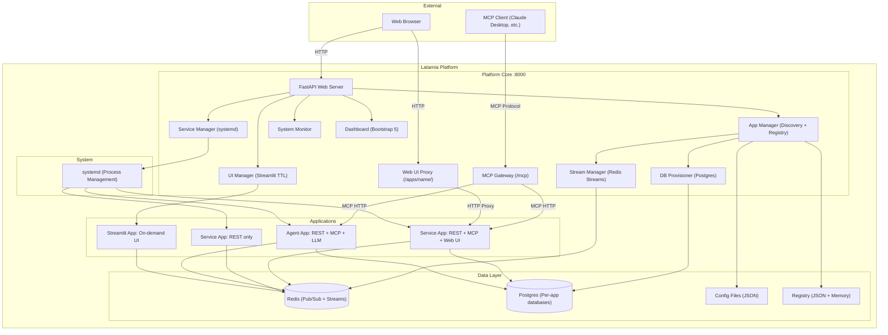
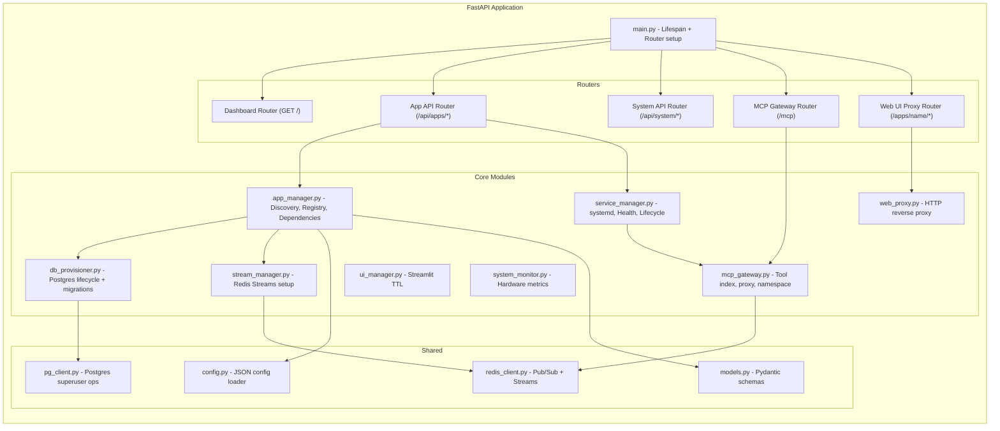
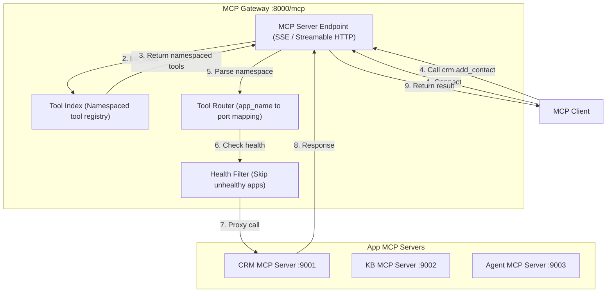
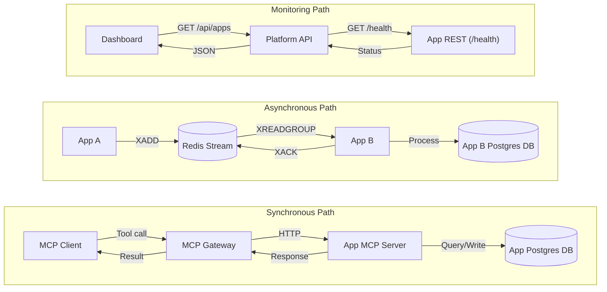
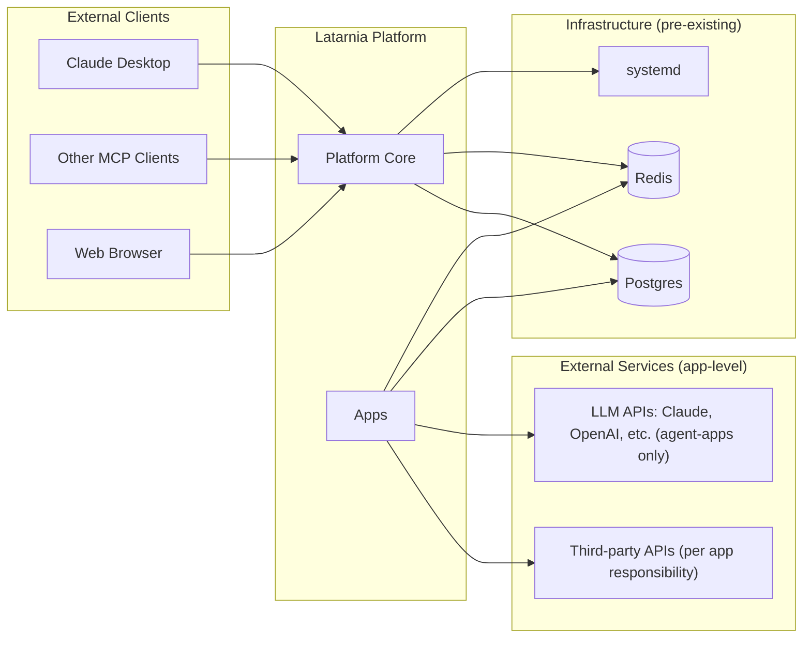

# P-0002: Latarnia Architecture

## System Overview



---

## Component Architecture

### Platform Core Modules



---

## MCP Gateway Architecture

The gateway acts as a single MCP server endpoint that aggregates tools from all MCP-enabled apps.



### Tool Index Structure

```
{
    "crm.add_contact":    { app: "crm", port: 9001, tool: "add_contact" },
    "crm.search_contacts": { app: "crm", port: 9001, tool: "search_contacts" },
    "kb.query":           { app: "kb",  port: 9002, tool: "query" },
    "kb.add_document":    { app: "kb",  port: 9002, tool: "add_document" }
}
```

### Gateway Behavior Rules
- Tool index is rebuilt on: platform startup, app start/stop, app version bump
- Tool calls to unhealthy apps return an error immediately (no timeout waiting)
- Namespace format is always `{app_name}.{tool_name}` — no nesting
- If two apps somehow expose tools with the same namespaced name, the second registration fails (enforced by unique app names)

---

## Data Flow Architecture



---

## Deployment Topology

### Production (Raspberry Pi 5 / VPS)

```
Machine
├── Postgres (pre-installed, port 5432)
│   ├── latarnia_crm        (app database)
│   ├── latarnia_kb          (app database)
│   └── latarnia_scraper     (app database)
│
├── Redis (port 6379)
│   ├── Pub/Sub channels     (platform events)
│   └── Streams              (app→app communication)
│
├── Latarnia Platform (port 8000)
│   ├── Dashboard            (GET /)
│   ├── API                  (GET /api/*)
│   ├── MCP Gateway          (SSE /mcp)
│   └── Web UI Proxy         (GET /apps/*)
│
├── Service Apps
│   ├── CRM App              (REST :8101, MCP :9001, Web UI via proxy)
│   ├── Knowledge Base       (REST :8102, MCP :9002)
│   ├── Scraper Agent        (REST :8103, MCP :9003)
│   └── Sensor Monitor       (REST :8104, no MCP)
│
└── Streamlit Apps (on-demand)
    └── Config Editor        (:8501, TTL-managed)
```

### Port Allocation

| Range | Purpose |
|-------|---------|
| 5432 | Postgres (pre-existing) |
| 6379 | Redis |
| 8000 | Latarnia platform (dashboard, API, MCP gateway, web proxy) |
| 8100-8199 | Service app REST/HTTP servers |
| 8501+ | Streamlit apps (on-demand) |
| 9001-9099 | Service app MCP servers (declared in manifest) |

---

## External System Interactions



**Key boundary:** The platform manages Postgres provisioning and Redis Streams setup but does NOT intermediate app-level data access. Apps connect to their own Postgres database and Redis streams directly at runtime.

---

## Security Model (Evolved)

### Database Isolation
- Each app gets a dedicated Postgres database and role
- Role can only CONNECT to its own database (enforced by Postgres, not convention)
- Platform superuser used for provisioning only; connection string never passed to apps
- Apps cannot query other apps' databases

### Network Isolation
- MCP gateway validates tool calls against the registered tool index — apps cannot be called with arbitrary tool names
- Web UI proxy validates that the target app exists and has `has_web_ui: true`
- Redis Streams enforce consumer group isolation — apps can only read from groups they own

### Process Isolation (unchanged)
- Each app runs as a separate systemd service
- Resource limits via systemd cgroups
- Apps cannot access each other's file system data directories

### Trust Model
- v1 assumes a trusted network (single operator, local deployment)
- No MCP authentication in v1 — any client that can reach port 8000 can invoke tools
- No Redis AUTH in v1 — assumed localhost-only deployment
- Postgres roles provide app-level isolation but no encryption in transit
