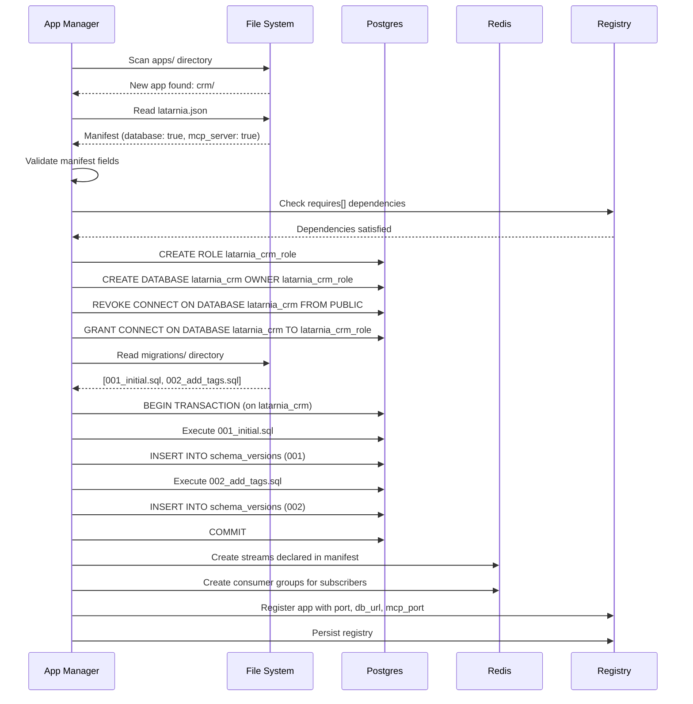
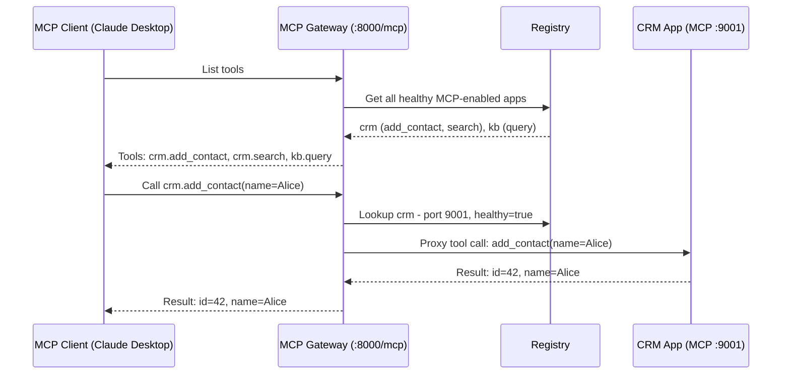
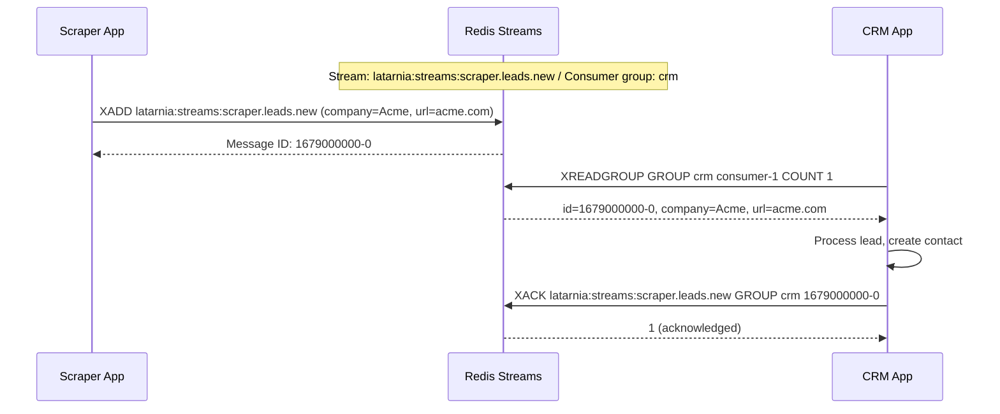
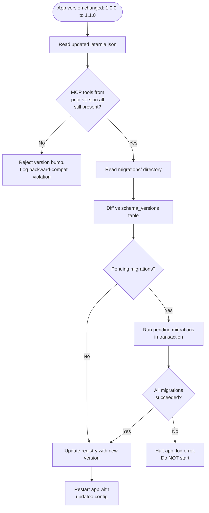

# P-0002: Latarnia — Unified Mini-App Platform

## Problem

Latarnia manages app lifecycles and renders a dashboard, but its interaction model is limited to REST calls and dashboard clicks. There is no way for an external client (human or AI) to discover what an app *can do* — only that it's running. Apps cannot communicate asynchronously with guaranteed delivery. Apps that need structured data are stuck with ad-hoc JSON files.

This blocks the next generation of use cases: a CRM populated by a scraper, an agent that reasons across multiple apps, a knowledge base that serves as shared memory. None of these are possible when the platform only knows that apps exist — not what they expose.

**Who is affected:** The platform operator (solo developer) who wants to build richer, composable mini-apps and connect them to MCP-compatible AI clients (e.g., Claude Desktop).

**Why it matters:** Without typed, discoverable tool surfaces and reliable inter-app messaging, every new integration is a bespoke REST client. The platform's value doesn't compound with each new app installed.

---

## Context & Constraints

### Business Context
- Evolved from Latarnia (P-0001, completed). The existing system is deployed and running on a Raspberry Pi 5.
- The operator uses Claude Desktop (and potentially other MCP clients) as the primary interaction surface beyond the dashboard.
- This is a solo/small-team project. Complexity must stay manageable.

### Existing Systems
- **Latarnia core** (FastAPI, systemd, Redis pub/sub, Bootstrap 5 dashboard) — all retained.
- **App contract** (`latarnia.json`, `/health`, `/ui`, REST API pattern) — extended, not replaced.
- **Redis** — gains Streams for app→app communication. Existing pub/sub retained for platform events only.
- **Postgres** — must be pre-installed on the target machine. Platform assumes superuser access for provisioning.

### Key Constraints
- Target hardware: Raspberry Pi 5 (8GB RAM), Raspberry Pi OS (Debian-based). Also deployable on VPS or local machine.
- Python 3.9+ runtime.
- Postgres must be pre-existing and accessible. Platform does not install or manage Postgres itself.
- MCP protocol compliance required for external client compatibility.
- Backward compatibility: existing Latarnia apps (no MCP, no DB, no Streams) must continue to work unchanged.
- Platform name changes from Latarnia → **Latarnia** (file paths, service names, dashboard branding).

---

## Proposed Solution (High-Level)

Latarnia evolves Latarnia into a general-purpose mini-app platform where apps can declare typed tool surfaces (MCP), communicate asynchronously (Redis Streams), and use managed databases (Postgres). The platform acts as infrastructure — lifecycle, routing, discovery — not reasoning.

### Main Actors
- **Platform Operator**: Installs/manages apps, uses the dashboard for monitoring.
- **MCP Client**: External AI client (Claude Desktop, etc.) that connects to the platform's MCP gateway to invoke app tools.
- **App Developer**: Builds apps that comply with the Latarnia app contract.

### Capabilities

- **cap-001**: Platform rename (Latarnia → Latarnia) across file paths, service names, config, dashboard, and systemd units.
- **cap-002**: Evolved app manifest — add `database`, `mcp_server`, `mcp_port`, `has_web_ui`, `redis_streams_publish`, `redis_streams_subscribe`, and `requires` fields to `latarnia.json` (renamed to `latarnia.json`). Existing fields remain, new fields are optional.
- **cap-003**: Centralized Postgres provisioning — on first discovery of an app with `database: true`, create an isolated Postgres database and a dedicated role. Inject `--db-url` at app launch. Track provisioned databases in the platform registry.
- **cap-004**: Mandatory migration system — apps with `database: true` must ship a `migrations/` directory with ordered SQL files. Platform runs pending migrations on first discovery and on version bump. Track applied migrations in a `schema_versions` table per app database. Migration failure halts the app and logs an error; no auto-rollback.
- **cap-005**: App-side MCP server — apps that declare `mcp_server: true` run an HTTP-based MCP server on their declared `mcp_port`. The platform does not implement the MCP server for the app; the app owns it entirely.
- **cap-006**: MCP gateway/proxy — the platform exposes a single MCP endpoint (HTTP+SSE or Streamable HTTP) that aggregates all app MCP tools under `app_name.tool_name` namespaces. External clients connect once to the gateway and get the full tool surface. Gateway handles discovery, health-aware routing (don't route to unhealthy apps), and namespace enforcement.
- **cap-007**: Redis Streams for inter-app communication — apps declare published/subscribed streams in their manifest. Platform creates streams and consumer groups at app registration time. Validates no publisher collisions (two apps cannot publish to the same stream name). Apps use XADD/XREADGROUP/XACK directly via their Redis connection.
- **cap-008**: Web UI reverse proxy — apps with `has_web_ui: true` serve their own HTTP on their assigned port. Platform reverse-proxies requests under `/apps/{app_name}/` to the app's HTTP server. Coexists with the existing REST-in-modal pattern.
- **cap-009**: App dependency resolution — at install/discovery time, if an app declares `requires`, check that each required app is installed and its version meets the minimum floor. Refuse registration if any dependency is unmet. No transitive resolution; no install ordering.
- **cap-010**: Dashboard updates — app tiles gain visual indicators for: MCP status (tool count), database status (provisioned/migrated), web UI availability (link), active stream subscriptions. No new dashboard pages.
- **cap-011**: App versioning contract — all versions under the same app name must be backward compatible. Breaking changes (removing/changing MCP tool signatures or stream schemas) require a new app name. Platform validates this by checking that registered tool names from a prior version still exist on version bump.

---

## Acceptance Criteria

- **cap-001**: All references to "Latarnia" in file paths, config files, systemd unit names, dashboard title/branding, and CLI output are replaced with "Latarnia". Existing apps continue to function after rename. `latarnia.json` manifest files are accepted with a deprecation warning; `latarnia.json` is the canonical name.
- **cap-002**: An app with only the existing manifest fields (no new fields) is discovered and runs identically to Latarnia behavior. An app with the new fields (`database`, `mcp_server`, etc.) is parsed correctly and the values are available in the registry.
- **cap-003**: When an app with `database: true` is first discovered, a new Postgres database named `latarnia_{app_name}` is created with a dedicated role `latarnia_{app_name}_role`. The role has CONNECT privilege only on its own database. The connection string is passed to the app as `--db-url` at launch. The database and role are recorded in the platform registry.
- **cap-004**: On first discovery of an app with `database: true` and a `migrations/` directory, all migration files are executed in order. A `schema_versions` table is created in the app's database tracking each applied migration. On version bump, only pending migrations run. If any migration fails, the app is NOT started and an error is logged with the failing migration file and Postgres error message. No partial state is left behind (migration runs in a transaction).
- **cap-005**: An app with `mcp_server: true` and `mcp_port: 9001` is expected to respond to MCP protocol requests on port 9001 after startup. The platform health check includes an MCP endpoint liveness probe after the standard `/health` check passes.
- **cap-006**: An MCP client connecting to `http://latarnia-host:8000/mcp` receives a tool listing containing all tools from all healthy MCP-enabled apps, namespaced as `app_name.tool_name`. A tool call to `crm.add_contact` is proxied to the CRM app's MCP server. If the CRM app is unhealthy, the tool call returns an error rather than hanging.
- **cap-007**: When an app with `redis_streams_publish: ["crm.contacts.created"]` is registered, the stream `latarnia:streams:crm.contacts.created` exists in Redis. When a second app with the same publish stream is registered, registration fails with a collision error. Consumer groups are created per subscribing app. Apps can XADD, XREADGROUP, and XACK using their Redis connection.
- **cap-008**: A request to `http://latarnia-host:8000/apps/crm/` is proxied to `http://localhost:{crm_port}/`. Static assets, WebSocket connections, and sub-paths are correctly proxied. The proxy adds appropriate headers (X-Forwarded-For, X-Forwarded-Proto). If the app is not running, the proxy returns a user-friendly error page.
- **cap-009**: An app with `requires: [{"app": "knowledge_base", "min_version": "1.2.0"}]` fails to register if `knowledge_base` is not installed. It also fails if `knowledge_base` is installed at version `1.1.0`. It succeeds if installed at `1.2.0` or `2.0.0`.
- **cap-010**: The dashboard app tile for a MCP-enabled app shows a tool count badge. An app with a provisioned database shows a DB status indicator. An app with `has_web_ui: true` shows a clickable link to `/apps/{name}/`. Stream subscription counts are visible on the tile.
- **cap-011**: On version bump, if the previous version exposed MCP tools `[search, add, delete]` and the new version only exposes `[search, add]`, the version bump is rejected with a backward-compatibility violation error. Adding new tools `[search, add, delete, export]` is accepted.

---

## Key Flows

### flow-01: App Discovery with Database Provisioning

An app with `database: true` is placed in the apps directory and discovered by the platform.

### flow-02: MCP Client Tool Invocation via Gateway

An external MCP client calls a tool through the platform gateway.

### flow-03: Inter-App Communication via Redis Streams

A scraper app publishes a lead, and the CRM app processes it asynchronously.

### flow-04: Version Bump with Migration and Backward Compatibility Check

An existing app is updated to a new version with new migrations and new MCP tools.

---

## Technical Considerations

### Architecture Approach
- Platform core remains FastAPI. New capabilities are added as modules/routers, not separate services.
- MCP gateway is a FastAPI router at `/mcp` that implements the MCP server protocol and proxies to app MCP servers over HTTP.
- Postgres interaction via `asyncpg` or `psycopg` for provisioning operations. Apps receive a connection string and use whatever Postgres client they want.
- Redis Streams coexist with existing pub/sub. Platform events (health, discovery) stay on pub/sub. App→app communication uses Streams exclusively.

### Integration Points
- **Postgres**: Platform needs superuser credentials in its config to create databases and roles. Each app gets a restricted-privilege connection string.
- **MCP protocol**: Platform must implement the MCP server spec (tool listing, tool invocation, likely SSE or streamable HTTP transport). This is the most technically novel component.
- **Redis Streams**: Platform creates streams and consumer groups. Apps interact with streams directly — platform does not intermediate message flow.
- **Reverse proxy**: FastAPI/Starlette reverse proxy for web UI. Needs to handle path rewriting, WebSocket upgrade, and static assets.

### Feasibility Validation Required
- **MCP server implementation in Python**: Validate that a Python MCP server (e.g., `mcp` Python SDK) can be embedded in FastAPI and proxy tool calls to downstream HTTP MCP servers. Prototype this before committing to the gateway architecture.
- **Reverse proxy in FastAPI**: Validate that `httpx`-based reverse proxying handles WebSocket upgrade, streaming responses, and path rewriting correctly. Prototype with a simple app before building the full integration.

---

## Risks, Rabbit Holes & Open Questions

### Technical Risks
- **MCP protocol maturity**: The MCP spec is evolving. Streaming HTTP transport may change. Pin to a specific protocol version and document it.
- **Postgres provisioning permissions**: On some Postgres installations, superuser may not have permission to create roles/databases without explicit configuration. Document prerequisites clearly.
- **Reverse proxy edge cases**: WebSocket proxying, large file uploads through the proxy, and path rewriting for relative asset URLs are all potential failure points.

### Product/UX Risks
- **App developer burden**: The evolved contract adds significant optionality (MCP server, migrations, streams). Documentation and a working example app are critical to adoption.
- **Migration failures in production**: A bad migration can brick an app. The "halt and alert" policy is correct, but the operator needs clear guidance on manual recovery.

### Rabbit Holes — Do NOT Build
- **Schema registry for Redis Streams**: Validate stream names only, not message contents. Apps own their message schemas.
- **Transitive dependency resolution**: Check direct dependencies only. No recursive graph walking.
- **Database backup/restore**: Out of scope for v1. Operator manages Postgres backups externally.
- **Built-in agent or chat UI**: The platform is infrastructure. MCP clients are external.
- **Per-user isolation or multi-tenancy**: Single operator, single tenant.
- **Auto-rollback on migration failure**: Forward-only. Operator handles rollback manually if needed.
- **MCP authentication/authorization**: v1 assumes trusted network. OAuth 2.1 or similar is a future project.
- **App auto-install or marketplace**: Apps are manually placed in the apps directory.
- **Hot-reload of MCP tools**: Tool listing is refreshed on app restart/discovery, not live.

### Open Questions
1. **MCP transport version**: Should the gateway use SSE-based transport or the newer Streamable HTTP? Decision needed before implementation. Recommend going with whatever the `mcp` Python SDK supports best at implementation time.
2. **Platform name in manifest**: Should the manifest file be renamed from `latarnia.json` to `latarnia.json` immediately, or support both with deprecation? Recommend: accept both, prefer `latarnia.json`, log deprecation warning for `latarnia.json`.
3. **Port allocation for MCP**: Apps currently get a single port (8100-8199) for REST. MCP needs a second port. Should MCP ports come from a separate range (e.g., 9001-9099), or should the app multiplex REST and MCP on the same port? Recommend: separate range, declared in manifest.

---

## Scope: IN vs OUT

### IN Scope
- Platform rename to Latarnia (paths, services, config, dashboard, manifest)
- Evolved app manifest with new optional fields
- Centralized Postgres provisioning (per-app isolated databases)
- Mandatory migration system (forward-only, transactional)
- App-side MCP HTTP server contract
- Platform MCP gateway/proxy with namespaced tool aggregation
- Redis Streams for app→app async communication
- Web UI reverse proxy coexisting with REST-in-modal
- App dependency resolution (presence + version check)
- Dashboard tile updates for new capability indicators
- App versioning and backward compatibility enforcement
- Updated app specification documentation
- Working example app demonstrating all new capabilities

### OUT Scope — Do NOT Implement
- Built-in agent, chat UI, or LLM integration in the platform
- Agent/platform memory store (removed from v1)
- Database backups or restore tooling
- MCP authentication/authorization (OAuth, API keys)
- Per-user isolation or multi-tenancy
- Transitive dependency resolution or install ordering
- Schema registry for Redis Stream messages
- App marketplace, auto-install, or remote app fetching
- Migration rollback automation
- Hot-reload of MCP tool surfaces
- Dashboard redesign or new dashboard pages

### Cut List (drop if scope needs to shrink)
- cap-010 (dashboard tile updates) — can be done in a follow-up
- cap-008 (web UI reverse proxy) — apps can be accessed directly by port in the interim
