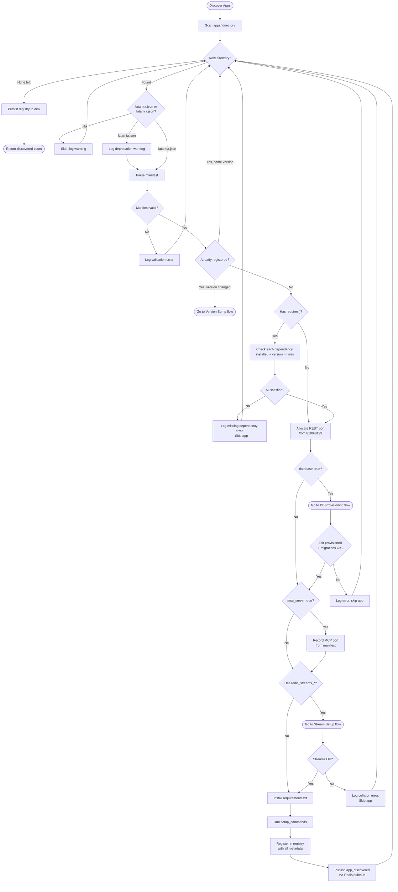
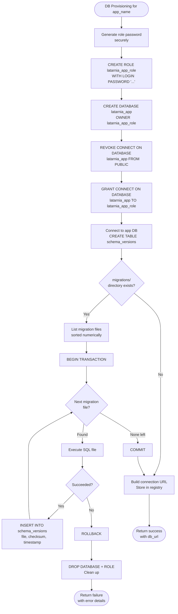
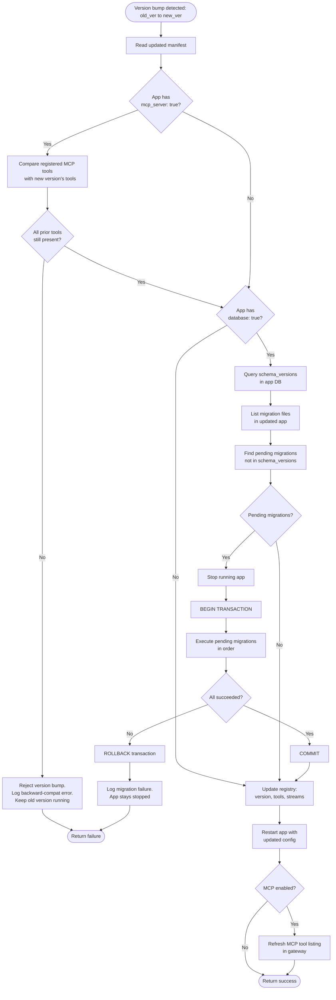
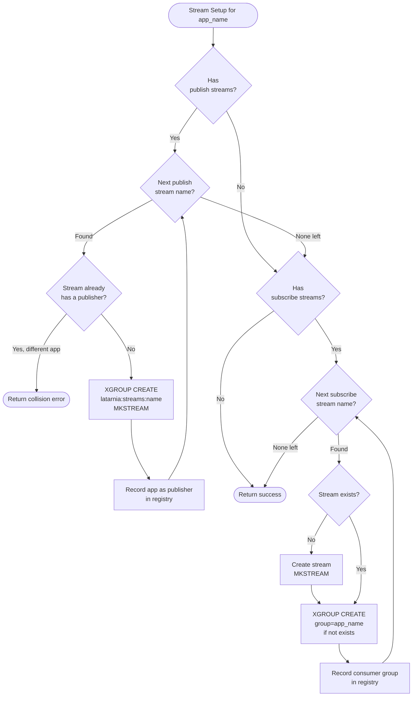
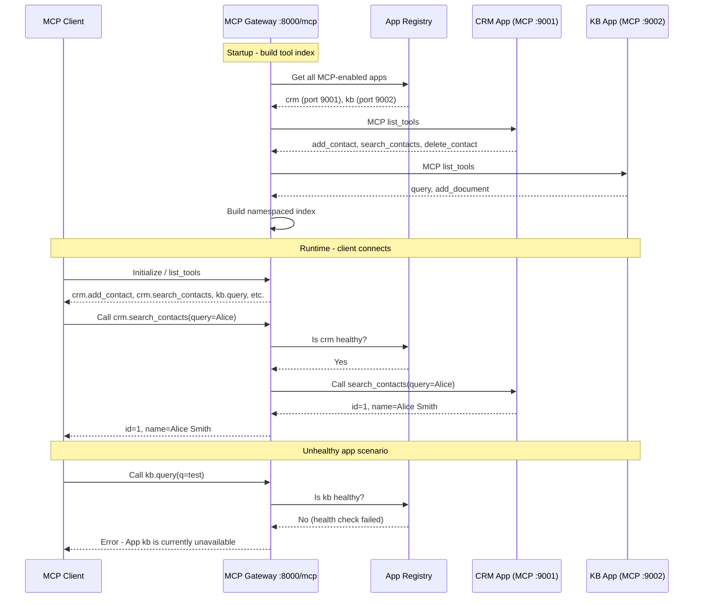
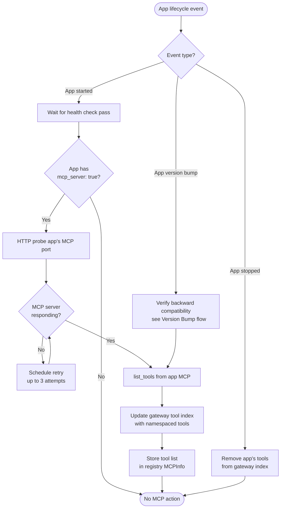
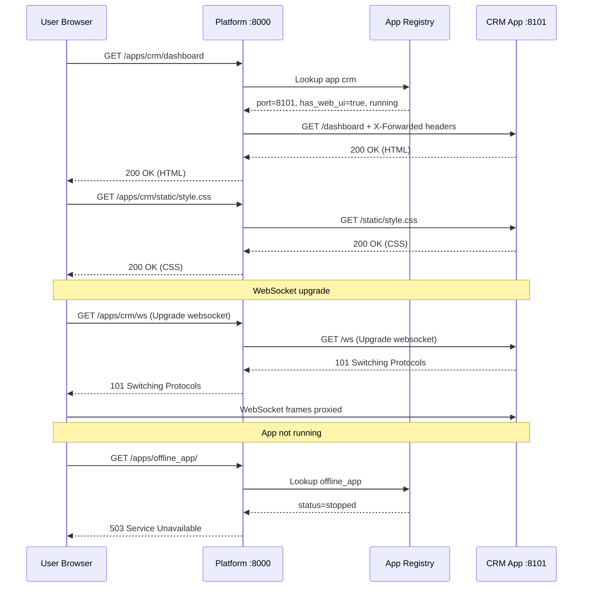
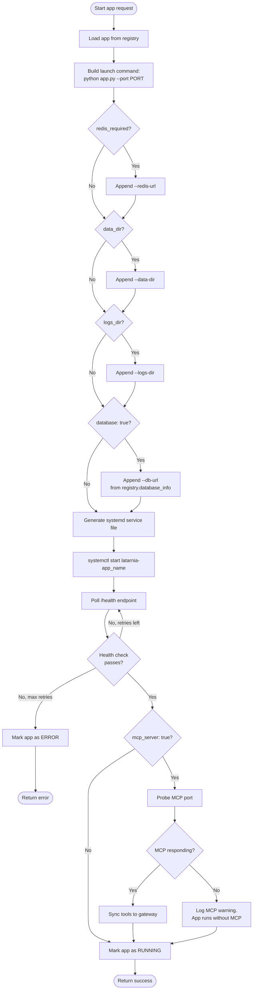
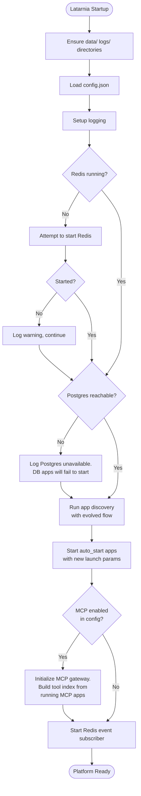

# P-0002: Latarnia Workflows

This document covers the process flows and interaction patterns introduced or modified by P-0002. For existing Latarnia workflows that remain unchanged, see `System/workflows.md`.

---

## 1. Evolved App Discovery [cap-002, cap-003, cap-004, cap-007, cap-009]

The discovery flow gains database provisioning, migration execution, stream setup, and dependency checking. Existing apps (no new manifest fields) follow the unchanged path.

---

## 2. Database Provisioning [cap-003, cap-004]

Triggered during app discovery when `database: true` is declared.

---

## 3. Version Bump Handling [cap-004, cap-011]

Triggered when a registered app's manifest version has changed.

---

## 4. Redis Stream Setup [cap-007]

Triggered during app discovery when `redis_streams_publish` or `redis_streams_subscribe` is declared.

---

## 5. MCP Gateway — Tool Discovery and Routing [cap-005, cap-006]

How the MCP gateway aggregates tools from all apps and routes client requests.

---

## 6. MCP Tool Sync on App Lifecycle Events [cap-005, cap-006]

How the gateway stays in sync when apps start, stop, or update.

---

## 7. Web UI Reverse Proxy Request Flow [cap-008]

How the platform proxies requests to app-owned web UIs.

---

## 8. App Launch Sequence (Evolved) [cap-003, cap-005]

How the Service Manager starts an app with the new parameters.

---

## 9. Platform Startup (Evolved) [cap-001, cap-006]

How the Latarnia platform starts up, including new MCP gateway initialization.

