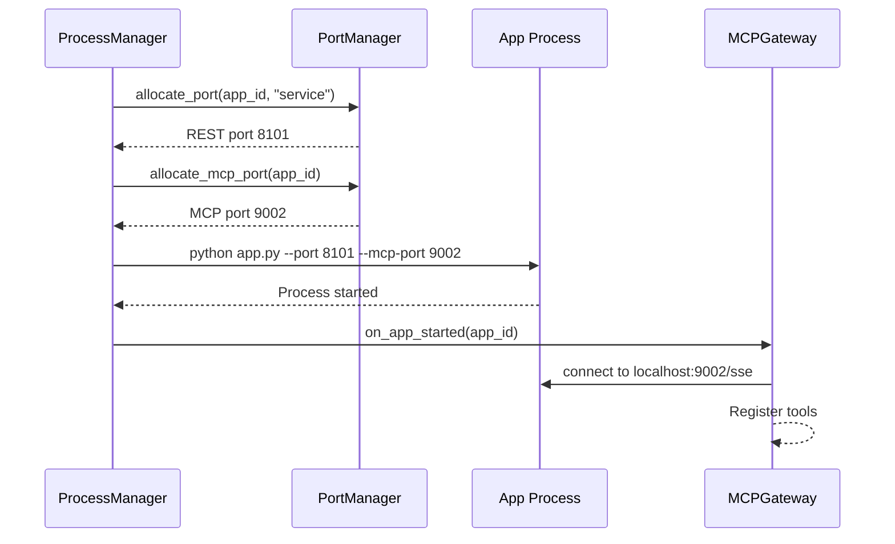

# Dynamic MCP Port Allocation

## Problem
MCP ports are currently hardcoded in each app's `latarnia.json` manifest (`"mcp_port": 9001`). If multiple apps declare MCP servers, they will conflict on the same port. The platform already dynamically allocates REST API ports via `PortManager`, but MCP ports bypass this mechanism entirely.

This creates a manual coordination burden: app developers must pick unique MCP ports by hand, and there's no system-level enforcement or conflict detection.

## Context & Constraints
- REST API ports are already dynamically allocated from a configurable range (default 8100–8199) by `PortManager`
- MCP ports are declared statically in `latarnia.json` and read by `AppManager` into `MCPInfo`
- The `ProcessManager` passes `--port` (REST) dynamically but does **not** pass `--mcp-port` at all — apps receive it from their own manifest
- The `MCPGateway` reads the MCP port from `MCPInfo` to connect to each app's MCP server
- `ServiceManager` (systemd on Pi) also needs to know the MCP port for the service template
- The existing `PortManager` only tracks one port per app (`app_ports` dict)
- Port range isolation between TST (8100–8149) and PRD (8150–8199) applies to REST ports; MCP ports currently live outside any managed range

## Proposed Solution (High-Level)

Extend the `PortManager` to allocate MCP ports from a dedicated range, and have the platform pass the allocated MCP port to apps via `--mcp-port` CLI argument — the same pattern used for REST ports.

**Main actors:** Platform (port allocation + process launch), App (receives port via CLI arg)

### Capabilities

- **cap-001: Remove `mcp_port` from manifest schema.** Delete `config.mcp_port` from `AppConfig`. Apps declare `"mcp_server": true` to signal MCP capability; the platform assigns the port.
- **cap-002: Add MCP port range to configuration.** Add a configurable `mcp_port_range` (start/end) alongside the existing `port_range` in `ProcessManagerConfig`.
- **cap-003: Allocate MCP ports dynamically.** Extend `PortManager` to handle a second port allocation for MCP-enabled apps. Track both REST and MCP ports per app.
- **cap-004: Pass MCP port to apps at launch.** `ProcessManager` adds `--mcp-port <allocated_port>` to the subprocess command for MCP-enabled apps. `ServiceManager` includes the MCP port in systemd templates.
- **cap-005: Update MCPGateway to use allocated port.** The gateway reads the MCP port from `MCPInfo` (which is now populated by the platform at launch, not from the manifest).
- **cap-006: Update example_full_app to reflect the change.** Remove `mcp_port` from `latarnia.json`, verify the app already accepts `--mcp-port` via CLI arg (it does).

## Acceptance Criteria

- **cap-001:** `AppConfig` has no `mcp_port` field. Apps with `mcp_server: true` get a port allocated automatically. Any manifest with `mcp_port` is rejected at validation.
- **cap-002:** `config.json` has a new `mcp_port_range` block with `start` and `end`. Defaults: `start=9001, end=9099`. TST and PRD ranges are documented in `SYSTEM.md`.
- **cap-003:** `PortManager.allocate_mcp_port(app_id)` returns a free port from the MCP range. `PortManager` tracks MCP ports separately from REST ports. `get_port_statistics()` includes MCP allocation counts.
- **cap-004:** When starting an MCP-enabled app, the command includes `--mcp-port <port>`. The allocated MCP port is stored in `MCPInfo.mcp_port`.
- **cap-005:** `MCPGateway` connects to the dynamically allocated port (no behavior change needed if `MCPInfo.mcp_port` is already populated correctly).
- **cap-006:** `examples/example_full_app/latarnia.json` has `"mcp_server": true` with no `mcp_port` field. App starts and MCP tools are reachable via the gateway.

## Key Flows

### flow-01: App startup with MCP port allocation

## Technical Considerations
- The `PortManager` currently uses a flat `app_ports: Dict[str, int]` mapping. It needs a parallel `app_mcp_ports: Dict[str, int]` mapping or a richer data structure.
- The `PortAllocation` dataclass needs an `allocation_type` field (rest vs mcp) or we need a second allocation dict.
- `ServiceManager` templates must include the MCP port in `ExecStart` args.
- The health monitor's MCP probe already reads `mcp_info.mcp_port` — no change needed there if the port is populated correctly.

## Risks, Rabbit Holes & Open Questions
- **Rabbit hole:** Do NOT redesign the entire port management system. Keep the existing approach (two parallel ranges) rather than introducing a unified port pool.
- **Rabbit hole:** Do NOT add MCP port to the REST API response for apps (it's an internal detail). The gateway is the only consumer.
- **Open question:** Should the MCP port range be separate from the REST port range? (Proposed: yes, to maintain clear separation and avoid confusion in logs/monitoring.)
## Scope: IN vs OUT
- **IN:** Dynamic MCP port allocation, config, port manager extension, process/service manager updates, example app update, remove `mcp_port` from manifest schema
- **OUT:** Unified port pool (keep separate ranges), MCP port in REST API response, changes to non-MCP port allocation logic, MCP transport changes (SSE stays as-is), backward compatibility for old `mcp_port` manifests
