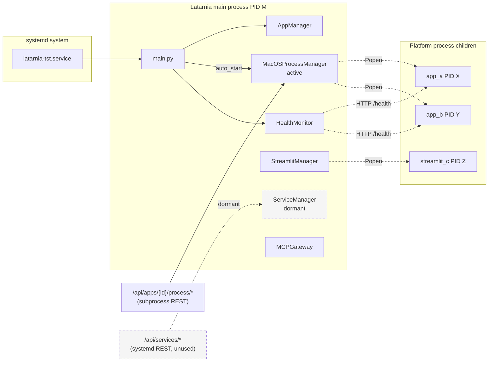
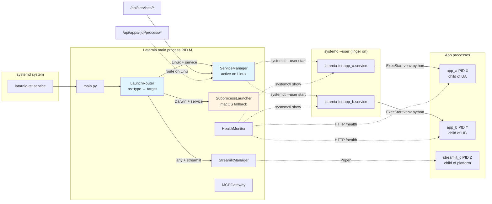
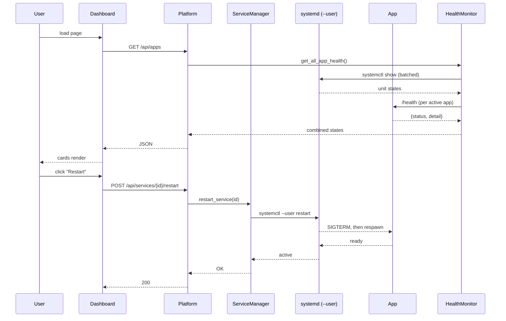

# P-0005 Architecture

## Before / after component diagram

### Before (current — subprocess active, systemd dormant)



### After (P-0005 — systemd active on Linux, subprocess macOS-only)



The `LaunchRouter` is a thin dispatch in `main.py` / the start path — not a new class with its own state. It just picks a target based on `(platform.system(), manifest.type)`.

---

## Deployment topology (Pi, after P-0005)

```mermaid
flowchart TB
    subgraph Pi["Raspberry Pi 5 (HERMES, 192.168.68.100)"]
        subgraph SystemScope["System-scope systemd (/etc/systemd/system/)"]
            TstUnit["latarnia-tst.service<br/>User=felipe, :8000"]
            PrdUnit["latarnia-prd.service<br/>User=felipe, :8080"]
        end

        subgraph UserScopeTst["~felipe/.config/systemd/user/ (TST)"]
            TstApp1[latarnia-tst-app_a.service]
            TstApp2[latarnia-tst-app_b.service]
            TstAppN[latarnia-tst-app_N.service]
        end

        subgraph UserScopePrd["~felipe/.config/systemd/user/ (PRD)"]
            PrdApp1[latarnia-prd-app_a.service]
            PrdApp2[latarnia-prd-app_b.service]
        end

        subgraph TstVenv["/opt/latarnia/tst/.venv/"]
            TstPython[bin/python]
        end

        subgraph PrdVenv["/opt/latarnia/prd/.venv/"]
            PrdPython[bin/python]
        end

        TstUnit --> TstPython
        PrdUnit --> PrdPython
        TstApp1 --> TstPython
        TstApp2 --> TstPython
        TstAppN --> TstPython
        PrdApp1 --> PrdPython
        PrdApp2 --> PrdPython

        Redis[(Redis :6379<br/>shared)]
        Pg[(Postgres :5432<br/>shared instance<br/>per-env DBs)]

        TstApp1 -.--> Redis
        TstApp2 -.--> Pg
        PrdApp1 -.--> Redis
        PrdApp2 -.--> Pg
    end

    Browser[Browser<br/>laptop] -->|:8000| TstUnit
    Browser -->|:8080| PrdUnit
```

Key properties:
- **System-scope** units for the main platforms — one per env, sudo to install.
- **User-scope** units for per-app services — generated at runtime by `ServiceManager`, no sudo needed. Linger enabled so they persist across login sessions.
- **One venv per env** — shared by the main platform and all its per-app units. `ExecStart` points to the absolute venv Python path.
- **Shared Redis and Postgres** at the host level; per-app DBs are provisioned under a single Postgres instance by env-scoped role/db prefixes.

---

## External system interactions

```mermaid
flowchart LR
    subgraph Pi[Pi]
        Platform[Latarnia platform<br/>main unit]
        AppUnit[Per-app systemd unit]
        App[App process]
    end

    Journal[(systemd journal)]
    Browser[Dashboard browser]
    MCPClient[MCP AI client<br/>Claude / IDE]

    Platform -.systemctl --user.-> AppUnit
    AppUnit -->|ExecStart| App
    App -->|stdout/stderr| Journal
    AppUnit -->|unit events| Journal
    Browser -->|HTTP :8000 dashboard| Platform
    Browser -->|HTTP :8000 /apps/{x}/| Platform
    Platform -->|HTTP proxy :81xx| App
    MCPClient -->|SSE :8000/mcp/sse| Platform
    Platform -->|SSE :9xxx| App
```

The dashboard and MCP paths are unchanged from today. The new arrow is `Platform -.systemctl --user.-> AppUnit` replacing `Platform -.Popen.-> App` from the before diagram.

---

## Data flow between components



No data model changes. No new tables, no new config fields. The only persistent new artifact is the per-app unit file under `~/.config/systemd/user/`, which is not project data — it's generated output.
