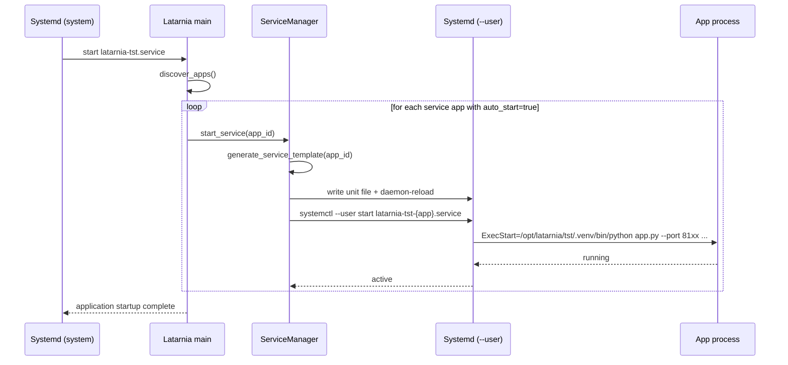
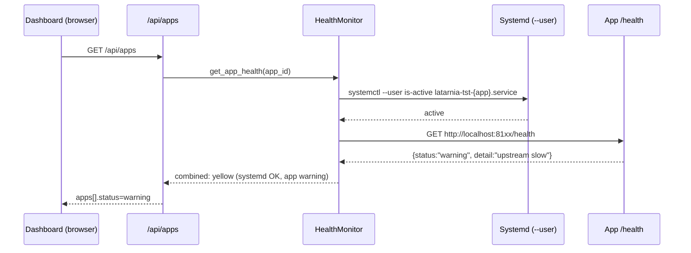
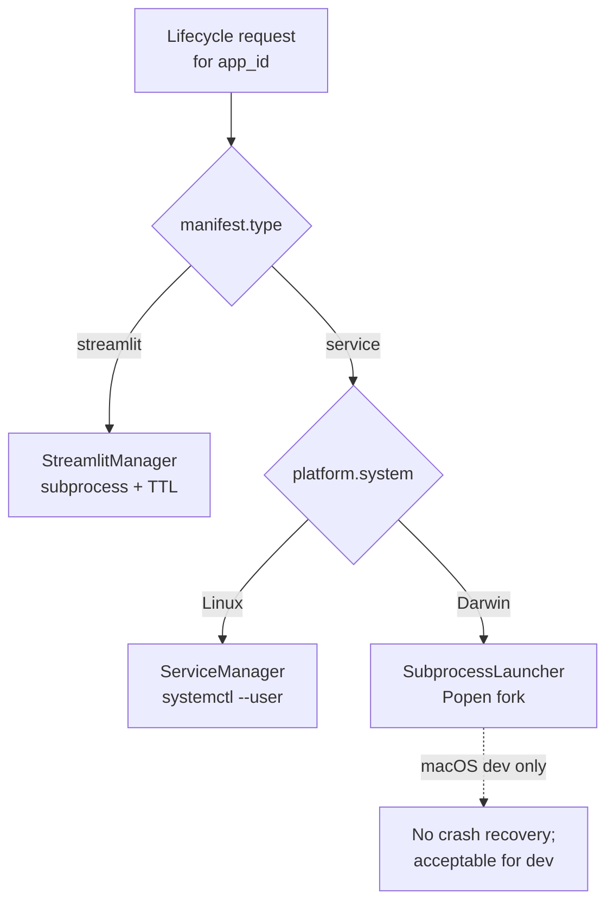
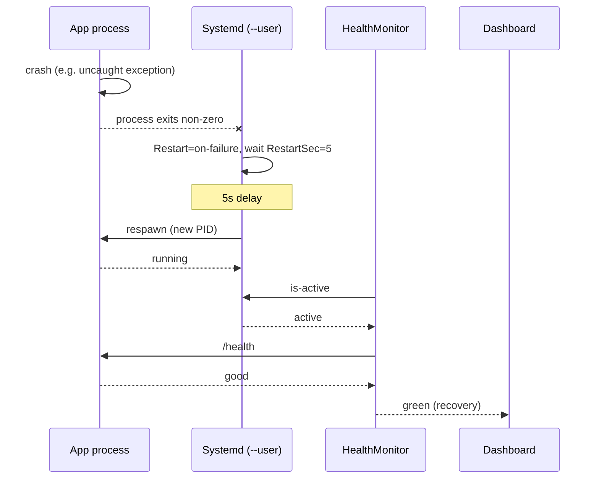

# P-0005: Activate Systemd Per-App Services

## Problem

The Latarnia platform has two parallel app launchers wired into it:

- `MacOSProcessManager` — spawns apps as subprocess children of the platform via `Popen`. Used by auto-start and by `/api/apps/{id}/process/*` endpoints. Despite the name, this is the **active** launcher on both macOS and Linux today.
- `ServiceManager` — generates systemd user units (`latarnia-{env}-{app}.service`), fully implemented and exposed via `/api/services/*` endpoints, but **never actually called** by the platform's boot or dashboard flows. Dormant code.

The original Latarnia design (see `docs/System/app-specification.md`) called for systemd per-app services. Reality diverged during implementation: a subprocess fallback was added for macOS dev, then reused on Linux "temporarily", and the systemd path was never wired in. The gap has gone unnoticed because `auto_start` has always been `false` in committed manifests and no one manually exercised the `/api/services/*` endpoints.

This matters now because the system is growing to 10+ apps:

- **No crash recovery.** `MacOSProcessManager` does not respawn a crashed child. An app failure is invisible until someone looks at the dashboard.
- **Shared lifecycle.** Restart the platform → all apps die with it. Ten cold starts every deploy.
- **Log aggregation is file-based.** Debugging "why did `camera_detection` die at 3am" means grepping app-specific log files. Systemd gives you `journalctl -u latarnia-tst-camera_detection --since 3am -p warning` for free.
- **No at-a-glance health.** `systemctl list-units 'latarnia-tst-*' --failed` would answer "what's unhappy right now" in one command.

P-0004 env-scoped the dormant systemd unit names. This project activates the systemd path so P-0004's fix becomes load-bearing and the two-launcher duplication is resolved.

## Context & Constraints

- **Target:** Raspberry Pi 5 with systemd (the homeserver, TST and PRD environments). Both environments run under user `felipe`, side-by-side, on ports 8000 (TST) and 8080 (PRD).
- **Main platform units** (`latarnia-tst.service`, `latarnia-prd.service`) already run as **system-scope** systemd units installed under `/etc/systemd/system/`. These stay as-is.
- **Per-app units** will be generated at runtime as **user-scope** systemd units under `~felipe/.config/systemd/user/`, using the env-scoped naming (`latarnia-{env}-{app}.service`) already implemented in P-0004.
- User-mode systemd requires **linger** to be enabled for user `felipe` (`loginctl enable-linger felipe`) so the user bus is available without an active login session. This needs to be documented in the deployment skill and verified at platform startup.
- **macOS has no systemd.** Local dev must continue to work. `MacOSProcessManager` remains as a macOS-only fallback, explicitly routed when `platform.system() == "Darwin"`.
- **Streamlit apps are out of scope.** Their lifecycle (on-demand, TTL-based, short-lived) does not match long-running systemd services. They keep their existing launcher (`streamlit_manager.py` / `MacOSProcessManager`).
- **App contract must not change.** Existing apps expose `/health` on their REST port, accept `--port`, `--mcp-port`, `--redis-url`, `--data-dir`, `--logs-dir`, `--db-url` as CLI args, and handle SIGTERM. Systemd calls them the same way subprocess does today — no changes required to any deployed app.
- **Two parallel REST APIs** exist today: `/api/apps/{id}/process/*` (subprocess) and `/api/services/{id}/*` (systemd). After P-0005, `/api/services/*` becomes the canonical service-lifecycle API on Linux; `/api/apps/{id}/process/*` is either deprecated or routed through `ServiceManager` on Linux.
- **Dashboard behavior must not change from the user's perspective.** Card layout, badges, status colors, Web UI button, start/stop/restart controls — all identical. Only the backend query source changes.

## Proposed Solution (High-Level)

Route **service apps** (`manifest.type == "service"`) through `ServiceManager` on Linux; leave streamlit apps and macOS-local-dev on their existing paths. Fix the two pre-existing `ServiceManager` bugs that would otherwise block this activation.

**Main actors:**
- **Platform (main process):** decides per-app whether to delegate to `ServiceManager` (Linux + service app) or to the fallback subprocess launcher (macOS, or any streamlit app).
- **Systemd user daemon:** supervises per-app services on Linux. Restarts on crash, captures stdout/stderr into the journal.
- **Apps:** unchanged contract. Expose `/health`, handle SIGTERM, accept the existing CLI flags.
- **Dashboard:** reads combined status (systemd unit state + app `/health`) and surfaces green/yellow/red per app.

### Capabilities

- **cap-001: ServiceManager uses the env's venv Python.** Generated systemd unit `ExecStart` references the absolute path to the platform's venv Python (e.g. `/opt/latarnia/tst/.venv/bin/python`), not bare `python`. The venv path is derived from `sys.executable` at platform startup. Apps continue to ship without their own venv — they run on the platform's interpreter.
- **cap-002: Service units declare `Environment=ENV={env}`.** Each generated unit carries the current environment so any app that reads `ENV` (or `ServiceManager` itself if re-entrant) behaves consistently. Matches the convention already used by the main platform units.
- **cap-003: Service apps launch via systemd on Linux.** On Linux, `auto_start` at boot and all lifecycle endpoints (`/api/services/*`, and service-app requests to `/api/apps/{id}/process/*`) delegate to `ServiceManager`. `systemctl --user start latarnia-{env}-{app}.service` is the actual launch mechanism. On macOS, the same entry points fall back to `MacOSProcessManager`.
- **cap-004: Streamlit apps and macOS dev continue through the subprocess launcher.** The platform routes by `(os.platform, app.manifest.type)`: Linux + service → systemd; macOS → subprocess; any-os + streamlit → streamlit manager. `MacOSProcessManager` is renamed to `SubprocessLauncher` to reflect its role honestly.
- **cap-005: Dashboard reports combined health.** Per-app dashboard status is derived from two signals: (a) `systemctl --user is-active` (or the subprocess PID liveness on macOS) — authoritative on "process alive"; (b) the app's `/health` endpoint — authoritative on "app working correctly". Combination rules: systemd `failed` → red; systemd `active` AND `/health` `error` → red; systemd `active` AND `/health` `warning` → yellow; both healthy → green.
- **cap-006: Crash recovery via `Restart=on-failure`.** Generated units include `Restart=on-failure` and `RestartSec=5` by default, overridable per-app via `manifest.config.restart_policy`. A crashed app is respawned by systemd without platform intervention.
- **cap-007: User-mode systemd prerequisites documented and verified.** The deployment skill documents `loginctl enable-linger felipe` as a one-time Pi setup step. The platform logs a clear warning at startup if linger is not enabled (detectable via `loginctl show-user felipe | grep Linger`).

## Acceptance Criteria

- **cap-001:** Generated `latarnia-{env}-{app}.service` units have `ExecStart=/opt/latarnia/{env}/.venv/bin/python /opt/latarnia/{env}/apps/{app}/app.py …` on the Pi (or the absolute path corresponding to `sys.executable`). No bare `python` or `python3` appears in any generated ExecStart. Unit test verifies the generated template contains the expected absolute path.
- **cap-002:** Generated units contain `Environment=ENV=tst` on TST, `Environment=ENV=prd` on PRD. Unit test covers both values.
- **cap-003:** With `auto_start: true` and the platform running on Linux, a fresh `sudo systemctl restart latarnia-tst.service` produces a `latarnia-tst-{app}.service` unit per auto-starting service app. `systemctl --user list-units 'latarnia-tst-*' --type=service` shows these units in `active` state. The dashboard's `/api/apps` response shows the same apps as `running` and `healthy`.
- **cap-004:** On macOS with `ENV=dev`, `auto_start: true` launches apps via subprocess fork, not systemd. `systemctl` is never invoked on macOS. Unit test (via platform patching) covers the routing decision.
- **cap-005:** Stopping an app via `systemctl --user stop latarnia-tst-{app}.service` causes its dashboard card to show a `stopped`/red status within the health check interval. Breaking the app's upstream (e.g., stopping Redis) causes `/health` to return `error` and the card flips to red while systemd still reports `active`.
- **cap-006:** Killing an app process with `kill -9 <pid>` on the Pi causes systemd to respawn it within `RestartSec=5` seconds. The dashboard shows a transient error state followed by recovery. `journalctl --user -u latarnia-tst-{app}.service` shows the restart event.
- **cap-007:** On a Pi where linger has been disabled (`loginctl disable-linger felipe`), platform startup logs a `WARNING` naming the missing prerequisite and the remediation command. Deployment skill's First-Time Bootstrap section documents `sudo loginctl enable-linger felipe` as a required step.

## Key Flows

### flow-01: Service app auto-start on platform boot (Linux)

Triggered by `latarnia-tst.service` starting. The platform discovers apps, then for each service app with `auto_start: true`, delegates to `ServiceManager` which installs and starts the unit.

### flow-02: Combined health reporting

The health monitor merges systemd unit state with the app's own `/health` endpoint before the dashboard sees a status.

### flow-03: Launcher routing decision

For every lifecycle request (auto-start at boot, or a dashboard button click), the platform picks the right launcher. Diagram is the same decision for start, stop, restart.

### flow-04: Crash recovery via systemd

Demonstrates the main user-visible benefit of the activation.

## Technical Considerations

- **Determining the venv Python path:** use `sys.executable` at platform startup and cache it on the `ServiceManager` instance. The platform itself is launched via `/opt/latarnia/{env}/.venv/bin/python -m uvicorn latarnia.main:app …`, so `sys.executable` is the venv Python. Works on both Linux and macOS.
- **Linger detection:** shell out to `loginctl show-user "$(whoami)" --property=Linger` at `ServiceManager.__init__` (Linux only). If `Linger=no`, log a warning and emit remediation command. Do not block startup — the main platform is already running via system-scope systemd, so linger only gates per-app user units.
- **Lifecycle coupling on platform restart:** generated per-app units should have `PartOf=latarnia-{env}.service` set in the Unit section so that a main-platform stop also stops the app units. If you want apps to outlive the platform, drop `PartOf` — but that complicates restart semantics. Default to `PartOf`; revisit if needed.
- **Dashboard status query cost:** shelling out to `systemctl` for each of 10+ apps on every dashboard refresh is wasteful. Batch it: `systemctl --user show --property=ActiveState,SubState --type=service 'latarnia-{env}-*'` returns all app states in one call. Parse once, cache briefly.
- **`/api/apps/{id}/process/*` endpoints:** simplest path is to route these through `ServiceManager` on Linux (same target as `/api/services/*`). Alternatively, deprecate them and have the dashboard only use `/api/services/*`. Choice deferred to Scope 2.
- **Backward compatibility:** none needed. No previous deployment has actually used systemd per-app units (verified by `systemctl --user list-units 'latarnia-*'` on the Pi returning empty before this project). Nothing to migrate.

## Risks, Rabbit Holes & Open Questions

- **Rabbit hole:** Do NOT attempt to unify systemd and subprocess behind a single abstraction class on Day 1. Keep `ServiceManager` and `SubprocessLauncher` as two concrete classes, select at call sites. A unified interface can be extracted later if needed.
- **Rabbit hole:** Do NOT try to run system-scope per-app units. User-scope is simpler (no sudo per install) and sufficient. The main platform is the only system-scope unit in play.
- **Rabbit hole:** Do NOT add security hardening directives (`NoNewPrivileges`, `ProtectSystem=strict`, `PrivateTmp`, etc.) in this project. The goal is supervision + logging, not isolation. Isolation is a potential V2 concern.
- **Rabbit hole:** Do NOT rewrite the dashboard. Only change the backend query source for status; keep cards, badges, modals, start/stop buttons exactly as they render today.
- **Rabbit hole:** Do NOT migrate streamlit apps to systemd. Their TTL/on-demand lifecycle does not fit systemd services.
- **Technical risk — linger off on fresh Pi:** if linger is not enabled, user-scope systemd units will not start outside an interactive login session. Mitigation: the Scope 1 linger check emits a loud warning; deployment skill documents the command.
- **Technical risk — env propagation:** an app that reads env vars (e.g. `REDIS_URL`) expects them set. Today `MacOSProcessManager` passes some via `os.environ` inheritance. Systemd units start with a minimal environment. Mitigation: explicit `Environment=` lines in the generated unit for each expected var. The current `generate_service_template` already does this; verify nothing is missed.
- **Open question:** should `/api/apps/{id}/process/*` be deprecated (returning 410 Gone on Linux) or transparently routed to `ServiceManager`? Proposal: route transparently in P-0005, mark deprecated in docs, remove in a future project once the dashboard confirms it's not needed.
- **Open question:** should the platform attempt to auto-enable linger at startup if it detects linger off, rather than only warning? Proposal: no. Enabling linger requires sudo; doing it at startup violates least-privilege. Warning + docs is the right level.

## Scope: IN vs OUT

- **IN:** `ServiceManager` fixes (venv python path; `Environment=ENV=...`); routing of service apps through `ServiceManager` on Linux; `MacOSProcessManager` renamed to `SubprocessLauncher` and restricted to macOS; `HealthMonitor` combines systemd state with `/health`; dashboard status query updated; `Restart=on-failure` in generated units; linger prerequisite documented and warned-on-startup.
- **OUT:** Streamlit apps on systemd; any change to the app `/health` contract; any change to the dashboard UI beyond backend query source; systemd hardening directives (`NoNewPrivileges` etc.); nginx/Caddy reverse proxy; Python venv-per-app; multi-host scheduling; unified launcher abstraction.
- **Cut list (if scope needs to shrink):**
  - Drop cap-007 (linger warning) — document it in deploy skill only, skip the startup check.
  - Drop the `MacOSProcessManager` rename — leave the misleading filename for now, just restrict it by platform check.
  - Keep `/api/apps/{id}/process/*` as the subprocess-only endpoint and make dashboard use `/api/services/*` exclusively on Linux (clearer separation, less magic).
