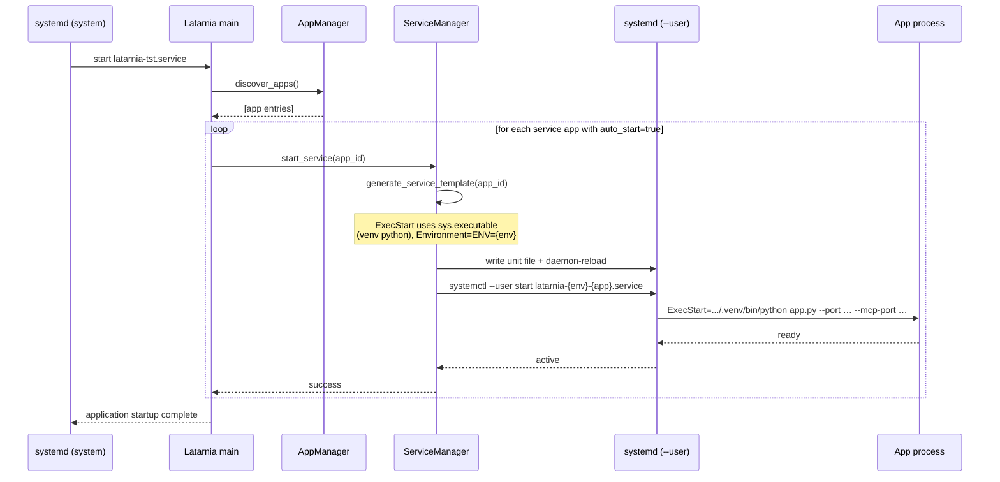
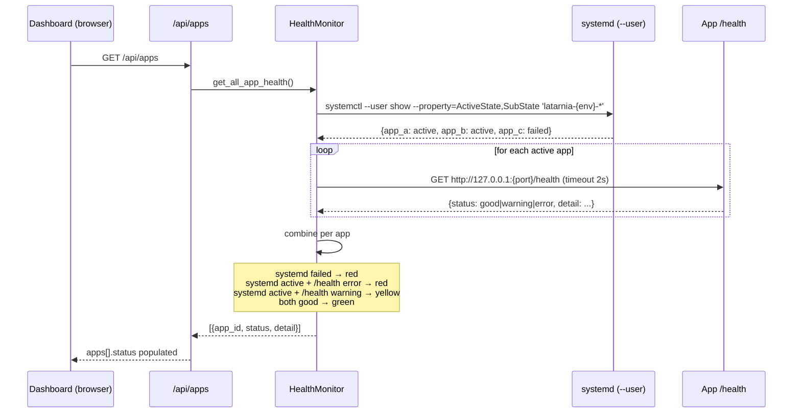
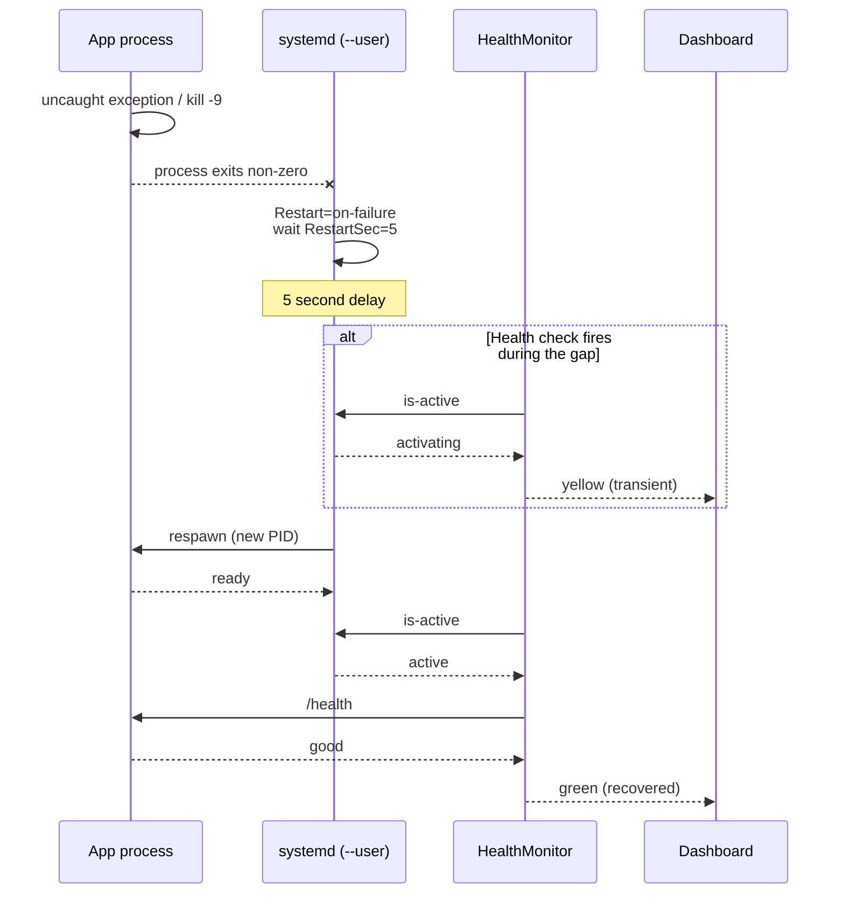
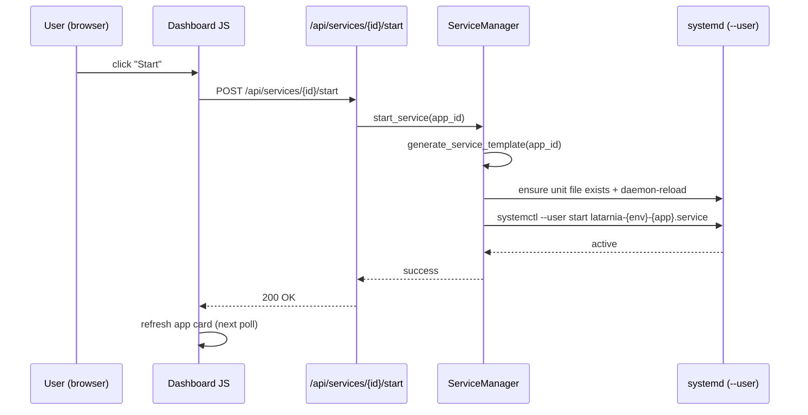

# P-0005 Workflows

Diagrams below reference capabilities defined in [spec.md](spec.md) (cap-001 … cap-007) and flows (flow-01 … flow-04).

---

## flow-01: Service app auto-start on platform boot (Linux) [cap-003, cap-001, cap-002, cap-006]

Triggered when `latarnia-{env}.service` starts. The platform discovers apps via `AppManager`, then for each service app whose manifest has `auto_start: true`, delegates to `ServiceManager`. The subprocess launcher is never invoked on Linux for service apps.



---

## flow-02: Launcher routing decision [cap-003, cap-004]

Every lifecycle request (auto-start at boot, dashboard button, REST call) passes through this decision. Same logic for start, stop, and restart. The decision is `(os.platform, manifest.type)`, not a per-app flag.

```mermaid
flowchart TD
    Request[Lifecycle request<br/>start / stop / restart] --> TypeCheck{manifest.type}
    TypeCheck -->|streamlit| StreamlitMgr[StreamlitManager<br/>subprocess + TTL cleanup]
    TypeCheck -->|service| OSCheck{platform.system}
    OSCheck -->|Linux| SystemdPath[ServiceManager<br/>systemctl --user]
    OSCheck -->|Darwin| MacPath[SubprocessLauncher<br/>Popen fork]

    SystemdPath --> UserUnits[~/.config/systemd/user/<br/>latarnia-{env}-{app}.service]
    MacPath --> Children[Platform-process children<br/>no Restart=, no journald]

    MacPath -.macOS dev only.-> DevNote[Limitation accepted:<br/>no crash recovery, flat logs]
```

---

## flow-03: Combined health reporting [cap-005]

The dashboard status for an app is derived from two orthogonal signals merged by `HealthMonitor`: systemd's view of the process, and the app's self-reported `/health`. A single query to `systemctl show` returns state for all `latarnia-{env}-*` units at once.



### Combination rules (cap-005)

| systemd state | `/health` status | Dashboard | Notes |
|---|---|---|---|
| `active` | `good` | green | normal case |
| `active` | `warning` | yellow | app reports degradation |
| `active` | `error` | red | app reports failure (e.g. upstream down) |
| `active` | unreachable | yellow | `/health` timeout; process alive but not responding |
| `activating` | — | yellow | transient startup state |
| `inactive` | — | grey | stopped on purpose |
| `failed` | — | red | systemd gave up or app crashed past Restart limit |

---

## flow-04: Crash recovery [cap-006]

Demonstrates the headline user-visible benefit. A crashed app is respawned by systemd without platform intervention. The dashboard briefly shows a transient state, then recovers.



Journal trail for the same event:
```
journalctl --user -u latarnia-tst-{app}.service --since "5 min ago"
→ app started
→ app main exception: RuntimeError: upstream
→ app.service: Main process exited, code=exited, status=1
→ app.service: Scheduled restart job, restart counter is at 1
→ Started latarnia-tst-{app}.service.
→ app started
```

---

## flow-05: Dashboard start/stop/restart button [cap-003, cap-005]

User clicks a lifecycle button in the dashboard. The request is routed by the decision in flow-02 (service app → ServiceManager on Linux).



Stop and restart follow the same pattern with `stop_service` / `restart_service`.
