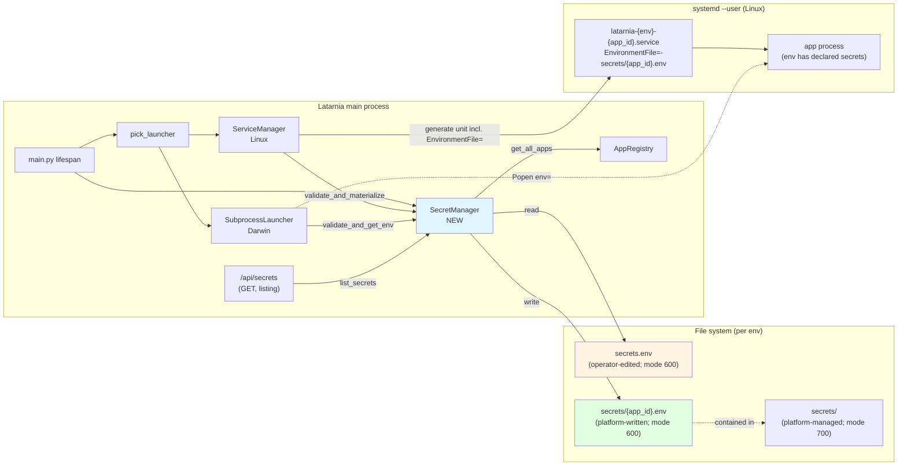
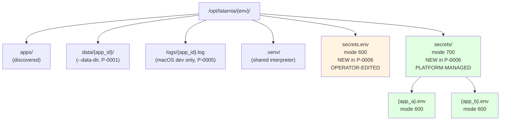
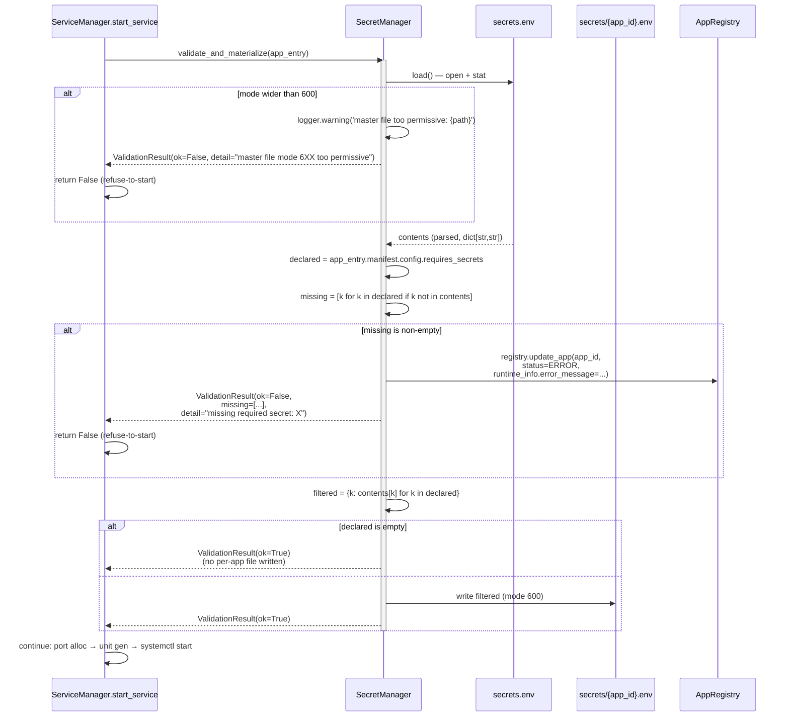
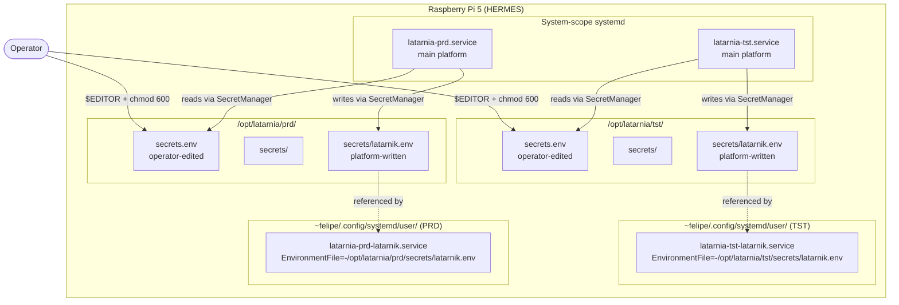

# P-0006 Architecture

## Component placement

`SecretManager` is a new platform-side component, peer to `ServiceManager` / `SubprocessLauncher` / `DbProvisioner` / `MCPGateway`. It owns the master `secrets.env` and the per-app filtered files. Both launchers consult it on every `start_service` call.

The blue node is new. Master file (yellow) is operator-owned; the platform never writes to it. Per-app files (green) are 100% platform-managed and idempotently regenerated on every launch.

---

## File-system layout (per env)

- **Master** is the only file the operator edits. One per env (TST and PRD must NOT share).
- **`secrets/`** dir is created by the platform on first need; mode 700 (only `felipe` enters).
- **`{app_id}.env`** files are written by `SecretManager.materialize` before each `start_service`. Idempotent — same input always produces same output. Stale files (apps removed) are NOT cleaned up in v1.

---

## Lifecycle: validate → materialize → launch

The tight sequence around every `start_service` call.

Key invariants:

1. **Validation runs before any side effect.** Port allocation + unit file generation + systemctl start happen only after `ok=True`.
2. **`registry.update_app` on failure** is what surfaces the error in `/api/apps` `overall_status` (red) via `runtime_info.error_message` — reusing existing P-0005 cap-005 plumbing, no new fields.
3. **Apps with `requires_secrets: []`** (the vast majority) never write a per-app file. The systemd unit's `EnvironmentFile=-...` line is harmless because of the `-` (ignore-missing).

---

## Deployment topology (Pi, after P-0006)

Key isolation property: a TST app's process can never read PRD secrets, and vice versa. Two mechanisms enforce this:

1. The two main-platform units run with different `Environment=ENV={env}`; each platform's `SecretManager` is bound to its own env at construction. It only ever reads `/opt/latarnia/{env}/secrets.env` — the path is computed from `self.env`, not from the request.
2. The per-app filtered files are written under env-scoped paths (`/opt/latarnia/tst/secrets/...` vs `/opt/latarnia/prd/secrets/...`). The systemd unit's `EnvironmentFile=` is absolute and bakes in the env at unit-write time.

---

## External system interactions

No new external interactions. P-0006 is platform-internal — file-system + the existing systemd integration. No network calls, no Redis pub/sub, no external secret store.

The arrow that would have existed in a CLI design (`latarnia secrets set ...`) is replaced by `$EDITOR` directly. We accept that the operator must remember `chmod 600` on first create; the platform refuses to read insufficiently-restricted files and logs why.

---

## Rejected alternatives (and why)

| Alternative | Why rejected for v1 |
|---|---|
| `EnvironmentFile=` pointing directly at master `secrets.env` (no per-app filtering) | Every app would see every secret. Pitch's "injected into the launched app's environment ONLY — not other apps'" rules this out. |
| `Environment=KEY=value` lines inlined into the generated unit file | Values would be readable from `~felipe/.config/systemd/user/latarnia-{env}-{app}.service`, a path more discoverable than the master file. Per-app filtered file with mode 600 in a 700 directory limits exposure surface. |
| Latarnia-side `os.execvpe` of the app with merged environment | Requires the platform to host the process, breaking systemd's ownership and giving up `Restart=`, journald, and reconciliation. Big regression vs P-0005. |
| HashiCorp Vault / external secret store | Overkill for single-operator Pi; deployment cost > the problem. |
| Latarnia CLI (`latarnia secrets set ...`) | No CLI binary exists today; introducing one for this feature alone is over-scope. File-only matches the existing operator surface (config files + dashboard buttons). |
| Encryption at rest (age/sops) | Defence-in-depth on top of mode 600 is real value but adds a key-management story (where does the platform's decryption key live?). v1 ships with mode 600 only; v2 can layer this on. |
