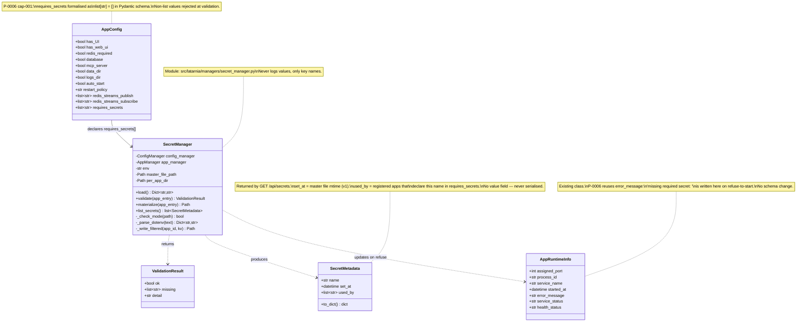

# P-0006 Data Model

No persistent database schema changes. The master secret store is a single file (`/opt/latarnia/{env}/secrets.env`); per-app filtered files (`/opt/latarnia/{env}/secrets/{app_id}.env`) are derived artifacts.

The model below describes the in-memory classes the implementation introduces and the manifest field formalised.



---

## File-system layout

The master and per-app files are the only on-disk artifacts.

```mermaid
classDiagram
    class MasterSecretsFile {
        path : /opt/latarnia/{env}/secrets.env
        mode : 0600 (enforced on read)
        owner : felipe
        format : dotenv (KEY=value, # comments, blank lines)
        edited_by : operator (felipe with $EDITOR)
        read_by : SecretManager.load on every launch
    }

    class PerAppSecretsDir {
        path : /opt/latarnia/{env}/secrets/
        mode : 0700 (enforced on first write)
        owner : felipe
        contents : {app_id}.env files (one per service app with requires_secrets)
    }

    class PerAppSecretsFile {
        path : /opt/latarnia/{env}/secrets/{app_id}.env
        mode : 0600
        owner : felipe
        format : dotenv (subset of master — only declared keys)
        written_by : SecretManager.materialize before each start_service
        read_by : systemd EnvironmentFile=- (Linux)
        not_used_on : Darwin (Popen env= merge instead)
    }

    MasterSecretsFile --> SecretManager : load
    SecretManager --> PerAppSecretsFile : write filtered subset
```

`SecretManager` is the only writer of files under `/opt/latarnia/{env}/secrets/`. The master file is operator-managed; the platform never writes to it.

---

## Manifest field reference

`config.requires_secrets` is the single new manifest field for P-0006.

| Field | Type | Default | Validation | Notes |
|---|---|---|---|---|
| `config.requires_secrets` | `list[str]` | `[]` | Each element must be a non-empty string; the list itself must be a JSON array. | Each element is the **name** of an environment variable the platform must place in the app's process environment. App is responsible for reading `os.environ.get("X")` itself. |

Names are case-sensitive and must match what the master file's `KEY=` left-hand side parses to. Conventional uppercase + underscores (e.g., `VOYAGE_API_KEY`) is recommended but not enforced.

---

## REST API response shape

`GET /api/secrets` (cap-006):

```json
{
  "env": "tst",
  "secrets": [
    {
      "name": "VOYAGE_API_KEY",
      "set_at": "2026-04-29T14:32:11+00:00",
      "used_by": ["latarnik"]
    },
    {
      "name": "ANTHROPIC_API_KEY",
      "set_at": "2026-04-29T14:32:11+00:00",
      "used_by": ["latarnik", "another_app"]
    }
  ]
}
```

- `env` is read from `ServiceManager.env` (the platform's current environment).
- `set_at` is the master file's mtime, ISO-8601 with timezone. **Per-key timestamps are not tracked in v1** — every key returned for a given response shares the same `set_at`.
- `used_by` is the set of registered apps where `name ∈ app.manifest.config.requires_secrets`. Apps not currently registered (e.g., not yet discovered, or removed) do not appear.
- **No `value` field exists at any nesting level.** This is the contract.
