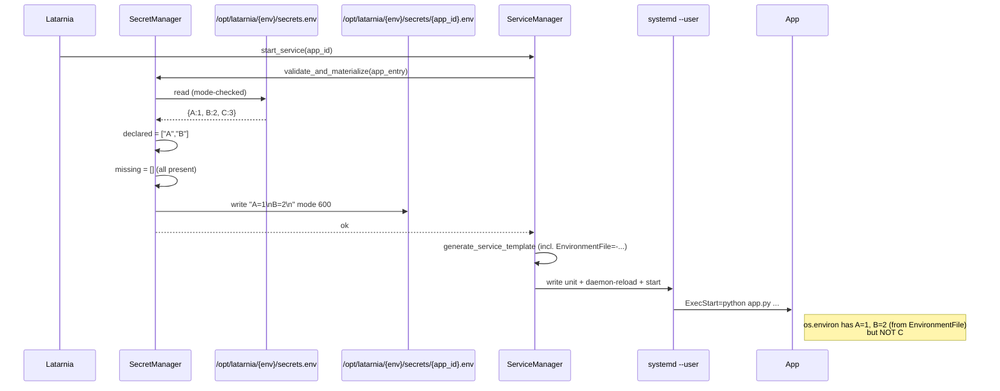
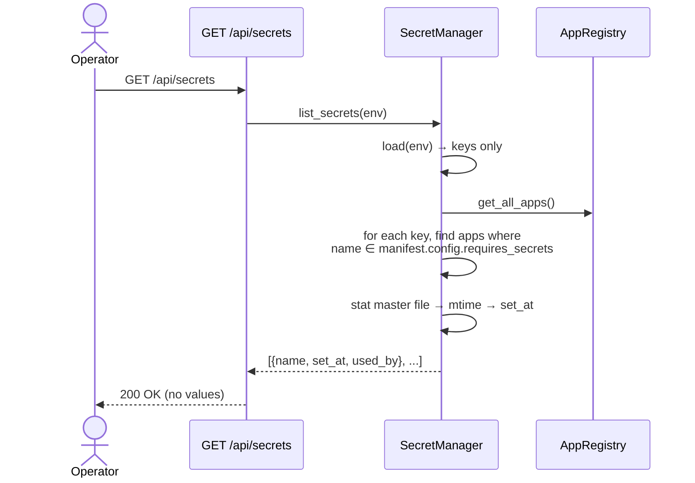

# P-0006: Secret Manager

## Problem

Latarnia apps increasingly need runtime secrets (API keys for Anthropic / Voyage / OpenAI; third-party tokens; non-platform-managed-DB credentials), and there is **no first-class way** to get a secret into an app's process environment. Concrete blocker: **Latarnik refuses to start without `VOYAGE_API_KEY` and `ANTHROPIC_API_KEY`.**

The only workaround today is hand-writing systemd user-level drop-ins (e.g. `~/.config/systemd/user/latarnia-tst-latarnik.service.d/secrets.conf`). That bypasses Latarnia entirely:

- The platform has no record of what was injected.
- Rotation is per-app and manual.
- Two apps sharing one secret duplicate the value in two places.
- `tst` / `prd` isolation is operator discipline, not enforced.
- `config.requires_secrets` is currently silently accepted as a no-op — apps using it as forward-looking documentation get no validation or injection.
- Every new app's deployment gains a "and now hand-edit this systemd file" step.

This is a one-app blocker today; without a fix it becomes an N-app drag.

---

## Context & Constraints

- **Apps run as per-app systemd user units** named `latarnia-{env}-{app_id}.service` on Linux; on macOS dev they run via `SubprocessLauncher` (Popen). P-0005 Scope 4.
- **The platform already injects scoped configuration via CLI args + `Environment=` lines** (`--db-url`, `--redis-url`, `--data-dir`, `Environment=ENV={env}`, etc.) so the pattern of platform-injected per-launch values exists.
- **The `latarnia.json` manifest already accepts `config.requires_secrets: string[]` informally** — Latarnik declares `["VOYAGE_API_KEY", "ANTHROPIC_API_KEY"]` today; the platform parses and ignores it.
- **Logs go to journald** (`journalctl _SYSTEMD_USER_UNIT=latarnia-{env}-{app}.service`). Anything echoed to stdout/stderr at startup is durably captured. Latarnia must NOT log secret values.
- **Multi-tenant on a single Pi:** `tst` and `prd` Latarnia instances coexist on the same host (same `felipe` user, same Postgres cluster). They must NOT share secret state.
- **Single-operator trust model:** `felipe` is the only user with shell access; cross-process `/proc/PID/environ` readability across same-user apps is acceptable for v1.
- **No platform CLI binary exists today.** All operator interactions go through `$EDITOR` on config files or HTTP endpoints.

---

## Proposed Solution (High-Level)

Introduce a **SecretManager** component that owns the master secret store on disk and injects per-app filtered secrets into the launched app's process environment. Formalize `config.requires_secrets` as a manifest field; refuse to start an app whose declared secrets are not all set.

### Main actors

- **Operator** (`felipe`): edits `/opt/latarnia/{env}/secrets.env` with `$EDITOR` (mode 600). No CLI subcommand in v1.
- **SecretManager** (new): loads the master file, validates declared-vs-available, materializes per-app filtered files, lists metadata for the dashboard.
- **ServiceManager / SubprocessLauncher**: call `SecretManager.materialize(app)` before launch; gate on validation result; reference the per-app file via `EnvironmentFile=` (Linux) or merge into Popen `env=` (Darwin).
- **App**: unchanged contract — secrets simply appear in `os.environ` at startup.

### Capabilities

- **cap-001: `requires_secrets` is a formal manifest field.** `AppConfig.requires_secrets: list[str] = []` is added to the Pydantic model. Existing apps that already declare it continue to parse; apps that omit it default to no required secrets.
- **cap-002: SecretManager loads the master `secrets.env`.** `SecretManager.load(env) -> Dict[str, str]` parses `/opt/latarnia/{env}/secrets.env` (dotenv-style). Refuses to read if file mode is wider than 600 (logs `WARNING`, returns empty dict). Tolerates blank lines and `#`-prefixed comments.
- **cap-003: Per-app filtered file written before launch (Linux).** Before `systemctl --user start`, `SecretManager.materialize(app)` writes `/opt/latarnia/{env}/secrets/{app_id}.env` containing exactly the keys declared in `app.manifest.config.requires_secrets`, mode 600. The generated systemd unit references it via `EnvironmentFile=-/opt/latarnia/{env}/secrets/{app_id}.env` (leading `-` = ignore-if-missing for apps with zero declared secrets).
- **cap-004: Same injection on macOS via Popen `env=`.** `SubprocessLauncher.start_service` merges the same filtered key-value map into the child process's `env` parameter (no file written; macOS dev only).
- **cap-005: Refuse-to-start on missing secrets.** If any key in `requires_secrets` is absent from the master file, `pick_launcher(app).start_service(app_id)` returns `False` *before* allocating ports, writing the unit file, or writing the per-app file. The app's registry status becomes `error` with `runtime_info.error_message = "missing required secret: <name>"`. The combined `/api/apps` `overall_status` becomes `red` with the same detail string.
- **cap-006: `GET /api/secrets` listing endpoint.** Returns `{secrets: [{name, set_at, used_by: [app_id, ...]}, ...]}`. `set_at` = master file mtime (per-key timestamps not tracked in v1). `used_by` = apps in the registry that declare this name in `requires_secrets`. **No values are ever returned.**
- **cap-007: Logging hygiene.** No code path on the launch / validation / inject / list flows ever emits a secret value to logs. Verified by a unit test that uses a sentinel value and asserts no record matches.

---

## Acceptance Criteria

- **cap-001:** `AppManifest.from_dict({"config": {"requires_secrets": ["X", "Y"]}})` parses and `app.manifest.config.requires_secrets == ["X", "Y"]`. `AppManifest.from_dict({"config": {"requires_secrets": "X"}})` (non-list) raises `ValidationError`. `AppManifest.from_dict({"config": {}})` parses with `requires_secrets == []`.
- **cap-002:** Given `/opt/latarnia/dev/secrets.env` with mode 600 containing `KEY1=val1\n# comment\n\nKEY2=val2\n`, `SecretManager(...).load("dev") == {"KEY1": "val1", "KEY2": "val2"}`. Given the same file with mode 644, `load("dev")` returns `{}` and a `WARNING` is logged naming the file path. Given a missing file, `load("dev")` returns `{}` (no warning).
- **cap-003:** Starting `latarnia-tst-myapp.service` where `requires_secrets: ["A", "B"]` and master contains `A=1, B=2, C=3` results in: (a) `/opt/latarnia/tst/secrets/myapp.env` exists with mode 600, content `A=1\nB=2\n` exactly (no `C`); (b) the generated `~felipe/.config/systemd/user/latarnia-tst-myapp.service` contains `EnvironmentFile=-/opt/latarnia/tst/secrets/myapp.env`; (c) `systemctl --user show -p Environment latarnia-tst-myapp.service` shows neither `A` nor `B` (those come from the EnvironmentFile, which `show -p` doesn't expand).
- **cap-004:** On macOS, `SubprocessLauncher.start_service` for the same app passes a `subprocess.Popen` `env=` dict that includes `A=1` and `B=2` but not `C`. Asserted via mocked `Popen` in unit tests.
- **cap-005:** `myapp` with `requires_secrets: ["A", "B"]` and master containing only `A=1`: `start_service("myapp")` returns `False`; no unit file is written; no per-app secrets file is written; `app.runtime_info.error_message` contains `"missing required secret"` and the missing key name; `GET /api/apps` shows `overall_status: "red"` and `overall_status_detail` containing `"B"`. The auto-start loop logs an error but the platform itself continues to boot (other apps unaffected).
- **cap-006:** `GET /api/secrets` returns 200 with body shape `{"secrets": [{"name": "...", "set_at": "<ISO8601>", "used_by": ["app_id_1", ...]}]}`. The list contains exactly the keys present in the current env's master file. `used_by` is the set of registered apps that declare each name in `requires_secrets`. No `value` field appears anywhere. Response is identical regardless of values stored.
- **cap-007:** A unit test sets `secrets.env` with `SENTINEL_KEY=sentinel-value-xyz123`, declares `requires_secrets: ["SENTINEL_KEY"]` for an app, runs through validation + materialize + launch (mocked subprocess), and asserts `caplog.records` contains no record with the substring `xyz123`.

---

## Key Flows

### flow-01: Operator sets a secret

Operator-side, file-edit-only model. No CLI subcommand in v1.

```mermaid
sequenceDiagram
    actor Op as Operator (felipe)
    participant FS as /opt/latarnia/{env}/secrets.env
    participant API as POST /api/apps/{id}/process/restart
    participant Plat as Latarnia
    participant App as App process

    Op->>FS: $EDITOR — add VOYAGE_API_KEY=pa-xxxxx
    Op->>FS: chmod 600  (one-time; new files)
    Note over Op,FS: No platform restart needed.<br/>SecretManager re-reads on every launch.
    Op->>API: trigger restart of consuming app(s)
    API->>Plat: pick_launcher(app).restart_service(app_id)
    Plat->>FS: SecretManager.load(env)
    FS-->>Plat: {VOYAGE_API_KEY: pa-xxxxx, ...}
    Plat->>Plat: filter to app's requires_secrets
    Plat->>Plat: write /opt/latarnia/{env}/secrets/{app_id}.env (600)
    Plat->>App: systemctl --user start (reads EnvironmentFile)
    App-->>Op: started, sees VOYAGE_API_KEY in os.environ
```

### flow-02: Launch with all secrets present (Linux)



### flow-03: Launch with a missing secret (refuse-to-start)

```mermaid
sequenceDiagram
    participant Plat as Latarnia
    participant SM as SecretManager
    participant Master as secrets.env
    participant SvcMgr as ServiceManager
    participant Reg as Registry
    participant API as /api/apps

    Plat->>SvcMgr: start_service(app_id)
    SvcMgr->>SM: validate_and_materialize(app_entry)
    SM->>Master: read
    Master-->>SM: {A:1}
    SM->>SM: declared = ["A","B"]; missing = ["B"]
    SM-->>SvcMgr: error: missing required secret: B
    SvcMgr->>Reg: update_app(status=ERROR,<br/>error_message="missing required secret: B")
    SvcMgr-->>Plat: False
    Note over SvcMgr: NO unit file written.<br/>NO per-app secrets file written.<br/>NO ports allocated.

    Plat->>API: /api/apps
    API-->>Plat: [{app_id, overall_status:"red",<br/>overall_status_detail:"missing required secret: B"}]
```

### flow-04: Operator lists what's set



---

## Technical Considerations

- **Module placement**: `src/latarnia/managers/secret_manager.py`. Wired into `main.py` alongside the other managers; injected into `ServiceManager.__init__` and `SubprocessLauncher.__init__`.
- **Master file format**: dotenv-style. Each line is `KEY=value` with the value optionally single-quoted to preserve special chars (`KEY='value with $ and = and "'`). Blank lines + `#`-prefixed comments tolerated. **No multi-line values in v1** — operator must escape newlines as `\n` if needed (rare for API keys). Document the format in `app-specification.md`.
- **Permission check**: `os.stat(path).st_mode & 0o077 != 0` → too permissive → refuse + warn. Same check on the per-app filtered file's *parent directory* (`/opt/latarnia/{env}/secrets/`).
- **Per-app file cleanup**: when an app is removed (dashboard delete or manifest dropped), delete the corresponding `/opt/latarnia/{env}/secrets/{app_id}.env`. **Out of v1 scope** — flag as a future scope; orphan files don't leak (they're 600).
- **Reading on every launch**: cheap (small file, ~hundreds of bytes). No caching. Operator edits take effect on the next `start_service` call.
- **Validation order**: `SecretManager.validate_and_materialize` must run **before** port allocation in `ServiceManager.start_service` so a refuse-to-start doesn't leak port allocations.
- **Reconciliation interaction (P-0005 Scope 4)**: an app whose unit survived a platform restart already has its old per-app secrets file from the previous launch. On reconciliation we mark it RUNNING; we do NOT regenerate the secrets file. If the operator changed the master file in the meantime, the running app sees stale values until restart — this matches the v1 contract ("rotate by re-running set + restart consuming apps").
- **Log hygiene mechanics**: `SecretManager` MUST NOT use `logger.info(secrets_dict)` style anywhere. All log lines refer to keys only (e.g., `"loaded 5 secret keys"`, `"missing required secret: B"`). Same rule applies to `ServiceManager.generate_service_template` — the unit file does NOT inline `Environment=KEY=value` for declared secrets; it uses `EnvironmentFile=-...`.
- **Dashboard surface**: `/api/secrets` exists in v1; rendering it on the dashboard HTML (a "Secrets" panel showing names + set_at + consumers) is **out of scope** but the endpoint is ready for it.

---

## Risks, Rabbit Holes & Open Questions

- **Rabbit hole: do NOT introduce a CLI binary in this scope.** No `latarnia secrets ...` subcommand. Cut-list option (3) from the pitch.
- **Rabbit hole: do NOT add encryption-at-rest, audit logs, rotation automation, or per-secret access policies.** All explicitly v2.
- **Rabbit hole: do NOT support multi-line secret values.** Single-line dotenv only.
- **Rabbit hole: do NOT broadcast secrets via Redis or any other channel.** They are file-only, per-app.
- **Rabbit hole: do NOT implement orphan-file cleanup** (per-app secrets files for apps that were removed). Files are 600; defer to v2.
- **Rabbit hole: do NOT add `LATARNIA_*` env vars** (`LATARNIA_APP_NAME`, etc.) in this scope. Adjacent but non-blocking.
- **Behavior change risk:** apps that already declare `requires_secrets` (Latarnik) will refuse to start once this lands if the operator hasn't populated the master file. This is intentional but must be called out in the project plan and the deployment skill.
- **Logging-hygiene risk:** every new log line on the launch path needs a code-review check ("does this `f"... {something}"` ever interpolate a secret?"). The logging-hygiene unit test covers the existing path; future PRs touching launch code must extend it.
- **systemd `EnvironmentFile=` semantics:** values containing `$` are subject to `$VAR` substitution by systemd. Document in app-spec: the safe form is `KEY='value-with-$'` (single-quoted in the file). systemd treats single-quoted values as literal.
- **`/proc/PID/environ` cross-process readability:** on a single-user Pi all apps run as `felipe`; any app can read another app's environ. Accepted for v1; if multi-tenant matters later, the platform needs to launch each app under a separate UID (out of v1 scope).
- **Open question (deferred to v2):** when the operator rotates a secret, should the platform proactively trigger restart of consuming apps, or only surface "N apps need restart" in the listing API? **v1 chooses the latter** — manual is safer.
- **Open question (deferred to v2):** should `latarnia-{env}-{app}.service.d/secrets.conf` drop-ins from the pre-P-0006 era be auto-cleaned at first run? **v1 chooses no** — operator is responsible for deleting the manual workaround per the migration note.

---

## Scope: IN vs OUT

### IN scope (v1)

- Formalise `AppConfig.requires_secrets: list[str]` as a Pydantic-validated manifest field.
- Master file `secrets.env` per env, mode-checked, dotenv-style.
- Per-app filtered injection: filtered file on Linux + Popen `env=` on Darwin.
- Refuse-to-start gate when declared secrets are missing; surfacing in `/api/apps` `overall_status`.
- `GET /api/secrets` listing endpoint (names + mtime + consumers, never values).
- Logging hygiene: zero secret values in any log; verified by unit test.
- Documentation update in `app-specification.md` (new "Secrets" section + manifest field reference) and the deployment skill (master-file location, format, permission requirements).

### OUT of scope (v2 or later)

- **Encryption at rest** — operator can layer disk encryption today.
- **Audit log** of who set / read which secret when.
- **Per-secret access policies** ("only app X may read secret Y" — v1 trusts manifest declaration; filter is enforced but no allowlist/denylist).
- **Secret rotation automation** / expiry alerts / scheduled rotation.
- **Web UI** for setting secrets — file-only in v1.
- **CLI binary** (`latarnia secrets ...`) — no platform CLI exists; not introducing one.
- **Sharing secrets across `tst` and `prd`** — intentionally disallowed.
- **Multi-operator workflows** (single-user Pi).
- **Multi-line secret values** — single-line dotenv only.
- **Auto-restart of consuming apps on rotation** — manual restart only.
- **Orphan per-app file cleanup** — when an app is removed.
- **`LATARNIA_*` env vars** — adjacent feature, not in this scope.
- **`/api/secrets` value display** — v1 surfaces presence + metadata, never values.
- **Dashboard rendering of the secrets list** — endpoint exists, HTML panel deferred.

### Cut list (drop in this order if scope shrinks)

1. **`/api/secrets` listing endpoint (cap-006)** — degrade to "operator reads the file directly." Keeps refuse-to-start enforcement and injection.
2. **Refuse-to-start enforcement (cap-005)** — degrade to "log WARNING when a declared secret is missing; let the app start anyway." Apps already validate themselves.
3. **macOS injection (cap-004)** — degrade to "Linux-only; macOS dev manually exports vars in shell." Keeps the production path working.
