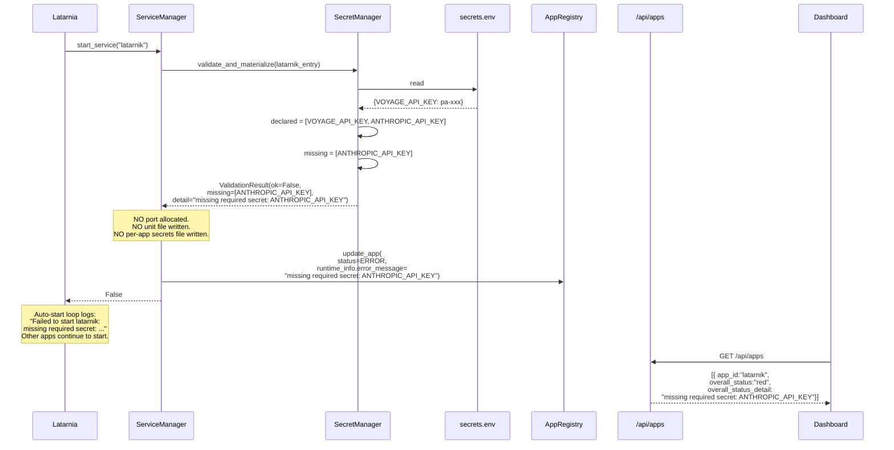
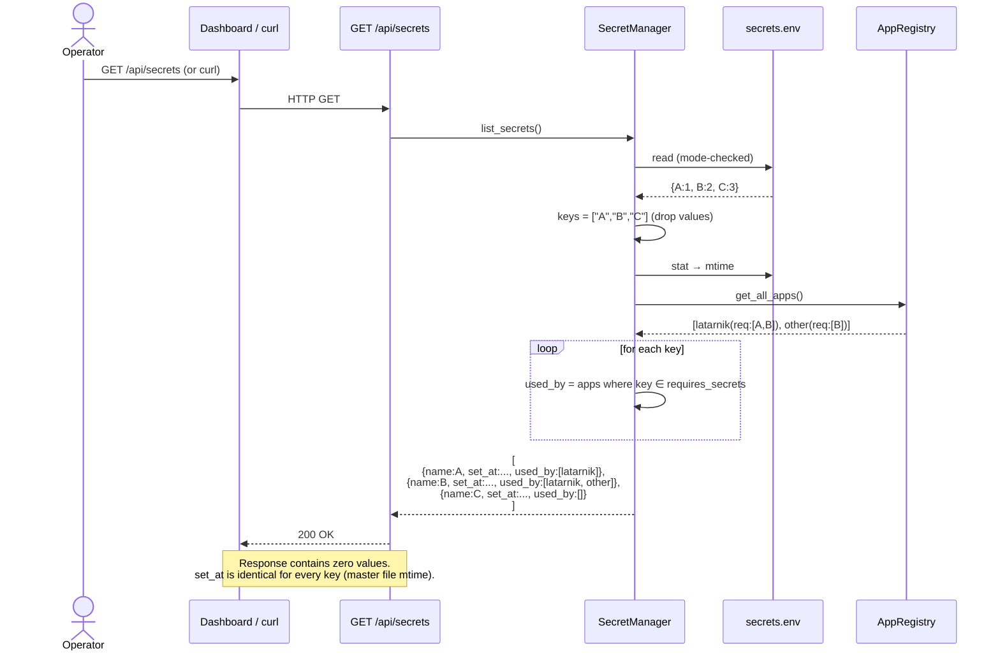
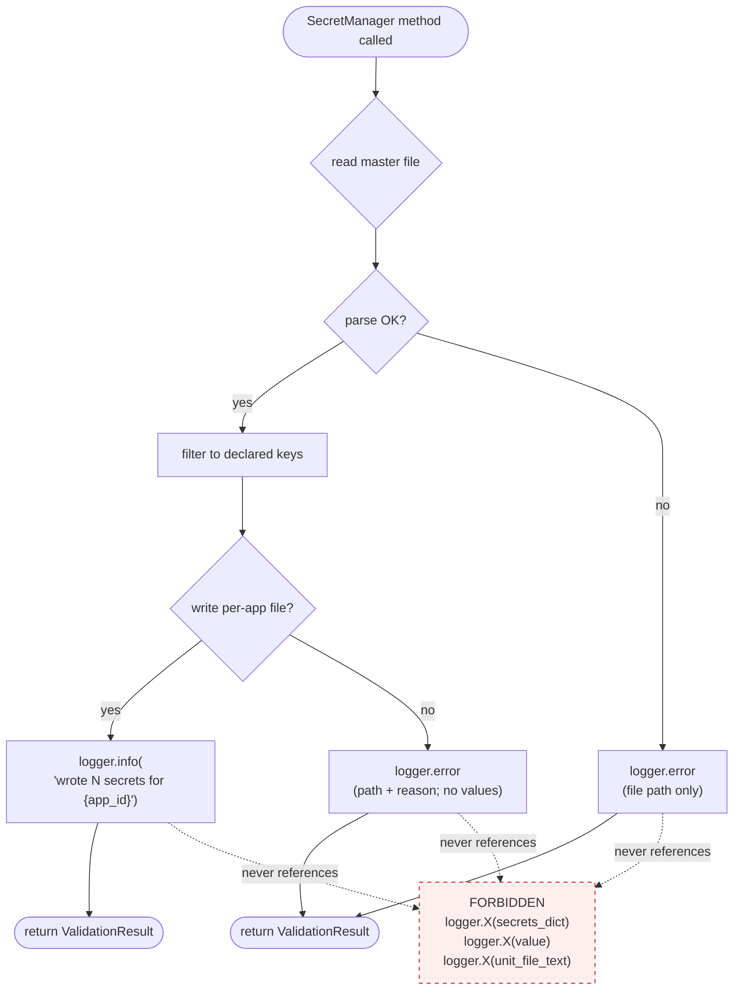

# P-0006 Workflows

Diagrams below reference capabilities defined in [spec.md](spec.md) (cap-001 … cap-007) and flows (flow-01 … flow-04).

---

## flow-01: Operator sets a secret [cap-002]

The operator-side mental model: edit one file, restart consuming apps, done. No platform restart needed; no CLI subcommand in v1.

```mermaid
sequenceDiagram
    actor Op as Operator (felipe)
    participant FS as /opt/latarnia/{env}/secrets.env
    participant Dash as Dashboard
    participant API as POST /api/apps/{id}/process/restart
    participant Plat as Latarnia
    participant SM as SecretManager
    participant SvcMgr as ServiceManager
    participant App as App process

    Op->>FS: $EDITOR — append/replace KEY=value
    Op->>FS: chmod 600 (one-time on first create)
    Note over Op,FS: Master file is operator-owned.<br/>Platform NEVER writes to secrets.env.

    Op->>Dash: click "Restart" on consuming app
    Dash->>API: POST /api/apps/latarnik/process/restart
    API->>Plat: pick_launcher(app).restart_service("latarnik")
    Plat->>SvcMgr: restart_service("latarnik")
    SvcMgr->>SM: validate_and_materialize(latarnik_entry)
    SM->>FS: read + parse (mode-checked)
    FS-->>SM: {KEY: value, ...}
    SM->>SM: filter to declared requires_secrets
    SM->>SM: write /opt/latarnia/{env}/secrets/latarnik.env (600)
    SM-->>SvcMgr: ok
    SvcMgr->>App: systemctl --user restart
    Note right of App: New process; reads EnvironmentFile;<br/>os.environ has the new value.
```

---

## flow-02: Launch with all secrets present [cap-003, cap-004]

Happy path on Linux. Same logic on Darwin substitutes Popen `env=` for `EnvironmentFile=`.

```mermaid
sequenceDiagram
    participant Plat as Latarnia (auto_start or API)
    participant Router as pick_launcher
    participant SvcMgr as ServiceManager (Linux)
    participant SubLn as SubprocessLauncher (Darwin)
    participant SM as SecretManager
    participant Master as /opt/latarnia/{env}/secrets.env
    participant PerApp as /opt/latarnia/{env}/secrets/{app_id}.env
    participant Sysd as systemd --user
    participant App

    Plat->>Router: pick_launcher(app_entry)
    alt Linux
        Router-->>Plat: ServiceManager
        Plat->>SvcMgr: start_service(app_id)
        SvcMgr->>SM: validate_and_materialize(app_entry)
        SM->>Master: read (chmod 600 enforced)
        Master-->>SM: {A:1, B:2, C:3}
        SM->>SM: declared = ["A","B"]; missing = []
        SM->>PerApp: write "A=1\nB=2\n" (mode 600)
        SM-->>SvcMgr: ValidationResult(ok=True)
        Note over SvcMgr: continue normal start path:<br/>port alloc → unit gen → systemctl start
        SvcMgr->>Sysd: write unit (incl. EnvironmentFile=-...)
        SvcMgr->>Sysd: systemctl --user start
        Sysd->>App: ExecStart=python ...
        Note right of App: os.environ has A=1, B=2 (NOT C)
    else Darwin
        Router-->>Plat: SubprocessLauncher
        Plat->>SubLn: start_service(app_id)
        SubLn->>SM: validate_and_get_env(app_entry)
        SM->>Master: read
        Master-->>SM: {A:1, B:2, C:3}
        SM-->>SubLn: {A:1, B:2}  (filtered, in-memory only)
        SubLn->>SubLn: env = {**os.environ, **filtered_secrets, ...}
        SubLn->>App: subprocess.Popen(cmd, env=env)
    end
```

---

## flow-03: Launch with a missing secret (refuse-to-start) [cap-005]

Hard fail before any side effect (no port allocation, no unit file, no per-app secrets file).



### Combination with P-0005 cap-005 (combined health)

The existing `/api/apps` `overall_status` rules are unchanged — refuse-to-start surfaces through them naturally:

| systemd state | health_results | overall_status | detail source |
|---|---|---|---|
| (no unit on disk; never started) | none | red | `runtime_info.error_message` (set by SecretManager refuse) |
| inactive | none | grey | "stopped" |
| failed | none | red | "systemd unit failed" |
| active | good | green | "/health good" |

The refuse-to-start path gives `red` because the systemd unit was never written, so `get_systemd_states()` doesn't see it. The dashboard surfaces the existing `runtime_info.error_message`, which `SecretManager` populates with the missing-secret detail.

---

## flow-04: List configured secrets [cap-006]

Read-only metadata view. Never returns values.



---

## flow-05: Logging hygiene gate [cap-007]

Verified by a unit test, not a runtime workflow. Documented here for clarity.



The logging-hygiene unit test sets a sentinel value in the master file, runs the full validate → materialize → start flow against mocked subprocess, and asserts no `caplog.records[i].message` contains the sentinel substring.
