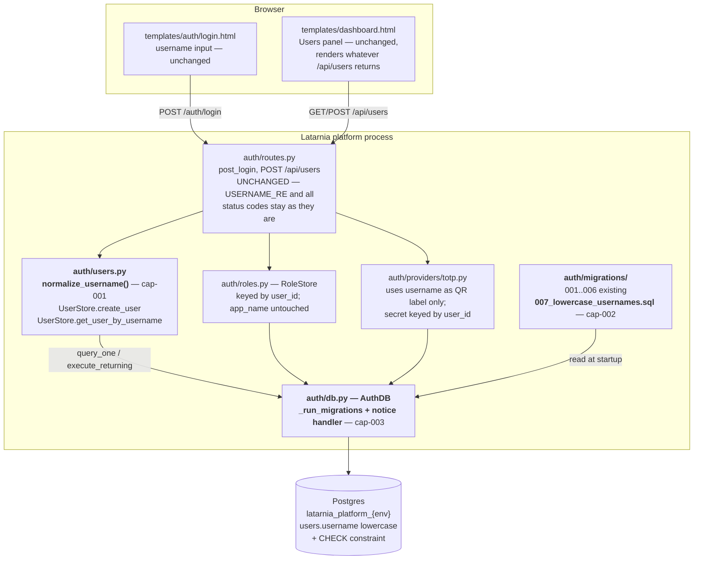
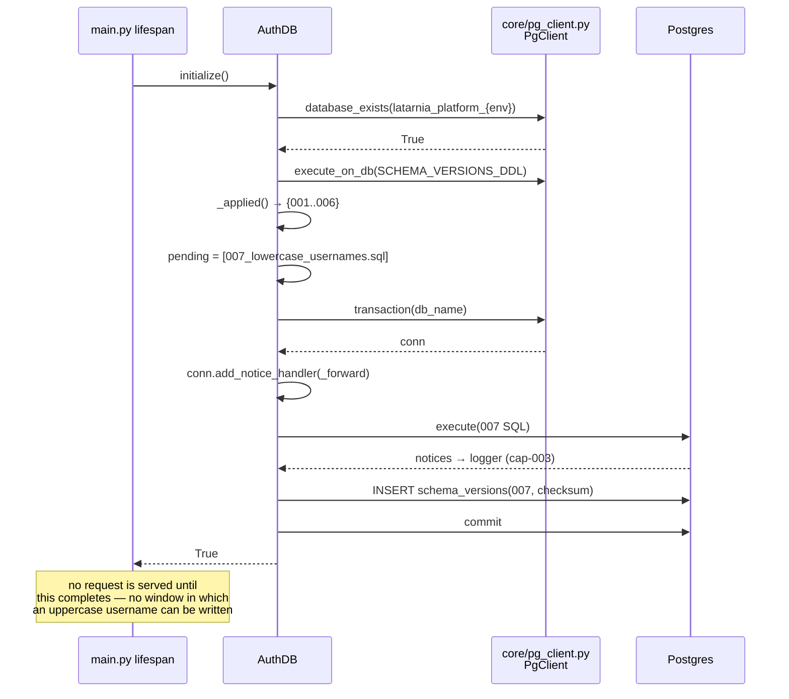
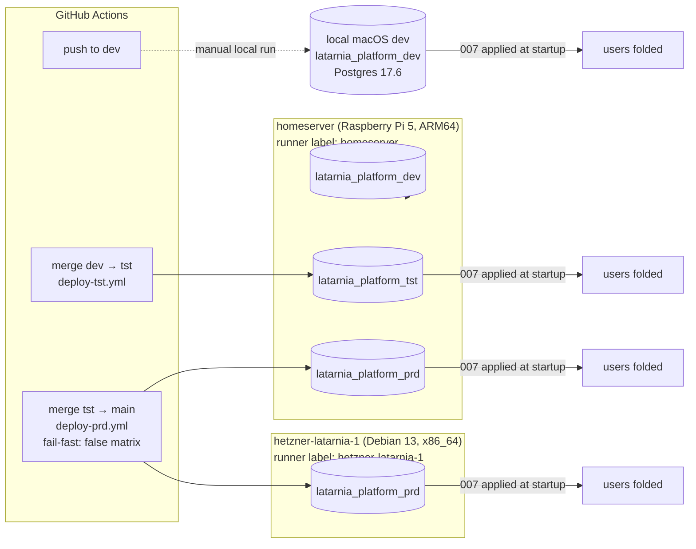
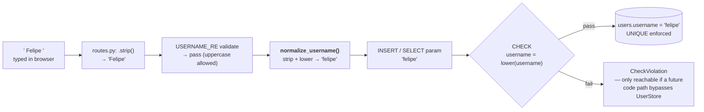

# P-0011 — Architecture

## Component view

No new component. Three touch points inside the existing auth subsystem (P-0008), shown in
bold. Everything else is context.

The key architectural decision is **where** normalization lives. `UserStore` is the only
module that issues SQL against the `users` table, so folding inside it makes the invariant
structural rather than a convention every caller must remember. `routes.py` therefore needs
no edit at all: its 409 duplicate check, the login lookup, and the bootstrap superuser
lookup already route through `UserStore.get_user_by_username`.

## Startup sequence — where migration 007 lands

## Deployment topology

Migration 007 is applied independently by each platform process at its own startup. There is
no cross-host coordination and none is needed: the migration is per-database and
self-contained.

Each of the four platform databases runs 007 once. Because collision renames are ordered by
`created_at`, two prd hosts holding *different* user data could in principle derive
different suffixes — the pre-deploy query in `spec.md` (Risks) establishes whether either
host has any collision at all before `main` is touched.

## Data flow — a username from keystroke to storage

`strip()` appears twice (once in `routes.py`, once in `normalize_username`) and that is
intentional: the login path never calls the `routes.py` strip, so the helper must be
self-sufficient rather than assume a pre-cleaned input.

## External systems

None added. No new extension, service, port, secret, or dependency. `psycopg`'s
`add_notice_handler` is part of the already-pinned `psycopg[binary]>=3.1.0,<4.0.0`.
