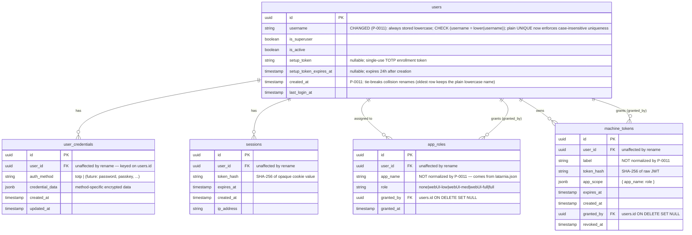

# P-0011 — Data Model

## Scope of change

Only `users.username` changes, and only in its **constraints and stored form** — no column
is added, renamed, or dropped, and no relationship changes. The four tables that reference
`users` do so by `users.id`, so renaming a username has no referential effect.

## `users.username` — before and after

| Aspect | Before (001–006) | After (007) |
|---|---|---|
| Stored form | Exactly as typed (`Felipe`, `felipe`, `FELIPE` all possible) | Always lowercase |
| Uniqueness | Case sensitive — `felipe` and `Felipe` coexist | Case insensitive in effect, because every write is folded before the plain `UNIQUE` is checked |
| DB-level guard | None | `CHECK (username = lower(username))`, named `users_username_lowercase` |
| Lookup | `WHERE username = %s` (exact) | Same SQL; the *argument* is normalized in `UserStore` |
| Index | `users_username_key` (implicit from `UNIQUE`) | Unchanged — no functional index, no `CITEXT` |

## Migration 007 — data transformation

`007_lowercase_usernames.sql` is a one-way data migration. Three statements, in order:

1. **Collision resolution** (`DO $$ ... $$`). For each set of rows whose `lower(username)`
   is shared, the row with the smallest `(created_at, id)` keeps the plain lowercase name;
   every later row is renamed to `left(lower(username), 62) || n`, where `n` is the smallest
   integer ≥ 2 such that no row (folded or not) already holds that name. Each rename emits
   `RAISE WARNING`, surfaced through the notice handler added in cap-003.
2. **Fold** — `UPDATE users SET username = lower(username) WHERE username <> lower(username)`.
   Cannot violate `UNIQUE`, because step 1 removed every case-variant collision.
3. **Constrain** — `DROP CONSTRAINT IF EXISTS users_username_lowercase` then `ADD CONSTRAINT
   ... CHECK (username = lower(username))`. The drop-first form keeps the whole migration
   re-runnable.

Worked example — three rows collide:

| id | username before | created_at | username after |
|---|---|---|---|
| `a1…` | `felipe` | 2026-01-01 | `felipe` (oldest, keeps the name) |
| `b2…` | `felipe2` | 2026-01-15 | `felipe2` (already lowercase and free; untouched) |
| `c3…` | `Felipe` | 2026-02-01 | `felipe3` (2 was taken by `b2…`) |

No rows are deleted and no `id` changes, so every session, TOTP credential, app role, and
machine token continues to resolve to the same person.

## No migration for other tables

`app_roles`, `machine_tokens`, `sessions`, and `user_credentials` are read-only with respect
to this project. Migration 007 touches the `users` table only.
