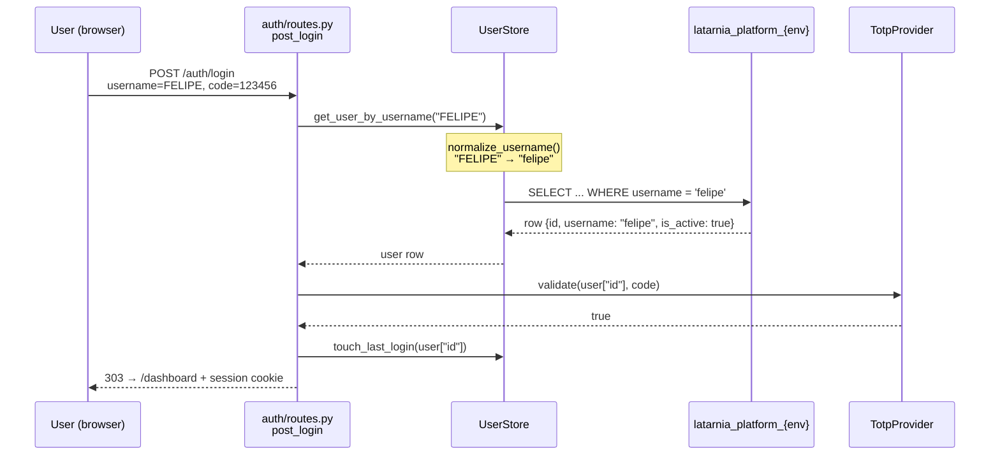
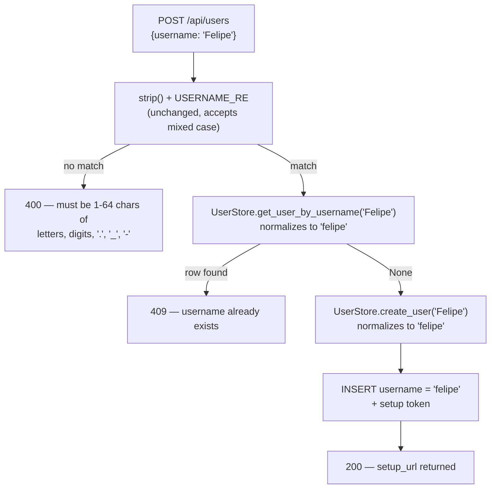
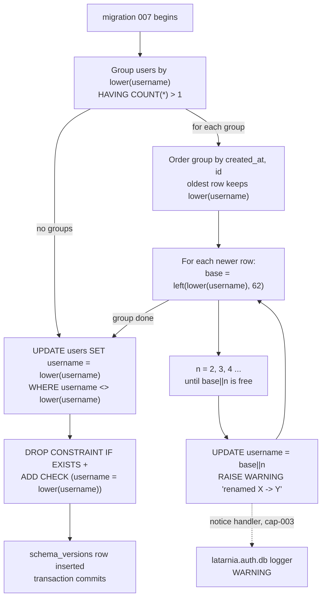

# Problem

Latarnia usernames are case sensitive end to end. Verified in code:

| Point | Location | Behaviour |
|---|---|---|
| Schema | `username TEXT NOT NULL UNIQUE` — `auth/migrations/001_create_users.sql:6` | Default Postgres collation; no `CITEXT`, no functional index on `lower(username)` |
| Lookup | `WHERE username = %s` — `auth/users.py:40` | Exact match |
| Creation | `.strip()` only, never `.lower()` — `auth/routes.py:340` | Stored exactly as typed |
| Validation | `USERNAME_RE = ^[A-Za-z0-9._-]{1,64}$` — `auth/routes.py:68` | Uppercase explicitly permitted |

Two concrete consequences:

1. **Login fails on capitalization.** A user enrolled as `admin` who types `Admin` gets
   `get_user_by_username` → `None` → `Invalid username or code.` (`auth/routes.py:270-277`).
   The error is deliberately generic, so the operator has no signal that the only fault was
   a capital letter. On a TOTP-only login (no password to fall back on) this reads as a
   broken authenticator.
2. **Duplicate identities.** `UNIQUE` is case sensitive, so `felipe` and `Felipe` can both
   exist as distinct users with separate TOTP secrets, separate `app_roles`, and separate
   machine tokens. Nothing in the platform prevents it. A Superuser inviting `Felipe` when
   `felipe` already exists gets a silent second account rather than a 409.

Who is affected: every human who logs into the dashboard, and any Superuser managing users.
Impact scales with user count — at one user it is an annoyance, at ten it is an authz
correctness problem (two accounts, divergent roles, one person).

This is a schema change (`users` table + `dataModel.md`), which fires promotion trigger 3
in `CLAUDE.md` → Project, not Task.

# Context & Constraints

**Existing systems touched (all inside the auth subsystem introduced by P-0008):**

- `src/latarnia/auth/users.py` — `UserStore`, the single gateway for all reads and writes
  of the `users` table. Both the login path and the invite path already funnel through it.
- `src/latarnia/auth/migrations/` — sequential SQL migrations applied by `AuthDB` against
  `latarnia_platform_{env}`, tracked by filename + checksum in `schema_versions`.
  Latest is `006_granted_by_set_null.sql`; this project adds `007`.
- `src/latarnia/auth/db.py` — `AuthDB._run_migrations`, which runs all pending migrations
  in a single transaction and rolls back on any failure.

**Constraints:**

- Migrations are **pure SQL**, executed via `conn.execute(sql_text)`. No Python migration
  hooks exist and none will be added — collision resolution must be expressible in SQL
  (a `DO $$ ... $$` block is in scope).
- Migrations run inside one transaction on every platform startup. A migration that raises
  aborts the whole batch and returns `initialize() → False`. This project must therefore
  **not** be able to fail on data it may encounter in prd.
- Renaming a user's `username` is safe: `user_credentials`, `sessions`, `app_roles`, and
  `machine_tokens` all reference `users.id`, never the name. Confirmed against
  `dataModel.md` "Platform Auth Database Schema" and migrations 002–006.
- `prd` spans two hosts (`homeserver`, `hetzner-latarnia-1`), each with its own
  `latarnia_platform_prd`. Migration 007 runs independently on each and may find different
  data. It must be correct per-host without coordination.
- Usernames are ASCII by construction (`USERNAME_RE`), so `str.lower()` is sufficient;
  no Unicode casefolding subtleties apply to stored names.

# Proposed Solution (High-Level)

Fold usernames to lowercase at the single boundary that already owns the `users` table
(`UserStore`), and fold the existing rows once via migration 007. The plain `UNIQUE`
constraint then enforces case-insensitive uniqueness for free, because every write is
lowercase — no `CITEXT`, no functional index.

Input stays permissive: a Superuser may still *type* `Felipe` and a user may still *type*
`FELIPE` at login. Both are accepted and normalized. `USERNAME_RE` is deliberately left
alone so mixed-case input is normalized, not rejected with a 400.

**Actors:** Superuser (invites users), User (logs in), Operator (runs the deploy that
applies migration 007).

**Capabilities:**

- **cap-001 — Normalize usernames at the `UserStore` boundary.** A single
  `normalize_username()` helper applied on write (`create_user`) and on read
  (`get_user_by_username`). Because the invite 409 check, the login lookup, and the
  bootstrap superuser lookup all already call `get_user_by_username`, this one change
  covers every path with zero changes to `routes.py`.
- **cap-002 — Migration 007: fold existing rows, auto-rename collisions, add a CHECK.**
  Collisions are resolved by keeping the oldest row's lowercase name and appending the
  lowest free numeric suffix to the newer ones, logging each rename. A
  `CHECK (username = lower(username))` constraint then makes the invariant enforced by the
  database rather than merely observed by convention.
- **cap-003 — Forward Postgres migration notices to the platform logger.** Without this,
  the `RAISE WARNING` emitted for every auto-rename in cap-002 goes nowhere: psycopg
  collects server notices and drops them silently. Renames must be visible in the deploy
  log, so `AuthDB._run_migrations` attaches a notice handler that maps server severity onto
  the `latarnia.auth.db` logger.

# Acceptance Criteria

## cap-001 — Normalize usernames at the `UserStore` boundary

- **test_normalize_username_folds_case:** `normalize_username("Felipe")` → `"felipe"`
- **test_normalize_username_strips_whitespace:** `normalize_username("  ADMIN  ")` → `"admin"`
- **test_normalize_username_leaves_lowercase_untouched:** `normalize_username("admin")` → `"admin"`
- **test_create_user_stores_lowercase:** `UserStore(stub_db).create_user("Felipe")` → the
  `INSERT INTO users` params tuple begins with `"felipe"`
- **test_get_user_by_username_folds_lookup:** `UserStore(stub_db).get_user_by_username("ADMIN")`
  → the `SELECT` params tuple is `("admin",)`
- **test_bootstrap_superuser_lookup_unaffected:** `get_or_create_bootstrap_superuser()` on a
  stub db returning `None` → `INSERT` params tuple is `("admin",)`
- **test_invite_duplicate_is_case_insensitive:** with active user `felipe` in the DB,
  `POST /api/users` body `{"username": "Felipe"}` as a Superuser → HTTP 409, detail
  `username already exists`, and no second row is created (`SELECT COUNT(*) FROM users
  WHERE lower(username) = 'felipe'` → `1`)
- **test_invite_stores_lowercase:** with an empty users table, `POST /api/users` body
  `{"username": "Felipe"}` as a Superuser → HTTP 200 and
  `SELECT username FROM users` → `felipe`
- **test_login_accepts_mixed_case:** active user `felipe` with a known TOTP secret,
  `POST /auth/login` form `username=FELIPE&code=<valid 6-digit code>` → HTTP 303 to
  `/dashboard` with a session cookie set
- **test_login_still_rejects_unknown_user:** `POST /auth/login` form
  `username=NoSuchPerson&code=000000` → HTTP 401 rendering `Invalid username or code.`

## cap-002 — Migration 007

All cap-002 criteria run against a throwaway Postgres database created by the test (never
the live `latarnia_platform_dev`), seeded with the `users` DDL from migration 001.

- **test_migration_007_folds_existing:** seed one row `username='Felipe'`; apply 007 →
  `SELECT username FROM users` → `felipe`, and `id` is unchanged
- **test_migration_007_leaves_lowercase_alone:** seed `admin`; apply 007 →
  `SELECT username, created_at FROM users` unchanged
- **test_migration_007_renames_newer_collision:** seed `felipe` with
  `created_at='2026-01-01'` and `Felipe` with `created_at='2026-02-01'`; apply 007 →
  the 2026-01-01 row is `felipe`, the 2026-02-01 row is `felipe2`, both original `id`s
  still present, `SELECT COUNT(*) FROM users` → `2`
- **test_migration_007_suffix_skips_taken:** seed `felipe` (2026-01-01), `felipe2`
  (2026-01-15), `Felipe` (2026-02-01); apply 007 → `Felipe` becomes `felipe3`; `felipe`
  and `felipe2` unchanged
- **test_migration_007_resolves_three_way_collision:** seed `felipe` (2026-01-01),
  `Felipe` (2026-02-01), `FELIPE` (2026-03-01); apply 007 → usernames are exactly
  `{felipe, felipe2, felipe3}` in `created_at` order
- **test_migration_007_check_rejects_uppercase:** after applying 007,
  `INSERT INTO users (username) VALUES ('Bob')` → raises `psycopg.errors.CheckViolation`
  naming `users_username_lowercase`
- **test_migration_007_idempotent:** apply 007 twice against the same seeded DB → the
  second run raises nothing and `SELECT username FROM users ORDER BY created_at` is
  identical after both runs
- **test_migration_007_long_name_stays_within_64:** seed a 64-char username `'A'*64` and
  its lowercase twin `'a'*64` (older); apply 007 → the newer row's username is 63 chars
  of `a` followed by `2`, i.e. `length(username) = 64`

## cap-003 — Migration notice forwarding

- **test_forward_notice_warning_severity_logs_warning:** a fake diagnostic with
  `severity_nonlocalized="WARNING"` and `message_primary="renamed x -> x2"` →
  `latarnia.auth.db` emits one WARNING record containing `renamed x -> x2`
- **test_forward_notice_notice_severity_logs_debug:** a fake diagnostic with
  `severity_nonlocalized="NOTICE"` and `message_primary="quiet"` → logged at DEBUG, and
  no WARNING record is emitted
- **test_migration_warning_reaches_logger_end_to_end:** run `_run_migrations` against a
  throwaway DB with a migration file whose body is
  `DO $$ BEGIN RAISE WARNING 'boom'; END $$;` → the `latarnia.auth.db` logger receives a
  WARNING record containing `boom`

# Key Flows

## flow-01 — Login with a mixed-case username (cap-001)

The normalization happens inside `UserStore`, so `routes.py` is untouched and the TOTP
validation continues to key off `user["id"]`.

## flow-02 — Invite rejects a case-variant duplicate (cap-001)

## flow-03 — Migration 007 collision resolution (cap-002, cap-003)

Runs once per environment per host, inside the existing migration transaction.

# Technical Considerations

**Architecture approach.** No new component. The change is confined to two files in the
existing auth subsystem plus one new migration:

- `normalize_username()` is a module-level function in `auth/users.py` — the same module
  that already owns `BOOTSTRAP_USERNAME`. Applying it inside `UserStore` rather than in
  `routes.py` is deliberate: `UserStore` is the only door to the `users` table, so any
  future caller inherits the behaviour without remembering to normalize.
- Migration 007 is pure SQL, consistent with 001–006. The `DO $$ ... $$` block is the only
  procedural element and exists solely because collision resolution needs a loop.
- The `CHECK (username = lower(username))` constraint is the belt to cap-001's braces. If a
  future code path bypasses `UserStore`, the write fails loudly at the database instead of
  silently reintroducing case-sensitive duplicates.

**Integration points.**

- `AuthDB._run_migrations` gains a notice handler (`conn.add_notice_handler`). psycopg 3 is
  already the driver (`psycopg[binary]>=3.1.0` in `requirements.txt`), so the API is
  available. This benefits every future migration, not just 007.
- `templates/dashboard.html` needs no change: it renders `u.username` from
  `GET /api/users`, which will simply return lowercase values.
- `TotpProvider` uses `username` only as the QR `account_name` label
  (`auth/providers/totp.py:87,117`); the secret is keyed by `user_id`. Already-enrolled
  authenticator apps keep displaying their original mixed-case label. Cosmetic, no
  re-enrollment needed.

**Needs validation before building:** nothing blocking. Postgres 17.6 is reachable at
`localhost:5432`, matching the skip-guard pattern the existing integration tests use, so
every cap-002 criterion is executable locally.

# Risks, Rabbit Holes & Open Questions

**Risks**

- **A real person's login name changes silently.** This is the accepted trade-off of the
  chosen collision strategy (auto-rename over failing the migration): the deploy never
  blocks, but a colliding user discovers their name became `felipe2` only when their old
  spelling stops working. Mitigations: every rename emits a WARNING through cap-003 so it
  is visible in the deploy log, and the dashboard user list shows the new name immediately.
  Before deploying to either prd host, run
  `SELECT lower(username), COUNT(*) FROM users GROUP BY 1 HAVING COUNT(*) > 1;` — if it
  returns no rows on that host, the rename path cannot fire there at all.
- **Divergent renames across prd hosts.** `homeserver` and `hetzner-latarnia-1` each own a
  separate `latarnia_platform_prd`, so if both happen to hold collisions with different
  `created_at` ordering, the resulting suffixes could differ per host. Accepted: the same
  pre-deploy query above establishes whether either host has collisions at all.
- **Uppercase rows written between deploy and migration.** None possible — migrations run
  during `AuthDB.initialize()` at startup, before any request is served.

**Rabbit holes — do NOT go here**

- Do **not** introduce the `CITEXT` extension, and do not add a functional unique index on
  `lower(username)`. The whole point of folding on write is that the existing plain
  `UNIQUE` becomes sufficient. Adding either is redundant surface area.
- Do **not** tighten `USERNAME_RE` to `^[a-z0-9._-]{1,64}$`. That converts a friendly
  normalization into a 400 error and is a behaviour regression for the invite form.
- Do **not** touch `app_roles.app_name`, `machine_tokens.label`, or the
  `X-Latarnia-App-Role` header matching. `app_name` comes from the manifest, not from
  human keyboard input at a login prompt.
- Do **not** refactor the migration runner beyond adding the notice handler. No migration
  tool, no down-migrations, no Python migration hooks.
- Do **not** merge colliding accounts (moving roles/tokens from one to the other). Renaming
  is the whole intervention; identity merging is a different, much riskier problem.
- Do **not** add a "username changed" email/notification mechanism. The platform has no
  outbound messaging and this project does not introduce one.

**Open questions:** none. The three design decisions (fold to lowercase, auto-rename with
numeric suffix, usernames only) were settled before this spec was written.

# Scope: IN vs OUT

**IN scope**

- `normalize_username()` helper in `auth/users.py`, applied in `UserStore.create_user` and
  `UserStore.get_user_by_username`.
- `auth/migrations/007_lowercase_usernames.sql`: collision auto-rename, fold to lowercase,
  `CHECK (username = lower(username))`.
- Postgres notice → platform logger forwarding in `AuthDB._run_migrations`.
- `tests/unit/test_user_store.py` (new) and `tests/integration/test_username_case.py` (new).
- `docs/System/dataModel.md`: `users.username` field note + migration count 001–007.
- One regression entry in `TESTS.md` for case-insensitive login.

**OUT of scope** (stated as constraints, not omissions)

- Do NOT normalize or case-fold `app_roles.app_name`, `machine_tokens.label`, or App
  manifest names.
- Do NOT change `USERNAME_RE` or any HTTP status code / error string in `auth/routes.py`.
- Do NOT add `CITEXT` or any new Postgres extension.
- Do NOT merge, notify, or otherwise reconcile colliding user accounts beyond renaming.
- Do NOT add username *change* as a product feature (no rename endpoint, no UI).
- Do NOT alter the TOTP QR `account_name` of already-enrolled users.

**Cut list** (drop in this order if scope must shrink)

1. `test_migration_007_long_name_stays_within_64` and the `left(..., 62)` truncation —
   requires a 64-char username to exist, which `USERNAME_RE` permits but no real user has.
2. cap-003 notice forwarding — the renames then happen silently, which is only acceptable
   if the pre-deploy collision query returned zero rows on every host.
3. The `CHECK` constraint — cap-001 alone is functionally sufficient; the constraint is
   defense in depth.
