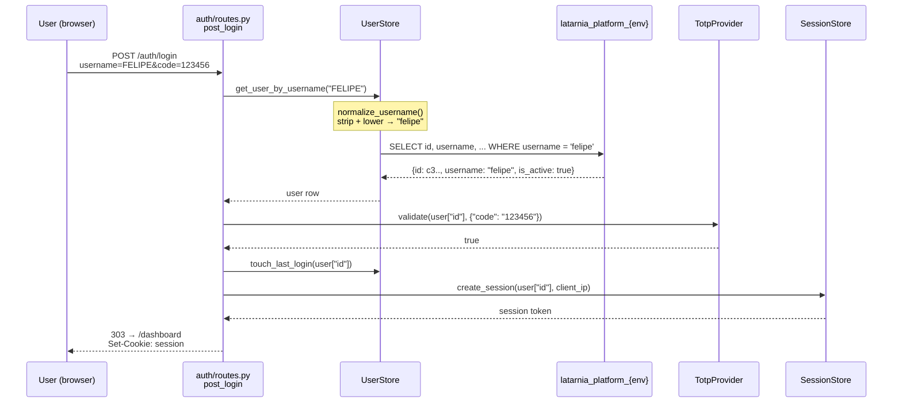
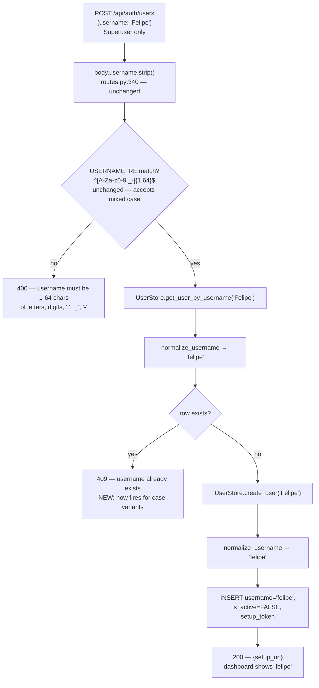
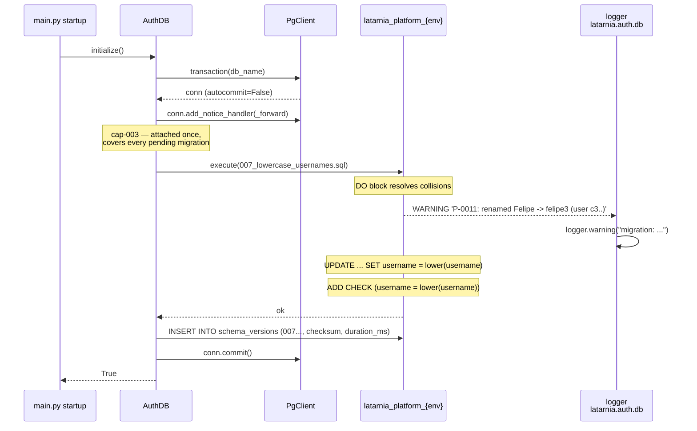
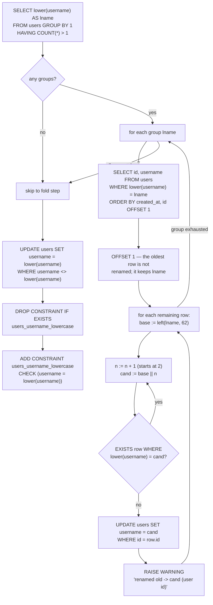
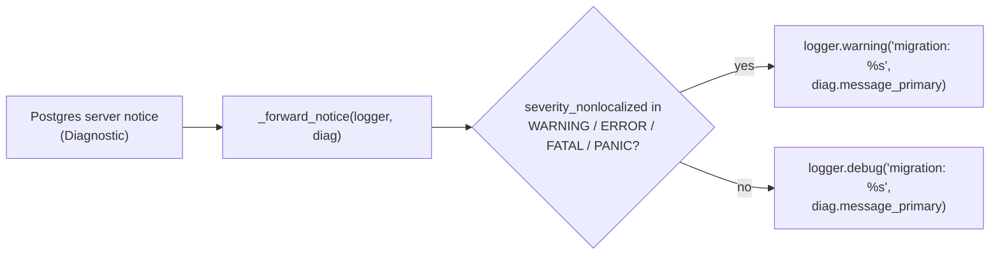

# P-0011 — Workflows

## flow-01 — Login with a mixed-case username (cap-001)

`auth/routes.py:post_login` is unchanged. Normalization is invisible to it because it
happens inside `UserStore.get_user_by_username`. TOTP validation keys off `user["id"]`, so
the stored casing is irrelevant to credential lookup.

Failure path is unchanged: an unknown name still yields the generic
`Invalid username or code.` at HTTP 401 — the project removes the capitalization *cause*
without weakening the message.

## flow-02 — Invite: case-variant duplicate is rejected (cap-001)

## flow-03 — Migration 007 applied at platform startup (cap-002, cap-003)

The migration runs inside the existing single-transaction batch in
`AuthDB._run_migrations`. The notice handler is attached to the connection *before* any
migration executes, so warnings raised by 007 are captured.

On any failure the existing `except` path calls `conn.rollback()` and re-raises, so a
partially folded `users` table is not possible.

## flow-04 — Collision resolution algorithm inside migration 007 (cap-002)

`left(lname, 62)` keeps a renamed username inside the 1–64 character contract that
`USERNAME_RE` enforces on invite, even when the original name used all 64 characters.
The `EXISTS` check compares against `lower(username)` rather than `username`, so a
candidate cannot collide with a row that has not yet been folded.

## flow-05 — Notice severity mapping (cap-003)

`NOTICE`, `INFO`, `DEBUG`, and `LOG` severities land at DEBUG so routine chatter (for
example the implicit index creation notices Postgres emits for `PRIMARY KEY`) does not
pollute the WARNING stream in a `prd` deploy log.
