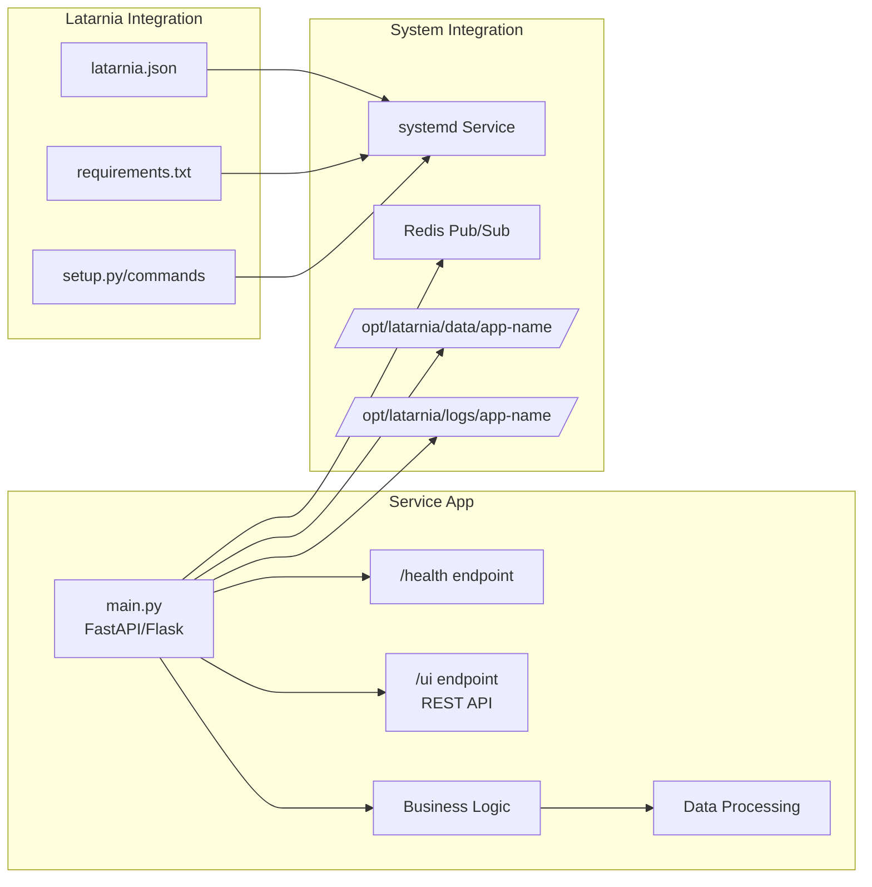
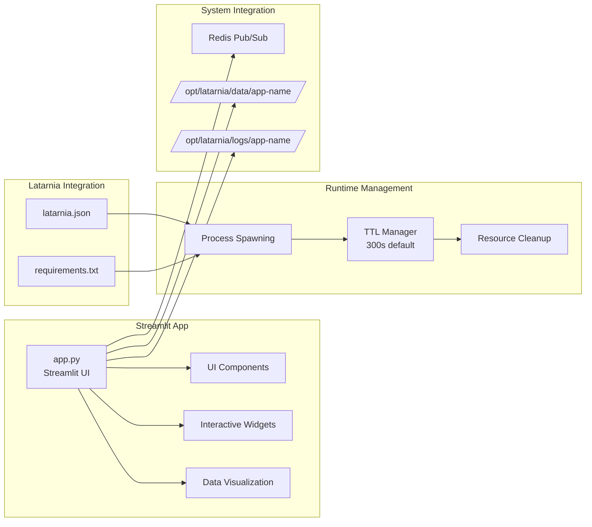
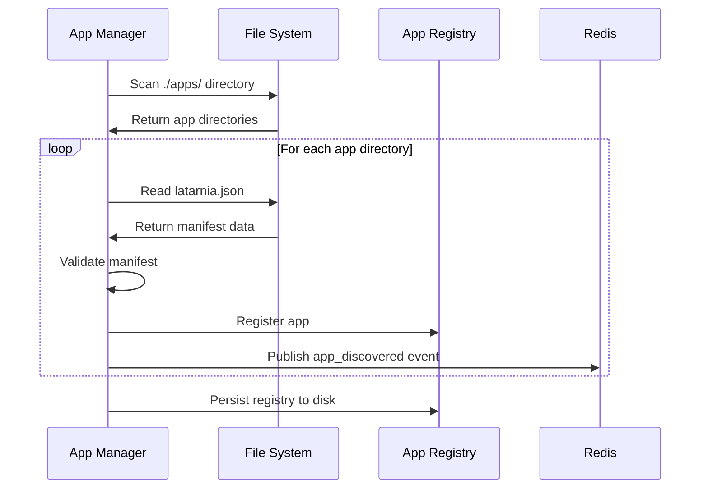
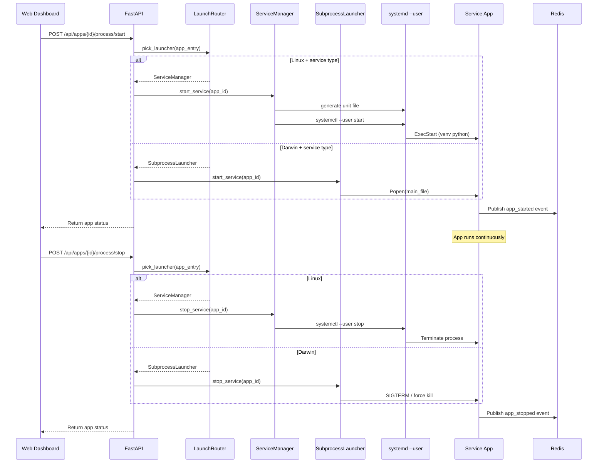
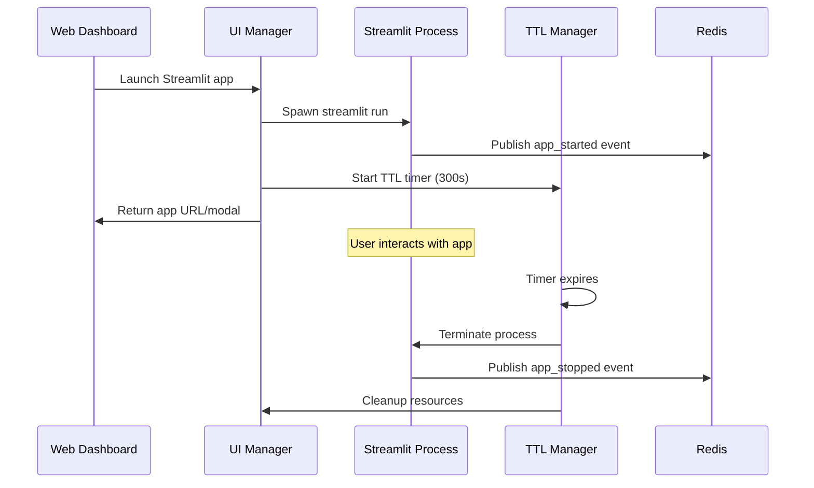
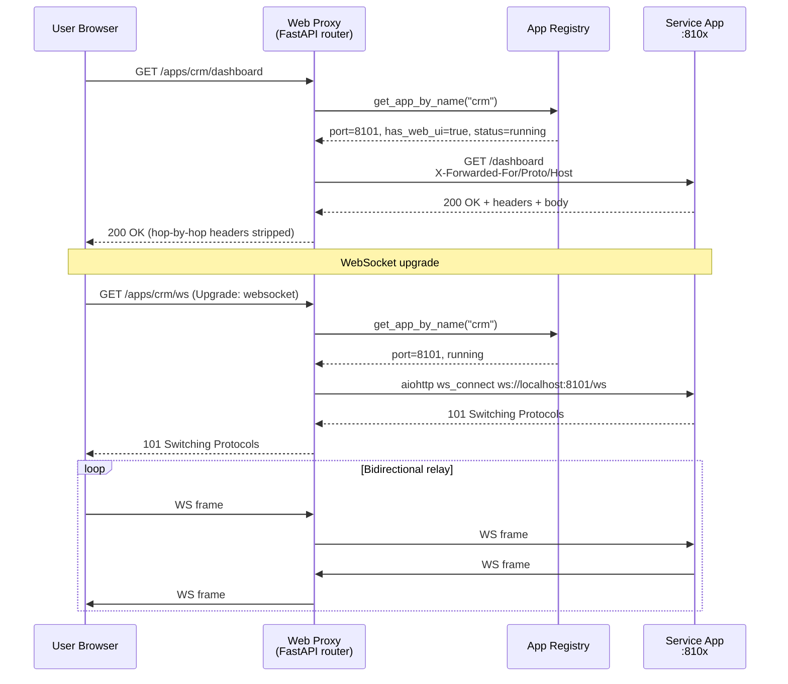

# Latarnia Architecture

This document describes the overall architecture of the Latarnia unified home automation platform.

## System Overview

```mermaid
graph TB
    subgraph "Raspberry Pi 5"
        subgraph "Latarnia Main Application"
            FastAPI[FastAPI Web Server<br/>Port 8000]
            AppMgr[App Manager<br/>Discovery & Registry]
            Router[LaunchRouter<br/>os + type → launcher]
            SvcMgr[Service Manager<br/>systemd --user]
            SubLaunch[SubprocessLauncher<br/>macOS fallback]
            UIMgr[UI Manager<br/>Streamlit TTL]
            SysMon[System Monitor<br/>Hardware Metrics]
            MCPGateway[MCP Gateway<br/>/mcp SSE endpoint]
            WebProxy[Web Proxy<br/>/apps/{name}/{path}]
        end
        
        subgraph "Message Bus"
            Redis[(Redis<br/>Port 6379)]
        end
        
        subgraph "systemd --user (Linux, linger on)"
            UA[latarnia-{env}-app_a.service]
            UB[latarnia-{env}-app_b.service]
        end

        subgraph "Applications"
            SvcApp1[Service App 1<br/>Port 8100-8199]
            SvcApp2[Service App 2<br/>Port 8100-8199]
            StreamlitApp1[Streamlit App 1<br/>Port 8501+]
            StreamlitApp2[Streamlit App 2<br/>Port 8501+]
        end
        
        subgraph "System Services"
            FileSystem[Shared Storage<br/>/opt/latarnia/]
        end
    end
    
    subgraph "External"
        Browser[Web Browser]
        MCPClient[MCP Client<br/>Claude Desktop etc.]
        User[User]
    end
    
    User --> Browser
    Browser --> FastAPI
    Browser -->|/apps/...| WebProxy
    MCPClient -->|MCP SSE| MCPGateway
    FastAPI --> AppMgr
    FastAPI --> Router
    FastAPI --> UIMgr
    FastAPI --> SysMon
    WebProxy --> AppMgr
    
    Router -->|Linux + service| SvcMgr
    Router -->|Darwin + service| SubLaunch
    Router -->|any + streamlit| UIMgr

    AppMgr --> Redis
    SvcMgr -.systemctl --user.-> UA
    SvcMgr -.systemctl --user.-> UB
    UA -->|ExecStart venv python| SvcApp1
    UB -->|ExecStart venv python| SvcApp2
    SubLaunch -.Popen.-> SvcApp1
    UIMgr --> StreamlitApp1
    UIMgr --> StreamlitApp2

    MCPGateway -->|MCP SSE| SvcApp1
    MCPGateway -->|MCP SSE| SvcApp2
    WebProxy -->|HTTP + WebSocket| SvcApp1
    WebProxy -->|HTTP + WebSocket| SvcApp2
    
    SvcApp1 --> Redis
    SvcApp2 --> Redis
    StreamlitApp1 --> Redis
    StreamlitApp2 --> Redis
    
    SvcApp1 --> FileSystem
    SvcApp2 --> FileSystem
    StreamlitApp1 --> FileSystem
    StreamlitApp2 --> FileSystem
```

## Core Components

### 1. FastAPI Main Application
- **Purpose**: Central web server and API gateway
- **Port**: 8000 (configurable)
- **Responsibilities**:
  - Web dashboard serving
  - Health monitoring endpoints
  - System metrics API
  - App management API
  - Configuration management

### 2. App Manager
- **Purpose**: Application discovery and lifecycle management
- **Responsibilities**:
  - Auto-discovery of apps in `./apps/` directory
  - Manifest parsing (`latarnia.json`)
  - In-memory app registry with persistence
  - Dynamic port allocation (8100-8199 range)
  - Python dependency installation
  - App validation and setup

### 3. Launch Router
- **Purpose**: Stateless dispatch function (`pick_launcher`) that selects the correct launcher for each app based on `(platform.system(), manifest.type)`
- **Module**: `latarnia.managers.launcher_router`
- **Routing rules**:
  - `streamlit` type → `StreamlitManager`
  - `service` + Linux → `ServiceManager` (systemctl --user)
  - `service` + Darwin → `SubprocessLauncher` (Popen fork)
- **Used by**: lifespan auto-start loop and `/api/apps/{id}/process/{start,stop,restart}` endpoints

### 4. Service Manager
- **Purpose**: systemd --user lifecycle controller for service apps on Linux
- **Responsibilities**:
  - Per-app unit file generation (`~/.config/systemd/user/latarnia-{env}-{app}.service`)
  - `ExecStart` uses absolute venv Python (`sys.executable`); `Environment=ENV={env}` injected
  - Default `Restart=on-failure` / `RestartSec=5`; overridable via `manifest.config.restart_policy`
  - `PartOf=latarnia-{env}.service` so stopping the main platform cascades to app units
  - `linger_enabled()` helper — shells out to `loginctl` on Linux; startup emits `WARNING` if linger is off
  - Service start/stop/restart operations via `systemctl --user`
  - Health check polling; log access via journalctl

### 5. Subprocess Launcher
- **Purpose**: macOS-only fallback launcher; spawns service apps as direct `Popen` children of the platform
- **Module**: `latarnia.managers.subprocess_launcher` (`SubprocessLauncher`)
- **Responsibilities**:
  - `start_service / stop_service / restart_service` (verbs harmonized with `ServiceManager`)
  - Process tracking by PID; graceful SIGTERM with force-kill fallback
  - No crash recovery (macOS dev path only — systemd restart policy not available)

### 6. UI Manager
- **Purpose**: On-demand Streamlit application management
- **Responsibilities**:
  - Streamlit process spawning
  - TTL-based cleanup (default 300 seconds)
  - Port management for Streamlit apps
  - Modal integration with main dashboard
  - Resource monitoring and cleanup

### 7. System Monitor
- **Purpose**: Hardware and system metrics collection
- **Responsibilities**:
  - CPU usage monitoring
  - Memory utilization tracking
  - Disk space monitoring
  - Temperature sensors (Raspberry Pi specific)
  - Process metrics collection
  - Health status determination

### 8. MCP Gateway
- **Purpose**: Aggregates MCP tools from all MCP-enabled apps and exposes them to external clients through a single endpoint
- **Mount path**: `/mcp` (configurable via `MCPConfig.gateway_path`)
- **Transport**: SSE (`mcp.server.sse.SseServerTransport`) — gateway acts as MCP server to clients and MCP client to apps
- **Responsibilities**:
  - Build and maintain a namespaced tool index (`app_name.tool_name`)
  - Proxy `list_tools` responses from the in-memory index
  - Proxy `call_tool` requests to the appropriate app's MCP server (localhost on declared `mcp_port`)
  - Skip unhealthy apps on tool calls (return error immediately)
  - Sync tool index on app start, stop, and version bump
  - Enforce backward compatibility on version bumps (set-difference check; reject and stop app on violation)
  - Expose `GET /api/mcp/status` and `GET /api/mcp/tools` REST endpoints

### 9. Redis Message Bus
- **Purpose**: Inter-app communication and event system
- **Responsibilities**:
  - Pub/Sub messaging between apps
  - Event logging and history
  - Health monitoring data
  - Configuration change notifications
  - App status updates

### 10. Web Proxy
- **Purpose**: Reverse proxy that exposes app-owned web UIs through the platform
- **Routes**: `GET|POST|... /apps/{app_name}/{path}` (HTTP), `WS /apps/{app_name}/{path}` (WebSocket)
- **Redirect**: Bare `/apps/{app_name}` issues a 307 to `/apps/{app_name}/`
- **Path stripping**: `/apps/crm/dashboard` → `/dashboard` forwarded to the app
- **HTTP client**: Shared `httpx.AsyncClient` (30 s timeout, no redirect following); closed during lifespan shutdown
- **WebSocket client**: Per-connection `aiohttp.ClientSession` with bidirectional frame relay
- **Header forwarding**: `X-Forwarded-For`, `X-Forwarded-Proto`, `X-Forwarded-Host`; hop-by-hop headers stripped
- **Error pages**: HTML-escaped pages for 404 (not found / no web UI), 503 (not running / connect error), 504 (timeout), 502 (unexpected error)
- **Guard conditions**: App must exist in registry, have `has_web_ui: true`, and status `running`

## Application Types

### Service Apps


### Streamlit Apps


## Data Flow

### App Discovery Flow


### Service App Lifecycle


### Streamlit App Lifecycle


### Web Proxy Request Flow


## Security Model

### Process Isolation
- Each app runs as separate systemd service
- Apps cannot access each other's data directly
- Shared resources through well-defined interfaces only

### File System Security
- Apps have dedicated data directories
- No cross-app file access
- Logs isolated per application
- Configuration files protected

### Network Security
- Port allocation managed centrally
- Apps communicate via Redis message bus
- No direct inter-app network connections
- Web dashboard proxies app UIs

### Resource Management
- Memory and CPU limits via systemd
- TTL-based cleanup for temporary processes
- Disk usage monitoring and alerts
- Process count limitations

## Deployment Architecture

### Development Environment
```
localhost:8000 (Main Dashboard + API + MCP Gateway at /mcp)
├── localhost:8100-8199 (Service App REST servers)
├── localhost:9001-9099 (Service App MCP servers, declared in manifest)
├── localhost:8501+     (Streamlit Apps)
└── localhost:6379      (Redis)
```

### Production Environment (Raspberry Pi)
```
raspberrypi.local:8000 (Main Dashboard + API + MCP Gateway at /mcp)
├── Internal:8100-8199 (Service App REST servers)
├── Internal:9001-9099 (Service App MCP servers, declared in manifest)
├── Internal:8501+     (Streamlit Apps)
└── Internal:6379      (Redis)

systemd --user units (per-app, generated at runtime):
~/.config/systemd/user/
├── latarnia-tst-{app}.service   (TST env apps)
└── latarnia-prd-{app}.service   (PRD env apps)
Each unit: ExecStart=<venv>/bin/python, Restart=on-failure, RestartSec=5
           Environment=ENV={env}, PartOf=latarnia-{env}.service
Prerequisite: sudo loginctl enable-linger {user}
```

### File System Layout
```
/opt/latarnia/
├── config/config.json
├── src/latarnia/ (Application code)
├── apps/ (Discovered applications)
├── data/ (Per-app data directories)
├── logs/ (Per-app log directories)
└── registry/ (App registry persistence)
```

## Performance Considerations

### Resource Optimization
- Manual refresh pattern (no auto-updates)
- TTL-based Streamlit cleanup
- Efficient Redis pub/sub usage
- systemd resource limits

### Scalability Targets
- Support 10-20 concurrent apps
- Raspberry Pi 5 with 8GB RAM
- Minimal CPU overhead for main app
- Efficient memory usage patterns

### Monitoring Strategy
- Hardware metrics collection
- Process resource monitoring
- Redis performance tracking
- App health check polling
