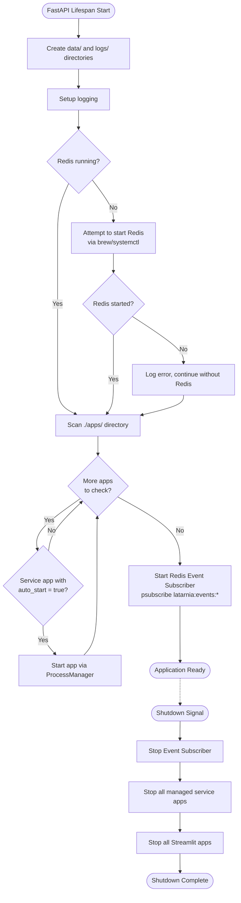
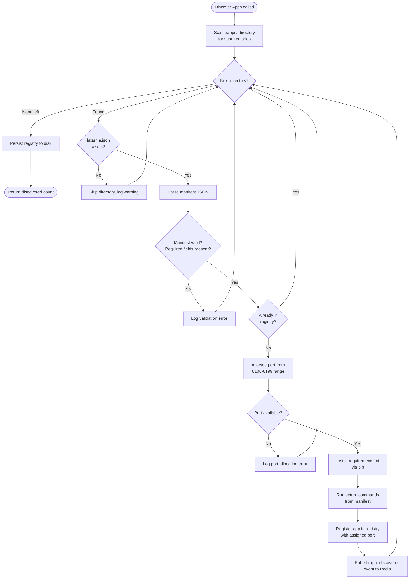
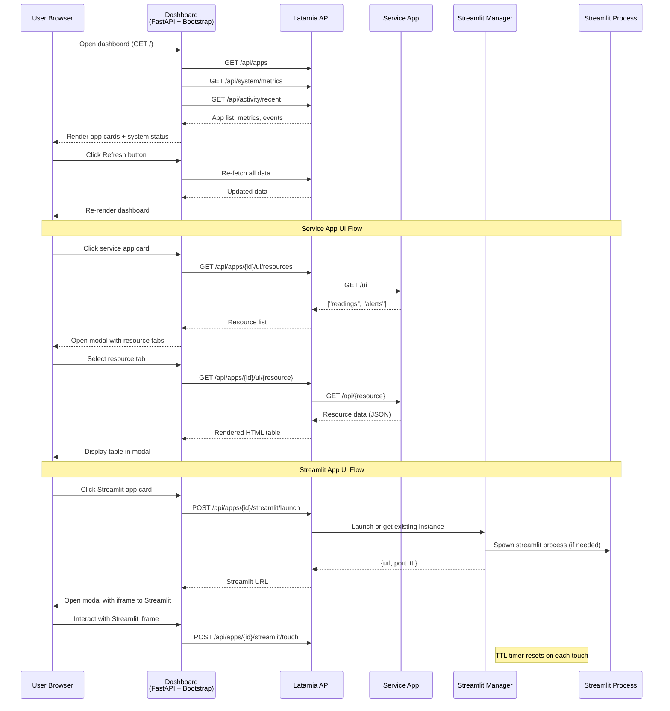
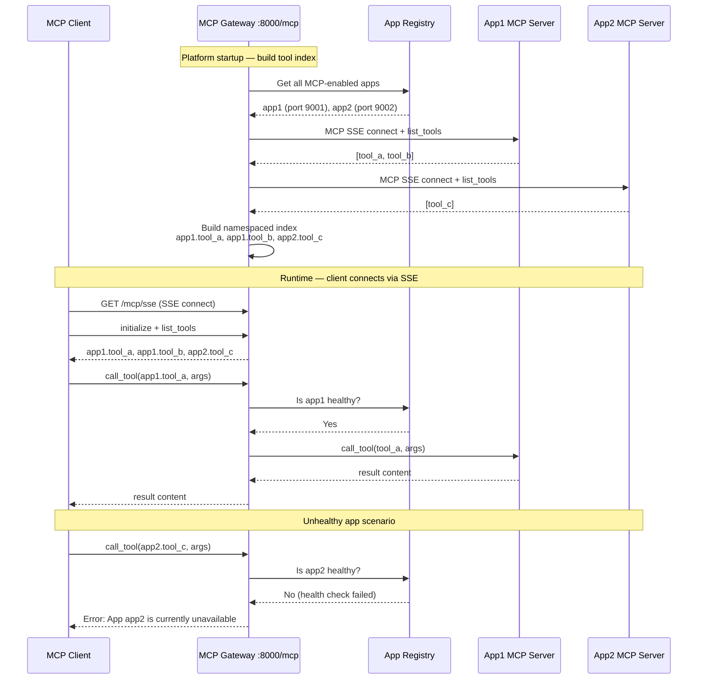
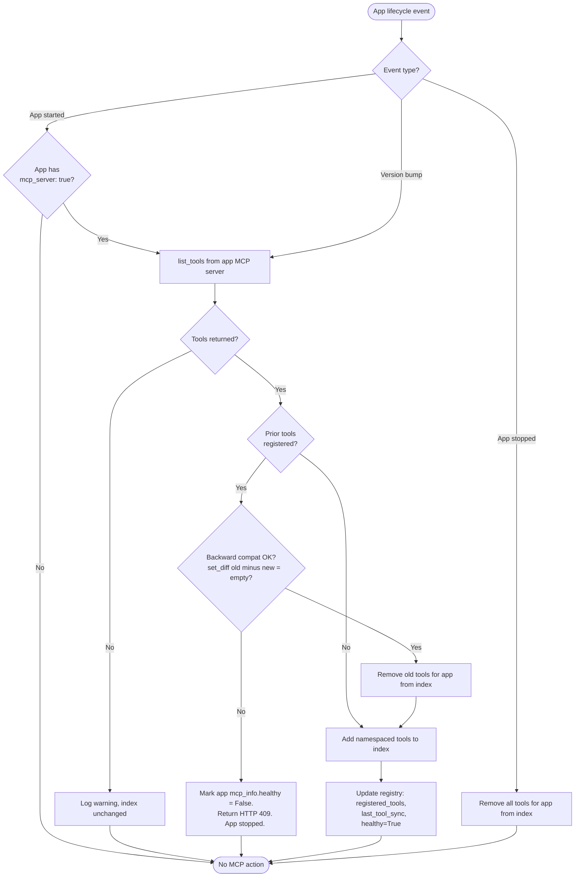
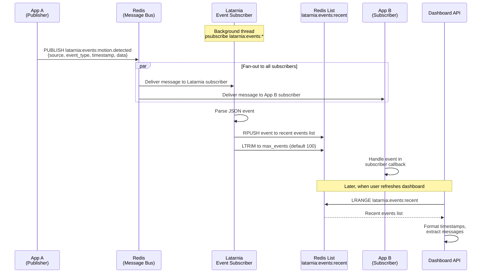
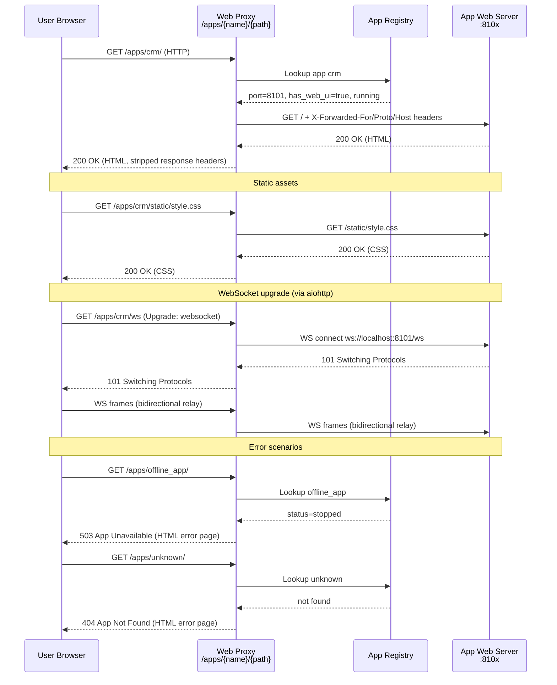
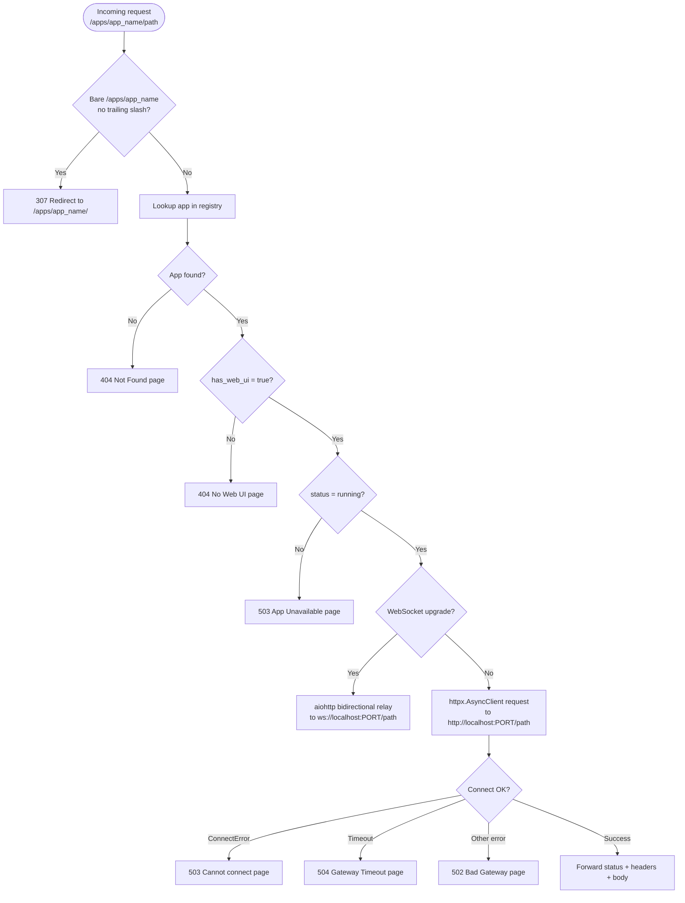

# Latarnia Workflows

This document covers the main process flows and interaction patterns in Latarnia. For component architecture and lifecycle sequence diagrams, see [architecture.md](architecture.md).

## 1. Application Startup

What happens when the Latarnia main application starts (the `lifespan` function in `main.py`).

## 2. App Installation and Discovery

Decision logic when the App Manager scans the `./apps/` directory and processes each app folder.

## 3. Dashboard UI Interaction

How a user navigates the web dashboard and interacts with apps through modals.

## 4. Health Check Monitoring

How the HealthMonitor periodically checks service app health and tracks failures.

## 5. MCP Gateway — Tool Discovery and Routing

How the MCP gateway aggregates tools from all MCP-enabled apps at startup and routes tool calls from external clients. References cap-006 and flow-05 in P-0002.

## 6. MCP Tool Sync on App Lifecycle Events

How the gateway keeps the tool index in sync when apps start, stop, or undergo a version bump. References cap-006, cap-011.

## 7. Redis Event Pub/Sub Flow

How apps publish events through Redis and how the Latarnia event subscriber captures them for the dashboard activity feed.

## 8. Web UI Reverse Proxy Request Flow

How the platform proxies HTTP and WebSocket requests to app-owned web UIs. References cap-008 in P-0002.

