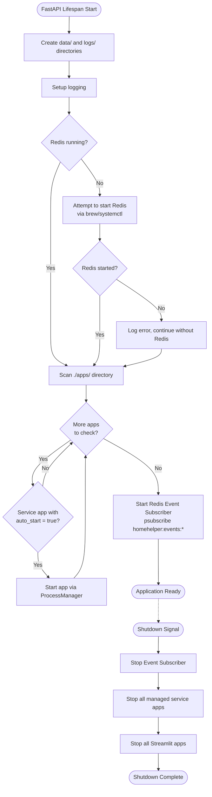
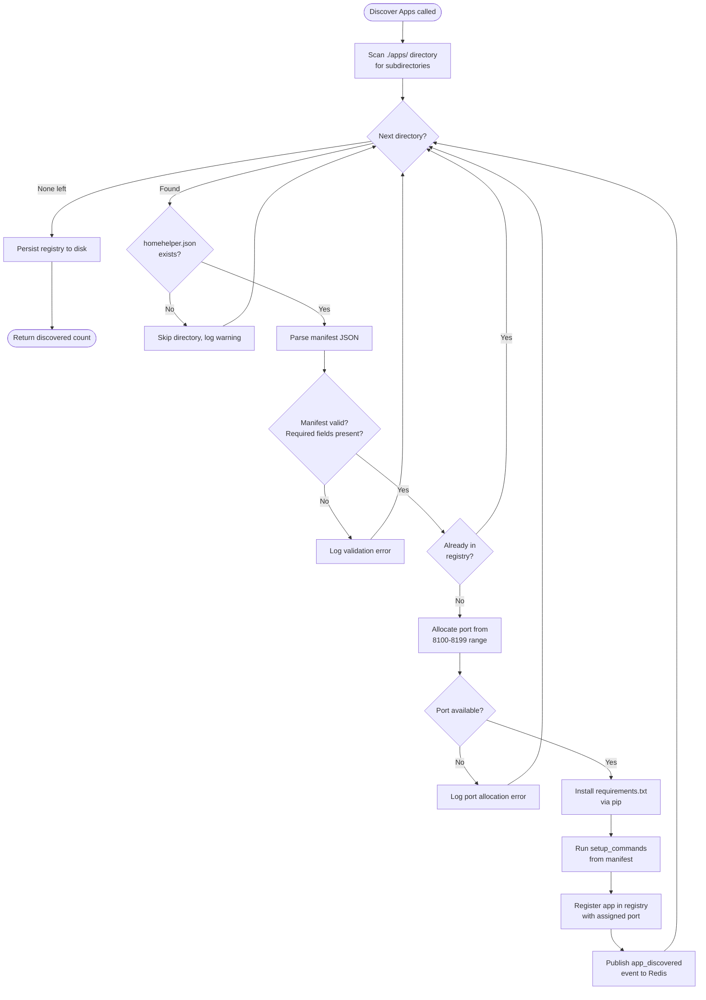
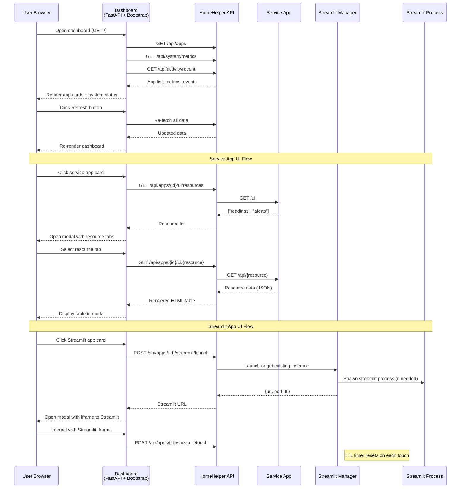
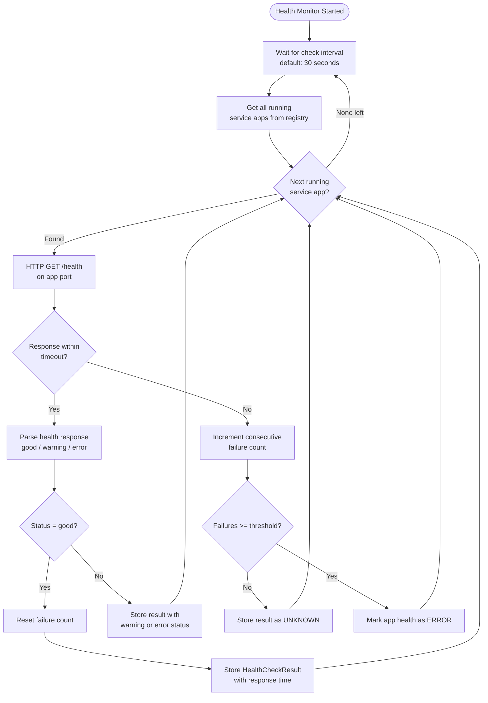
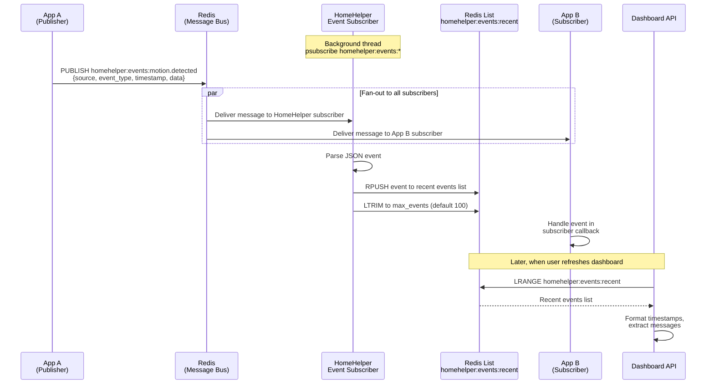

# HomeHelper Workflows

This document covers the main process flows and interaction patterns in HomeHelper. For component architecture and lifecycle sequence diagrams, see [architecture.md](architecture.md).

## 1. Application Startup

What happens when the HomeHelper main application starts (the `lifespan` function in `main.py`).

## 2. App Installation and Discovery

Decision logic when the App Manager scans the `./apps/` directory and processes each app folder.

## 3. Dashboard UI Interaction

How a user navigates the web dashboard and interacts with apps through modals.

## 4. Health Check Monitoring

How the HealthMonitor periodically checks service app health and tracks failures.

## 5. Redis Event Pub/Sub Flow

How apps publish events through Redis and how the HomeHelper event subscriber captures them for the dashboard activity feed.

