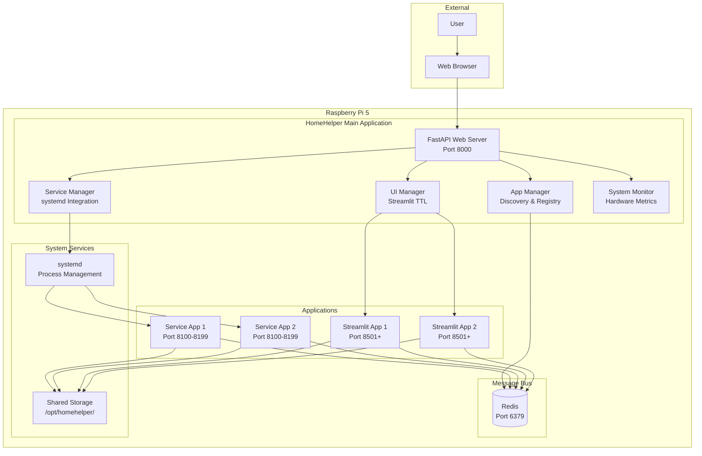
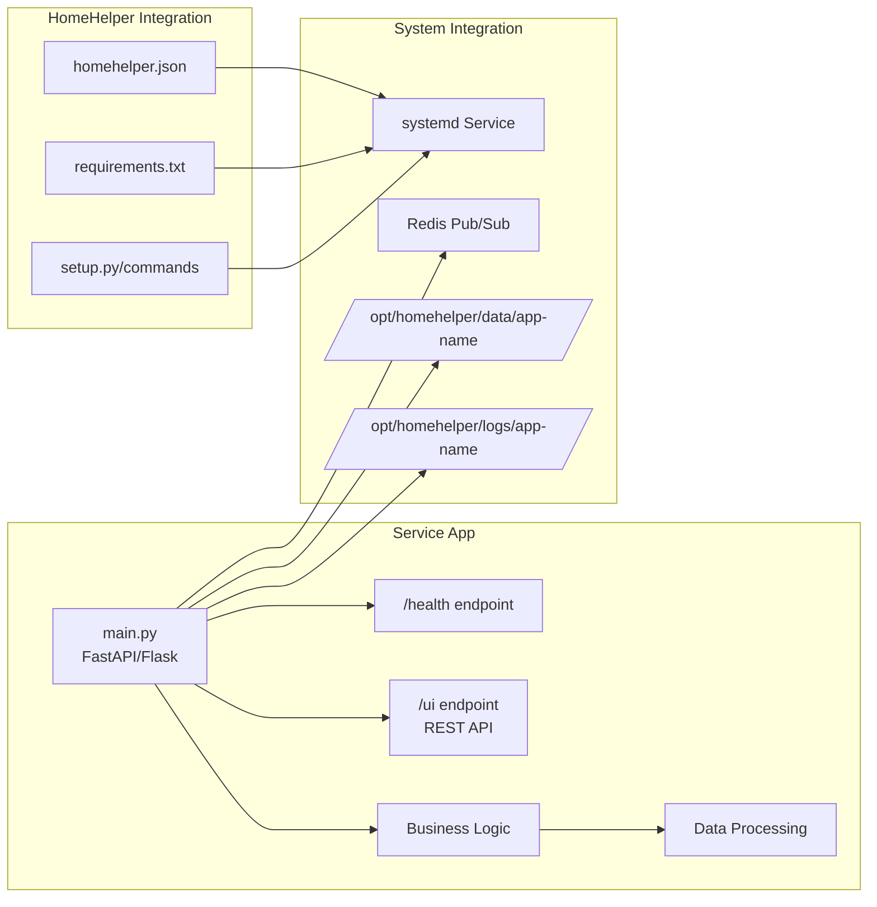
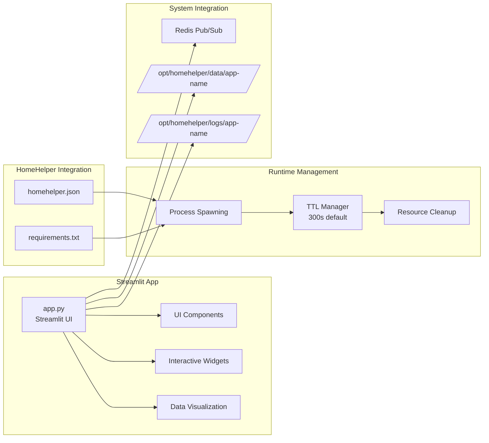
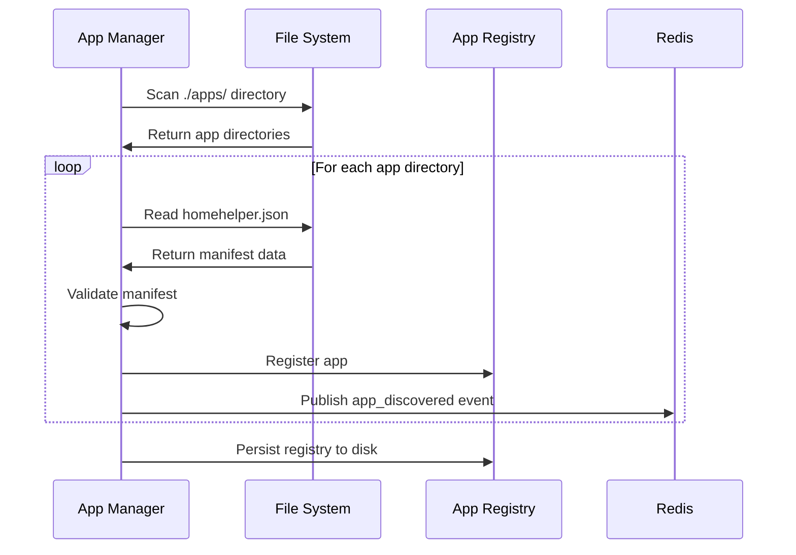
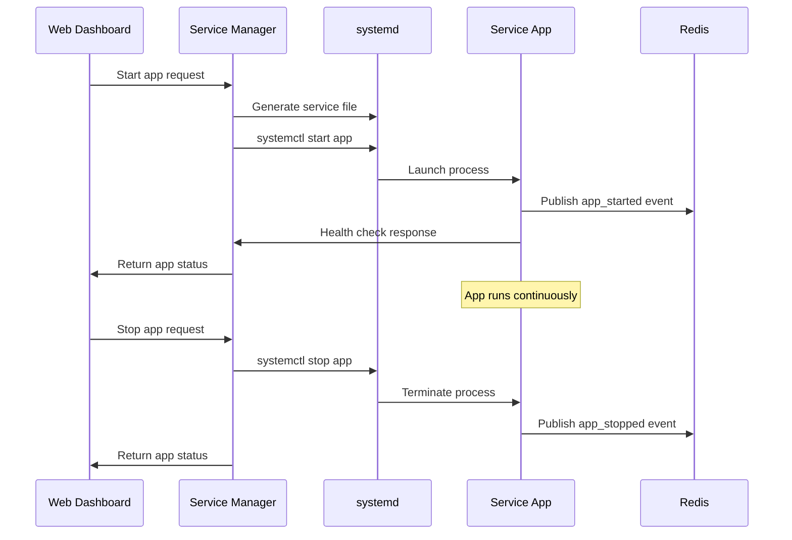
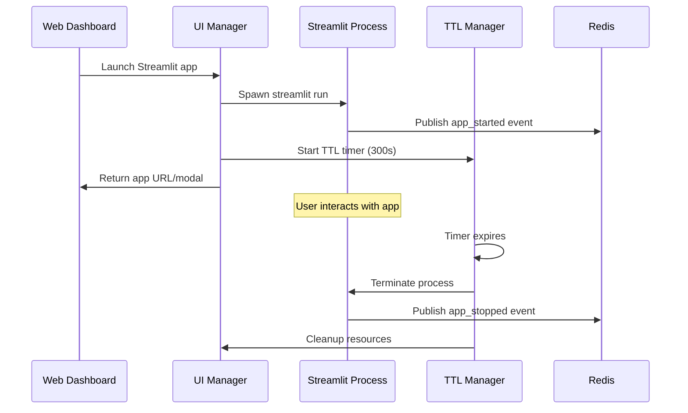

# HomeHelper Architecture

This document describes the overall architecture of the HomeHelper unified home automation platform.

## System Overview



## Core Components

### 1. FastAPI Main Application
- **Purpose**: Central web server and API gateway
- **Port**: 8000 (configurable)
- **Responsibilities**:
  - Web dashboard serving
  - Health monitoring endpoints
  - System metrics API
  - App management API
  - Configuration management

### 2. App Manager
- **Purpose**: Application discovery and lifecycle management
- **Responsibilities**:
  - Auto-discovery of apps in `./apps/` directory
  - Manifest parsing (`homehelper.json`)
  - In-memory app registry with persistence
  - Dynamic port allocation (8100-8199 range)
  - Python dependency installation
  - App validation and setup

### 3. Service Manager
- **Purpose**: Background service lifecycle control
- **Responsibilities**:
  - systemd service template generation
  - Service start/stop/restart operations
  - Health check polling
  - Process monitoring and metrics
  - Error recovery and restart policies
  - Log access via journalctl

### 4. UI Manager
- **Purpose**: On-demand Streamlit application management
- **Responsibilities**:
  - Streamlit process spawning
  - TTL-based cleanup (default 300 seconds)
  - Port management for Streamlit apps
  - Modal integration with main dashboard
  - Resource monitoring and cleanup

### 5. System Monitor
- **Purpose**: Hardware and system metrics collection
- **Responsibilities**:
  - CPU usage monitoring
  - Memory utilization tracking
  - Disk space monitoring
  - Temperature sensors (Raspberry Pi specific)
  - Process metrics collection
  - Health status determination

### 6. Redis Message Bus
- **Purpose**: Inter-app communication and event system
- **Responsibilities**:
  - Pub/Sub messaging between apps
  - Event logging and history
  - Health monitoring data
  - Configuration change notifications
  - App status updates

## Application Types

### Service Apps


### Streamlit Apps


## Data Flow

### App Discovery Flow


### Service App Lifecycle


### Streamlit App Lifecycle


## Security Model

### Process Isolation
- Each app runs as separate systemd service
- Apps cannot access each other's data directly
- Shared resources through well-defined interfaces only

### File System Security
- Apps have dedicated data directories
- No cross-app file access
- Logs isolated per application
- Configuration files protected

### Network Security
- Port allocation managed centrally
- Apps communicate via Redis message bus
- No direct inter-app network connections
- Web dashboard proxies app UIs

### Resource Management
- Memory and CPU limits via systemd
- TTL-based cleanup for temporary processes
- Disk usage monitoring and alerts
- Process count limitations

## Deployment Architecture

### Development Environment
```
localhost:8000 (Main Dashboard)
├── localhost:8100-8199 (Service Apps)
├── localhost:8501+ (Streamlit Apps)
└── localhost:6379 (Redis)
```

### Production Environment (Raspberry Pi)
```
raspberrypi.local:8000 (Main Dashboard)
├── Internal:8100-8199 (Service Apps)
├── Internal:8501+ (Streamlit Apps)
└── Internal:6379 (Redis)
```

### File System Layout
```
/opt/homehelper/
├── config/config.json
├── src/homehelper/ (Application code)
├── apps/ (Discovered applications)
├── data/ (Per-app data directories)
├── logs/ (Per-app log directories)
└── registry/ (App registry persistence)
```

## Performance Considerations

### Resource Optimization
- Manual refresh pattern (no auto-updates)
- TTL-based Streamlit cleanup
- Efficient Redis pub/sub usage
- systemd resource limits

### Scalability Targets
- Support 10-20 concurrent apps
- Raspberry Pi 5 with 8GB RAM
- Minimal CPU overhead for main app
- Efficient memory usage patterns

### Monitoring Strategy
- Hardware metrics collection
- Process resource monitoring
- Redis performance tracking
- App health check polling
