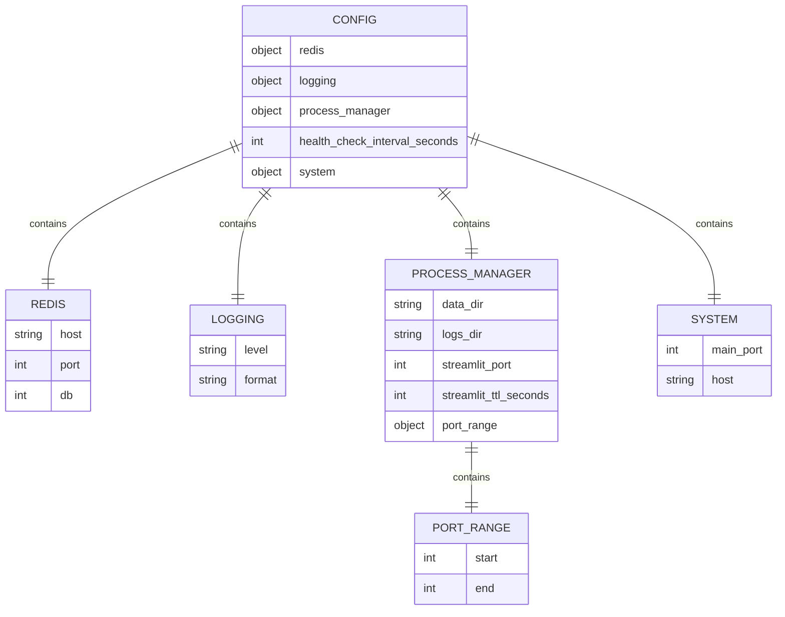
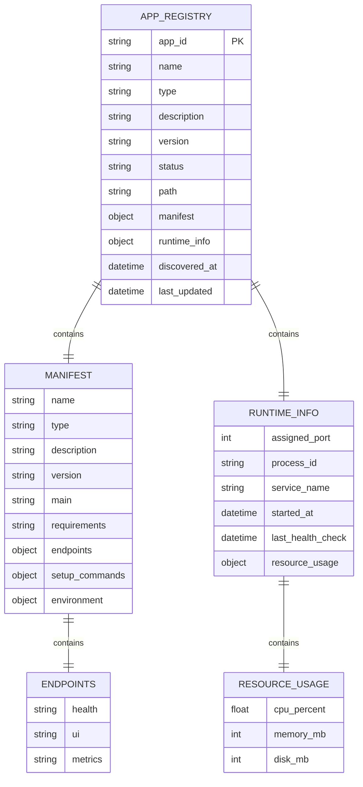
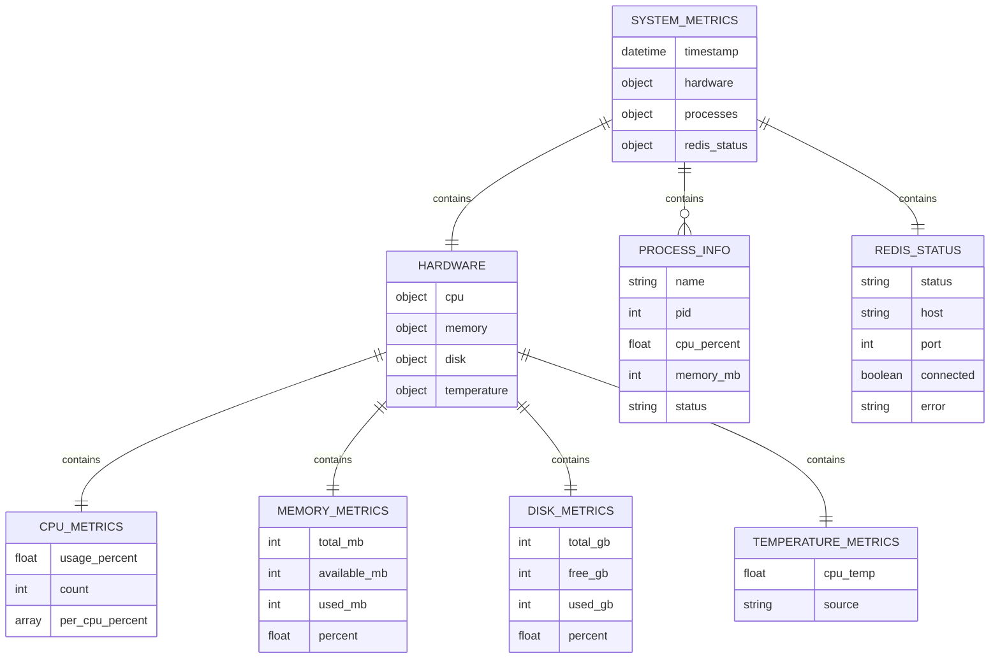

# HomeHelper Database Schema

This document describes the data storage and persistence strategy for the HomeHelper platform.

## Storage Strategy

HomeHelper uses a hybrid storage approach optimized for Raspberry Pi deployment:

- **Configuration**: JSON files for human-readable settings
- **App Registry**: JSON persistence with in-memory operations
- **Message Bus**: Redis for real-time communication
- **Logs**: File-based logging with rotation
- **App Data**: File-based storage per application

## Data Models

### Configuration Schema



### App Registry Schema



### System Metrics Schema



## File System Structure

### Configuration Files
```
/opt/homehelper/config/
├── config.json                 # Main configuration
├── config.backup.json          # Configuration backup
└── .env                        # Environment overrides (optional)
```

### App Registry Persistence
```
/opt/homehelper/registry/
├── apps.json                   # App registry data
├── ports.json                  # Port allocation tracking
└── history/                    # Registry change history
    ├── 2024-01-01.json
    └── 2024-01-02.json
```

### Application Data Structure
```
/opt/homehelper/data/
├── app-name-1/                 # Per-app data directory
│   ├── config/                 # App-specific configuration
│   ├── database/               # App database files
│   ├── uploads/                # File uploads
│   └── cache/                  # Temporary cache files
└── app-name-2/
    └── ...
```

### Logging Structure
```
/opt/homehelper/logs/
├── homehelper/                 # Main application logs
│   ├── main.log
│   ├── main.log.1
│   └── main.log.2
├── app-name-1/                 # Per-app logs
│   ├── app.log
│   ├── error.log
│   └── access.log
└── system/                     # System-level logs
    ├── discovery.log
    ├── health.log
    └── performance.log
```

## Redis Data Structures

### Message Bus Channels
```
homehelper:events              # General system events
homehelper:apps:*              # App-specific events
homehelper:health              # Health check events
homehelper:metrics             # System metrics
homehelper:logs                # Log events
```

### Redis Keys
```
homehelper:config              # Cached configuration
homehelper:apps:registry       # App registry cache
homehelper:system:metrics      # Latest system metrics
homehelper:ports:allocated     # Port allocation tracking
homehelper:health:*            # Health check results
```

### Event Message Format
```json
{
  "timestamp": "2024-01-01T12:00:00Z",
  "event_type": "app_started|app_stopped|health_check|error",
  "source": "app_id|system|service_manager",
  "data": {
    "app_id": "camera-detection",
    "status": "running",
    "port": 8101,
    "pid": 12345
  },
  "metadata": {
    "version": "1.0.0",
    "correlation_id": "uuid"
  }
}
```

## Data Persistence Patterns

### Configuration Management
- **Primary**: JSON file (`config/config.json`)
- **Backup**: Automatic backup on changes
- **Environment**: Override via `HOMEHELPER_*` variables
- **Validation**: Pydantic models with type checking

### App Registry Management
- **Primary**: In-memory dictionary for fast access
- **Persistence**: JSON file with atomic writes
- **Backup**: Daily snapshots in history directory
- **Recovery**: Automatic reload from disk on startup

### System Metrics
- **Collection**: Real-time via psutil
- **Storage**: Redis with TTL (1 hour)
- **Aggregation**: No historical storage (manual refresh pattern)
- **Export**: On-demand JSON API

### Log Management
- **Format**: Structured logging with timestamps
- **Rotation**: Size-based rotation (10MB per file)
- **Retention**: 30 days for app logs, 7 days for system logs
- **Access**: File-based reading with pagination

## Data Migration Strategy

### Version 1.0 Schema
- Initial implementation with JSON persistence
- No database migrations required
- Configuration schema versioning

### Future Considerations
- SQLite integration for complex queries
- Time-series database for metrics history
- Backup and restore procedures
- Data export/import capabilities

## Performance Considerations

### Memory Usage
- In-memory app registry (< 1MB for 100 apps)
- Redis memory limits (64MB default)
- Log file size limits (10MB per file)
- Metrics data TTL (1 hour)

### Disk Usage
- Configuration files (< 1KB)
- App registry (< 100KB for 100 apps)
- Log files (rotated, max 100MB per app)
- App data (unlimited, per-app responsibility)

### Access Patterns
- Configuration: Read on startup, write on changes
- App registry: Read frequently, write on discovery/changes
- Metrics: Read on dashboard access, write every 60 seconds
- Logs: Write continuously, read on demand

## Backup and Recovery

### Automatic Backups
- Configuration: On every change
- App registry: Daily snapshots
- System state: Redis persistence (RDB)

### Manual Backup Procedures
```bash
# Backup configuration
cp /opt/homehelper/config/config.json /backup/config-$(date +%Y%m%d).json

# Backup app registry
cp /opt/homehelper/registry/apps.json /backup/registry-$(date +%Y%m%d).json

# Backup Redis data
redis-cli BGSAVE
cp /var/lib/redis/dump.rdb /backup/redis-$(date +%Y%m%d).rdb
```

### Recovery Procedures
1. Stop HomeHelper services
2. Restore configuration and registry files
3. Restore Redis data if needed
4. Restart services
5. Verify app discovery and status
